# 강의 목표

- Figma 디자인 문서를 개발 관점으로 읽는다.
- Figma AI로 초안, 콘텐츠, 레이어, 프로토타입을 빠르게 만든다.
- Dev Mode 정보를 React/Next.js 컴포넌트로 옮긴다.
- QA 에이전트로 반응형, 접근성, 시각적 품질을 점검한다.

---

# PART 0
## 오늘 강의를 시작하기 전에

---

## 글로벌 테크기업 리더들은 지금,

```
"수천 일 안에 초지능이 온다.
 앞으로 4년 내 대부분의 인지 노동을
 AI가 대체할 것이다."

                    — Sam Altman, OpenAI CEO
```
<!-- 
> **발표자 노트:**
> 오늘 강의는 기술 강의가 아닙니다. AI 에이전트가 우리 일상과 업무를 어떻게 바꾸고 있는지, 그리고 우리 회사가 어떻게 준비할 수 있는지를 함께 생각해보는 자리입니다. 첫 슬라이드는 잠시 멈추고 읽어보게 합니다. Sam Altman은 OpenAI CEO로, ChatGPT를 만든 회사의 수장입니다. -->

---

# AI 낙관론

| 인물 | 소속 | 핵심 발언 |
|------|------|-----------|
| **Sam Altman** | OpenAI CEO | "4년 내 대부분의 인지 노동을 AI가 대체한다" |
| **Dario Amodei** | Anthropic CEO | "AI 인지 능력은 4~12개월마다 2배 성장 중" |
| **Elon Musk** | xAI CEO | "AGI는 2026년 도달 가능하다" |
| **Jensen Huang** | NVIDIA CEO | "AI 인프라 구축은 인류 역사상 가장 큰 투자다" |
| **Demis Hassabis** | Google DeepMind CEO | "두뇌(모델)는 준비됐다. 몸이 따라오는 중" |

<!-- > **발표자 노트:**
> 여기서 중요한 포인트는, 이 사람들이 단순한 테크 낙관론자가 아니라 실제로 AI를 만들고 있는 사람들이라는 점입니다. Dario Amodei는 Claude를 만든 Anthropic의 CEO입니다. Jensen Huang은 AI 칩의 90%를 공급하는 NVIDIA의 CEO입니다. 이들의 말은 예측이 아니라 실제 관찰에서 나온 발언입니다. -->

---

# AI 균형론

```
"2026년은 AI 발견의 시대가 끝나고
 확산의 시대가 시작되는 해다.
 에이전트 퍼스트 경제로 전환 중이다."

                    — Satya Nadella, Microsoft CEO


"AI의 지능에는 상한선이 없다.
 인간 수준을 넘기 전에 멈추지 않을 것이다.
 주 4일제를 준비하라."

                    — Bill Gates, Microsoft 공동창업자
```

<!-- > **발표자 노트:**
> Satya Nadella는 매우 현실적인 사람입니다. 그는 AGI라는 단어 자체를 "의미 없는 벤치마크 게임"이라고 했습니다. 중요한 건 실제로 얼마나 많은 인지 노동이 자동화되느냐라고 말합니다. Bill Gates의 주 4일제 발언은 흥미롭습니다. AI가 생산성을 높이면 인간의 노동 시간 자체가 줄어들 수 있다는 얘기입니다. -->

---

# 낙관론 vs 신중론 — 그러나 방향은 하나

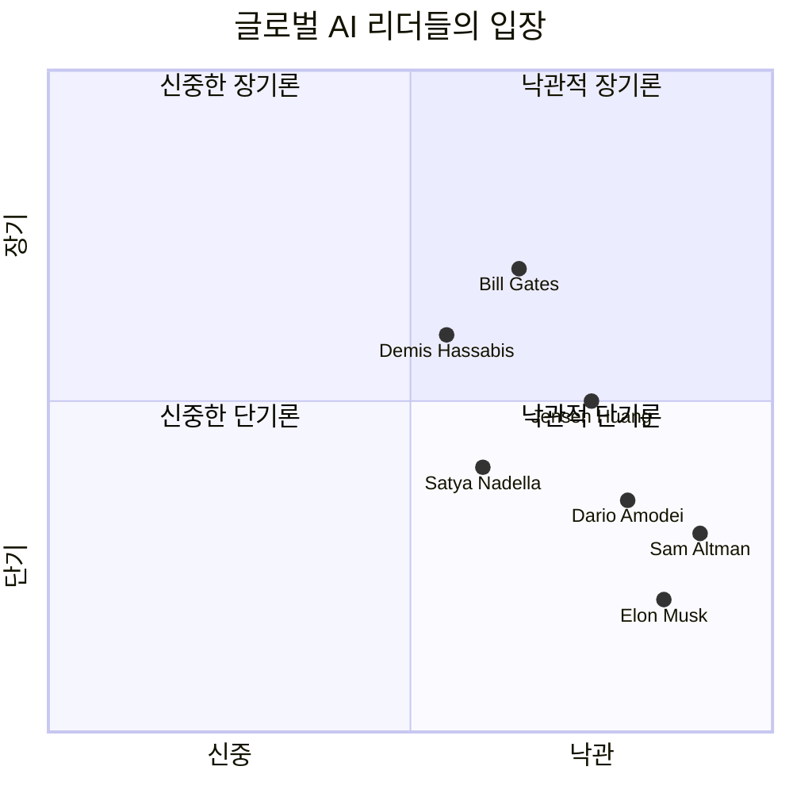
```mermaid
quadrantChart
    title 글로벌 AI 리더들의 입장
    x-axis 신중 --> 낙관
    y-axis 단기 --> 장기
    quadrant-1 낙관적 장기론
    quadrant-2 신중한 장기론
    quadrant-3 신중한 단기론
    quadrant-4 낙관적 단기론
    Sam Altman: [0.9, 0.3]
    Elon Musk: [0.85, 0.2]
    Dario Amodei: [0.8, 0.35]
    Jensen Huang: [0.75, 0.5]
    Demis Hassabis: [0.55, 0.6]
    Satya Nadella: [0.6, 0.4]
    Bill Gates: [0.65, 0.7]
```

**공통 결론: 시점에 대한 이견은 있지만, 방향에 대한 이견은 없다**

<!-- > **발표자 노트:**
> 이 차트가 오늘 강의의 핵심 전제입니다. 누가 더 빠르게 올 것인지에 대해서는 의견이 갈립니다. 하지만 AI가 인간의 지적 노동을 상당 부분 대체하는 방향으로 가고 있다는 것에 이견을 가진 리더는 없습니다. 오늘 강의는 이 방향을 전제로 합니다. -->

---

# PART 1
## AI AGENT

---

## AI의 진화 단계 — ANI · AGI · SGI

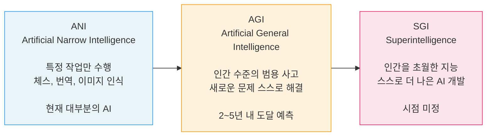
```mermaid
flowchart LR
    A["ANI\nArtificial Narrow Intelligence\n\n특정 작업만 수행\n체스, 번역, 이미지 인식\n\n현재 대부분의 AI"] 
    --> B["AGI\nArtificial General Intelligence\n\n인간 수준의 범용 사고\n새로운 문제 스스로 해결\n\n2~5년 내 도달 예측"]
    --> C["SGI\nSuperintelligence\n\n인간을 초월한 지능\n스스로 더 나은 AI 개발\n\n시점 미정"]

    style A fill:#e8f4f8,stroke:#2196F3
    style B fill:#fff3e0,stroke:#FF9800
    style C fill:#fce4ec,stroke:#E91E63
```

<!-- > **발표자 노트:**
> ANI는 Artificial Narrow Intelligence. 지금 우리가 쓰는 ChatGPT, 번역기, 추천 알고리즘이 모두 ANI입니다. 매우 뛰어나지만 딱 그 일만 합니다. AGI는 인간처럼 어떤 문제도 스스로 생각하고 해결하는 AI입니다. SGI는 Superintelligence로, 인간보다 모든 면에서 뛰어난 AI입니다. 오늘 우리가 다룰 AI 에이전트는 ANI와 AGI 사이 어딘가에 위치합니다. 단순 도구에서 목표를 이해하고 스스로 계획하는 방향으로 진화하는 중입니다. -->

---

## 우리는 지금 어디에 있나

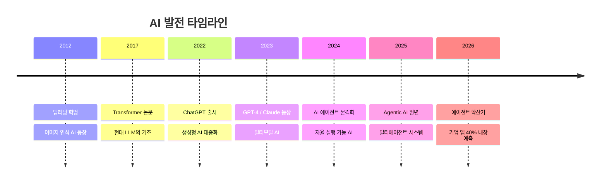
```mermaid
timeline
    title AI 발전 타임라인
    2012 : 딥러닝 혁명
         : 이미지 인식 AI 등장
    2017 : Transformer 논문
         : 현대 LLM의 기초
    2022 : ChatGPT 출시
         : 생성형 AI 대중화
    2023 : GPT-4 / Claude 등장
         : 멀티모달 AI
    2024 : AI 에이전트 본격화
         : 자율 실행 가능 AI
    2025 : Agentic AI 원년
         : 멀티에이전트 시스템
    2026 : 에이전트 확산기
         : 기업 앱 40% 내장 예측
```

<!-- > **발표자 노트:**
> 2022년 ChatGPT가 나온 지 불과 4년이 지났습니다. 그 사이 AI는 "질문에 답하는 것"에서 "스스로 행동하는 것"으로 진화했습니다. 오늘 여러분이 배울 AI 에이전트는 바로 이 "스스로 행동하는 AI"입니다. -->

---

## 챗봇 vs AI 에이전트 — 결정적 차이

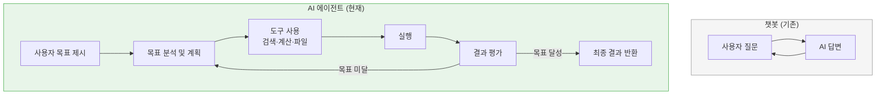
```mermaid
flowchart TD
    subgraph 챗봇["챗봇 (기존)"]
        U1[사용자 질문] --> R1[AI 답변]
        R1 --> U1
    end

    subgraph Agent["AI 에이전트 (현재)"]
        U2[사용자 목표 제시] --> P[목표 분석 및 계획]
        P --> T1[도구 사용\n검색·계산·파일]
        T1 --> E[실행]
        E --> M[결과 평가]
        M -->|목표 미달| P
        M -->|목표 달성| R2[최종 결과 반환]
    end

    style 챗봇 fill:#f5f5f5,stroke:#999
    style Agent fill:#e8f5e9,stroke:#4CAF50
```

<!-- > **발표자 노트:**
> 챗봇은 질문-답변의 1회성 상호작용입니다. "오늘 날씨 어때?"라고 물으면 답을 줍니다. AI 에이전트는 다릅니다. "다음 주 출장 준비해줘"라고 하면, 스스로 일정을 확인하고, 호텔을 검색하고, 비용을 계산하고, 예약을 진행합니다. 중간에 문제가 생기면 다시 계획을 세웁니다. 이 차이가 핵심입니다. -->

---

## AI 에이전트의 4가지 핵심 능력

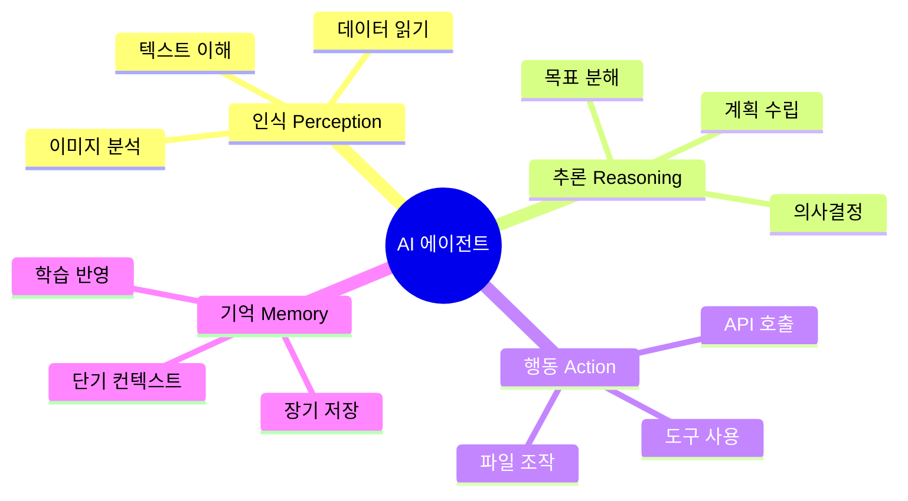
```mermaid
mindmap
  root((AI 에이전트))
    인식 Perception
      텍스트 이해
      이미지 분석
      데이터 읽기
    추론 Reasoning
      목표 분해
      계획 수립
      의사결정
    행동 Action
      도구 사용
      API 호출
      파일 조작
    기억 Memory
      단기 컨텍스트
      장기 저장
      학습 반영
```

<!-- > **발표자 노트:**
> 에이전트를 이해하는 가장 쉬운 방법은 이 4가지입니다. 인식: 상황을 파악합니다. 추론: 어떻게 할지 계획합니다. 행동: 실제로 실행합니다. 기억: 이전 결과를 기억해서 다음에 활용합니다. 사람이 일하는 방식과 거의 같습니다. -->

---

## 에이전트 유형 — Single vs Multi

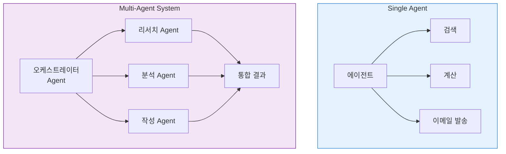
```mermaid
flowchart TB
    subgraph Single["Single Agent"]
        SA[에이전트] --> T1[검색]
        SA --> T2[계산]
        SA --> T3[이메일 발송]
    end

    subgraph Multi["Multi-Agent System"]
        O[오케스트레이터\nAgent] --> A1[리서치 Agent]
        O --> A2[분석 Agent]
        O --> A3[작성 Agent]
        A1 --> R[통합 결과]
        A2 --> R
        A3 --> R
    end

    style Single fill:#e3f2fd,stroke:#1976D2
    style Multi fill:#f3e5f5,stroke:#7B1FA2
```

<!-- > **발표자 노트:**
> Single Agent는 혼자 모든 것을 처리합니다. 간단한 작업에 적합합니다. Multi-Agent는 여러 에이전트가 팀처럼 협력합니다. 한 명이 조사하고, 한 명이 분석하고, 한 명이 보고서를 씁니다. 복잡한 업무일수록 Multi-Agent가 더 효과적입니다. 우리가 팀으로 일하는 것처럼요. -->

---

## 에이전트가 일하는 방식 — ReAct 루프

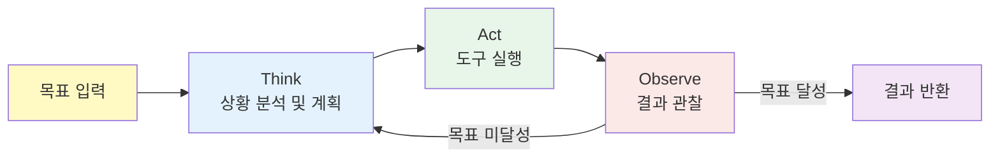
```mermaid
flowchart LR
    G[목표 입력] --> Th
    Th[Think\n상황 분석 및 계획] --> Ac[Act\n도구 실행]
    Ac --> Ob[Observe\n결과 관찰]
    Ob -->|목표 미달성| Th
    Ob -->|목표 달성| Re[결과 반환]

    style G fill:#FFF9C4
    style Th fill:#E3F2FD
    style Ac fill:#E8F5E9
    style Ob fill:#FBE9E7
    style Re fill:#F3E5F5
```

**ReAct = Reasoning + Acting** 

<!-- > **발표자 노트:**
> ReAct는 AI 에이전트가 작동하는 핵심 원리입니다. 생각하고(Think), 행동하고(Act), 결과를 보고(Observe), 다시 생각합니다. 이 루프가 목표를 달성할 때까지 반복됩니다. 사람이 문제를 해결할 때와 동일한 방식입니다. -->

---

# PART 2
## 2026년 현재 — 트렌드와 사례


---

## AI 에이전트 시장 규모

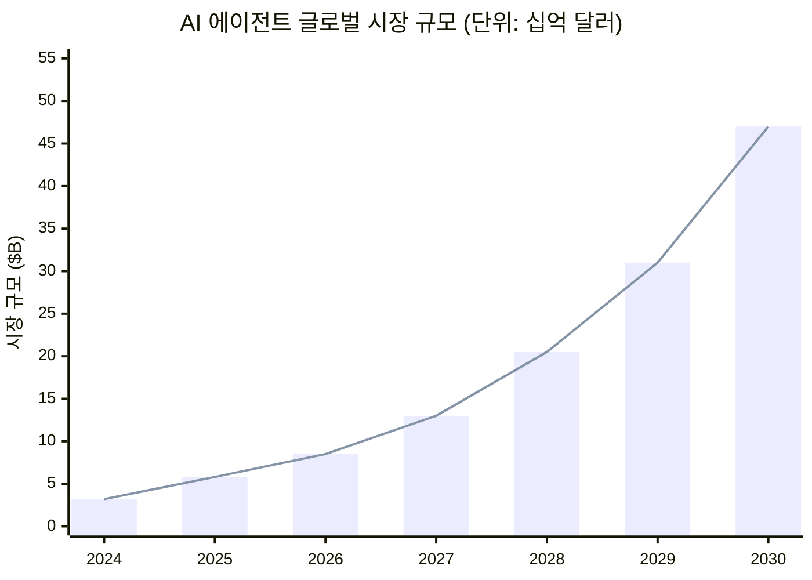
```mermaid
xychart-beta
    title "AI 에이전트 글로벌 시장 규모 (단위: 십억 달러)"
    x-axis [2024, 2025, 2026, 2027, 2028, 2029, 2030]
    y-axis "시장 규모 ($B)" 0 --> 55
    bar [3.2, 5.8, 8.5, 13.0, 20.5, 31.0, 47.0]
    line [3.2, 5.8, 8.5, 13.0, 20.5, 31.0, 47.0]
```

<!-- **발표자 노트:**
> 2026년 현재 AI 에이전트 시장은 85억 달러 규모입니다. 2030년에는 470억 달러로 성장할 것으로 예측됩니다. 4년 만에 5.5배 성장입니다. 이는 단순한 트렌드가 아니라 산업 구조의 변화를 의미합니다. -->

---

## 기업 도입 현황 — 2026년 수치

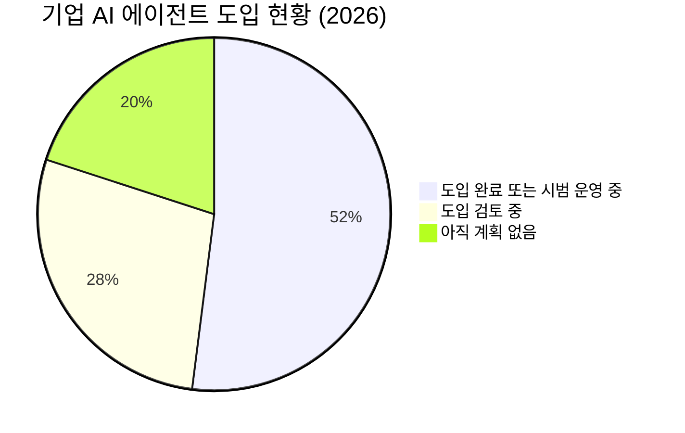
```mermaid
pie title 기업 AI 에이전트 도입 현황 (2026)
    "도입 완료 또는 시범 운영 중" : 52
    "도입 검토 중" : 28
    "아직 계획 없음" : 20
```

**Gartner 예측: 2026년 말 기준 기업 앱의 40%에 AI 에이전트 내장**

<!-- > **발표자 노트:**
> 절반 이상의 기업이 이미 AI 에이전트를 도입하거나 시범 운영 중입니다. "아직 계획 없음"이 20%밖에 안 됩니다. 3년 전만 해도 이 숫자가 반대였습니다. 속도가 매우 빠릅니다. -->

---

## 어느 업무에 먼저 들어오고 있나


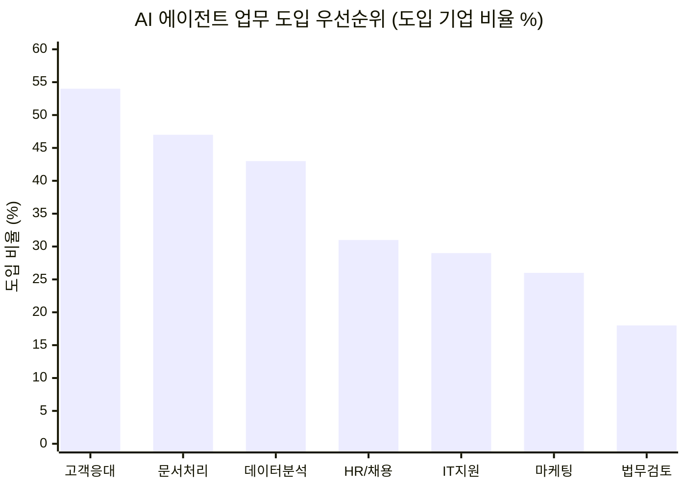
```mermaid
xychart-beta
    title "AI 에이전트 업무 도입 우선순위 (도입 기업 비율 %)"
    x-axis ["고객응대", "문서처리", "데이터분석", "HR/채용", "IT지원", "마케팅", "법무검토"]
    y-axis "도입 비율 (%)" 0 --> 60
    bar [54, 47, 43, 31, 29, 26, 18]
```

<!-- > **발표자 노트:**
> 고객 응대가 1위입니다. 24시간 응대, 다국어 지원, 반복 문의 자동 처리 때문입니다. 문서 처리가 2위입니다. 계약서 검토, 보고서 요약, 데이터 입력이 여기에 포함됩니다. 우리 회사에서 어떤 업무가 가장 먼저 적용될 수 있을지 잠시 생각해보세요. -->

---

## 국내 주요 기업 도입 사례

| 기업 | 적용 분야 | 성과 |
|------|-----------|------|
| **SK텔레콤** | 전 사업 영역 AI 적용 선언 | AI 기반 고객 경험 혁신 |
| **LG유플러스** | Google Agentspace 도입 | 임직원 생산성 향상 |
| **야놀자** | 고객 지원 티켓 자동 분류 | 반복 문의 처리 자동화 |
| **하나투어** | ChatGPT Enterprise 도입 | 조직 단위 업무 인프라화 |
| **삼성SDS** | Agentic Workforce 구축 | 복합 업무 에이전트 팀 운영 |

<!-- > **발표자 노트:**
> 이 기업들의 공통점은 AI를 "개인 도구"가 아니라 "조직 인프라"로 도입하고 있다는 점입니다. 한 사람이 쓰는 것이 아니라, 팀 전체의 업무 프로세스에 AI 에이전트를 심는 방식입니다. 특히 야놀자 사례는 흥미롭습니다. 고객 지원 티켓을 AI가 분류하고 담당자에게 자동 배분하는 방식으로 수십 시간의 단순 업무를 줄였습니다. -->

---

## 해외 도입 성과 — 실제 수치

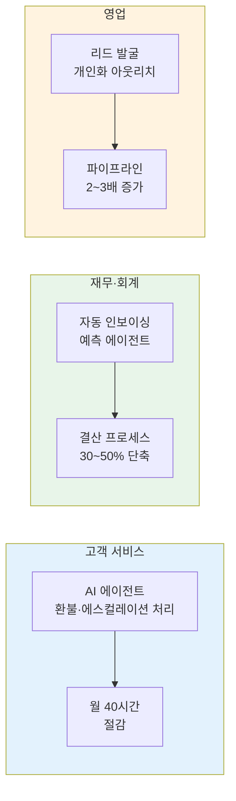
```mermaid
flowchart LR
    subgraph CS["고객 서비스"]
        A1[AI 에이전트\n환불·에스컬레이션 처리] --> B1["월 40시간\n절감"]
    end

    subgraph FIN["재무·회계"]
        A2[자동 인보이싱\n예측 에이전트] --> B2["결산 프로세스\n30~50% 단축"]
    end

    subgraph SALES["영업"]
        A3[리드 발굴\n개인화 아웃리치] --> B3["파이프라인\n2~3배 증가"]
    end

    style CS fill:#e3f2fd
    style FIN fill:#e8f5e9
    style SALES fill:#fff3e0
```

<!-- > **발표자 노트:**
> 이 수치들은 컨설팅 자료가 아니라 실제 기업들이 측정한 결과입니다. 고객 서비스 에이전트가 월 40시간을 아낀다는 건, 직원 한 명이 그 40시간을 더 가치 있는 일에 쓸 수 있다는 의미입니다. 재무 결산이 50% 단축된다는 건 마감 스트레스가 절반으로 준다는 얘기입니다. -->

---

## 2026년 7대 에이전트 트렌드

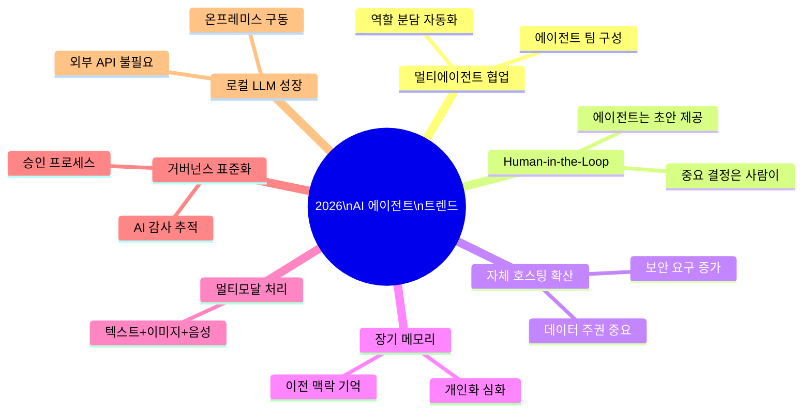
```mermaid
mindmap
  root((2026\nAI 에이전트\n트렌드))
    멀티에이전트 협업
      에이전트 팀 구성
      역할 분담 자동화
    Human-in-the-Loop
      중요 결정은 사람이
      에이전트는 초안 제공
    자체 호스팅 확산
      데이터 주권 중요
      보안 요구 증가
    장기 메모리
      이전 맥락 기억
      개인화 심화
    멀티모달 처리
      텍스트+이미지+음성
    거버넌스 표준화
      AI 감사 추적
      승인 프로세스
    로컬 LLM 성장
      외부 API 불필요
      온프레미스 구동
```

<!-- > **발표자 노트:**
> 이 중 우리 회사에 가장 중요한 트렌드를 세 가지 강조하겠습니다. 첫째, Human-in-the-Loop. 에이전트가 모든 것을 혼자 결정하지 않고, 중요한 순간에 사람의 확인을 받는 방식입니다. 둘째, 자체 호스팅. 외부 서버 없이 사내에서 운영하는 방식으로, 보안 환경에서 핵심입니다. 셋째, 로컬 LLM. 외부 AI API 없이 사내 서버에서 AI를 구동하는 방식입니다. -->

---

# PART 3
## 에이전트를 만드는 방법
### 도구 소개 및 비교

---

## 에이전트를 만드는 3가지 경로

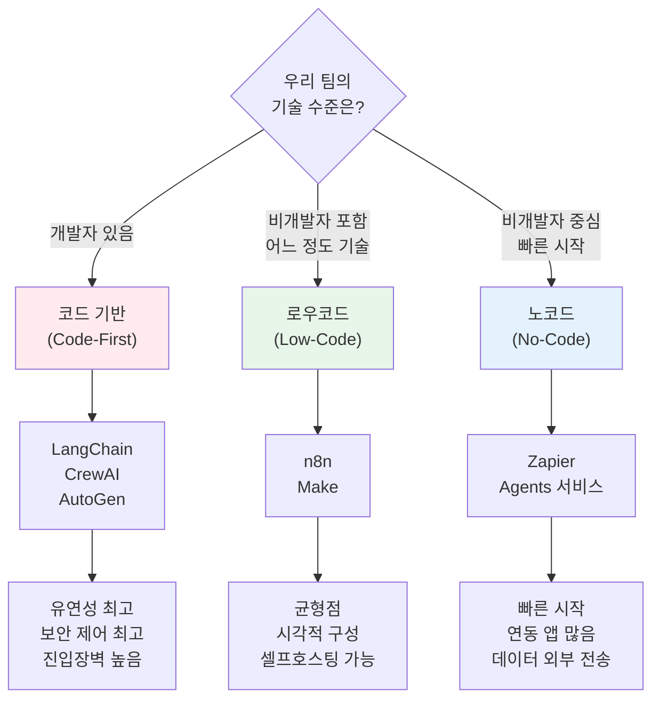
```mermaid
flowchart TD
    Q{우리 팀의\n기술 수준은?} 
    
    Q -->|개발자 있음| A["코드 기반\n(Code-First)"]
    Q -->|비개발자 포함\n어느 정도 기술| B["로우코드\n(Low-Code)"]
    Q -->|비개발자 중심\n빠른 시작| C["노코드\n(No-Code)"]

    A --> A1[LangChain\nCrewAI\nAutoGen]
    B --> B1[n8n\nMake]
    C --> C1[Zapier\nAgents 서비스]

    A1 --> R["유연성 최고\n보안 제어 최고\n진입장벽 높음"]
    B1 --> S["균형점\n시각적 구성\n셀프호스팅 가능"]
    C1 --> T["빠른 시작\n연동 앱 많음\n데이터 외부 전송"]

    style A fill:#ffebee
    style B fill:#e8f5e9
    style C fill:#e3f2fd
```

<!-- > **발표자 노트:**
> 에이전트를 만드는 방법은 크게 세 가지입니다. 코드로 직접 짜거나, 시각적 도구로 구성하거나, 완성된 SaaS를 쓰거나. 보안이 중요한 우리 환경에서는 데이터가 외부로 나가지 않는 코드 기반 또는 로우코드 방식이 현실적입니다. -->

---

## 코드 없이 시작하기 전에 — 코드 기반 접근

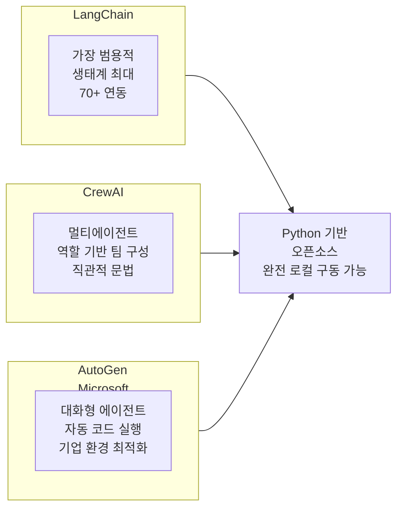
```mermaid
flowchart LR
    subgraph LC["LangChain"]
        L1[가장 범용적\n생태계 최대\n70+ 연동]
    end
    subgraph CA["CrewAI"]
        C1[멀티에이전트\n역할 기반 팀 구성\n직관적 문법]
    end
    subgraph AG["AutoGen\nMicrosoft"]
        A1[대화형 에이전트\n자동 코드 실행\n기업 환경 최적화]
    end

    LC --> P[Python 기반\n오픈소스\n완전 로컬 구동 가능]
    CA --> P
    AG --> P
```

**보안 환경 핵심 조합: `n8n 셀프호스팅` + `Ollama 로컬 LLM`**

<!-- > **발표자 노트:**
> 코드 기반 접근의 가장 큰 장점은 데이터가 외부로 전혀 나가지 않는다는 점입니다. Ollama라는 도구를 쓰면 사내 서버에서 AI 모델을 직접 구동할 수 있습니다. LangChain, CrewAI, AutoGen 모두 오픈소스라 라이선스 비용이 없습니다. 개발자가 있는 팀이라면 가장 강력한 선택지입니다. -->

---

## n8n vs Make vs Zapier — 한눈 비교

| 항목 | n8n | Make | Zapier |
|------|-----|------|--------|
| **셀프호스팅** | 가능 (핵심 강점) | 불가 | 불가 |
| **AI 에이전트 기능** | LangChain 네이티브 통합 (70+ AI 노드) | Maia AI 어시스턴트 | Zapier Agents |
| **시각적 편집** | 중간 | 최고 | 중간 |
| **연동 앱 수** | 400+ | 1,500+ | 8,000+ |
| **가격 (월)** | 셀프호스팅 시 무료 | $9~ | $19.99~ |
| **기술 난이도** | 중~고 | 낮~중 | 낮 |
| **데이터 주권** | 완전 통제 가능 | 클라우드 저장 | 클라우드 저장 |
| **보안 환경 적합성** | 높음 | 낮음 | 낮음 |

<!-- > **발표자 노트:**
> 보안 환경에서 가장 중요한 기준은 "데이터가 어디에 저장되는가"입니다. Make와 Zapier는 클라우드 기반이라 데이터가 외부 서버를 거칩니다. n8n은 사내 서버에 직접 설치할 수 있어서 데이터가 외부로 나가지 않습니다. 이것이 우리 환경에서 n8n이 가장 현실적인 선택인 이유입니다. -->

---

## n8n — 워크플로우 구조 예시

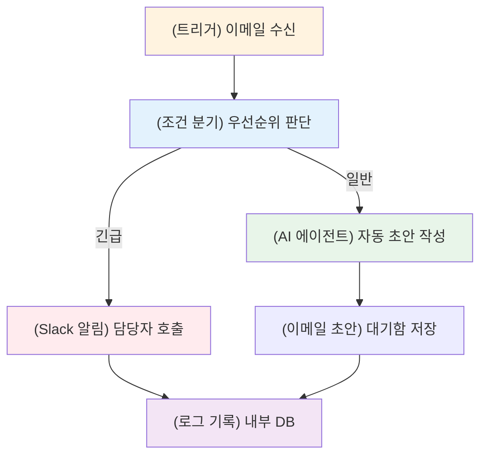
```mermaid
flowchart TD
    T["(트리거) 이메일 수신"] --> C["(조건 분기) 우선순위 판단"]
    C -->|긴급| A1["(Slack 알림) 담당자 호출"]
    C -->|일반| A2["(AI 에이전트) 자동 초안 작성"]
    A2 --> A3["(이메일 초안) 대기함 저장"]
    A1 --> LOG["(로그 기록) 내부 DB"]
    A3 --> LOG

    style T fill:#fff3e0
    style C fill:#e3f2fd
    style A1 fill:#ffebee
    style A2 fill:#e8f5e9
    style LOG fill:#f3e5f5
```

<!-- > **발표자 노트:**
> 이것이 n8n의 실제 워크플로우 구조입니다. 왼쪽부터 오른쪽으로 흐릅니다. 이메일이 들어오면, 조건을 판단하고, 긴급하면 즉시 알림을 보내고, 일반이면 AI가 초안을 작성합니다. 모든 결과는 내부 DB에 기록됩니다. 외부 API 없이 사내에서만 동작합니다. -->

---

## Make — 시나리오 구조 예시

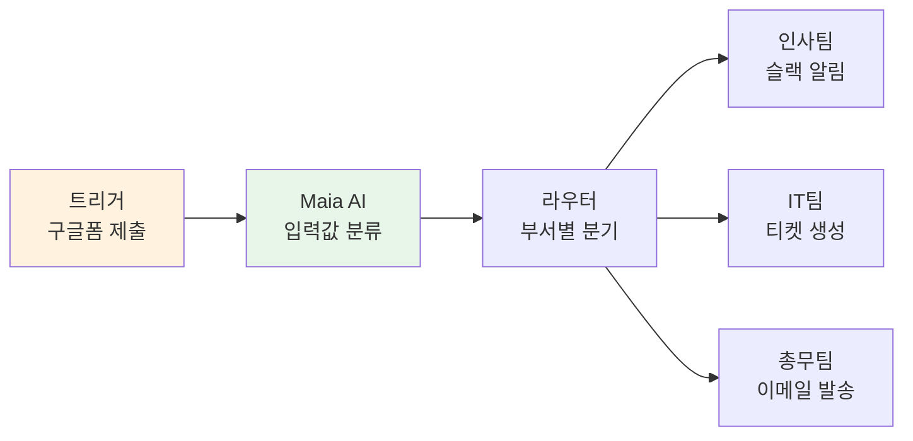
```mermaid
flowchart LR
    T[트리거\n구글폼 제출] --> M[Maia AI\n입력값 분류]
    M --> R[라우터\n부서별 분기]
    R --> D1[인사팀\n슬랙 알림]
    R --> D2[IT팀\n티켓 생성]
    R --> D3[총무팀\n이메일 발송]

    style T fill:#fff3e0
    style M fill:#e8f5e9
```

**시각적 편집이 가장 직관적 — 비개발자에게 적합**

<!-- > **발표자 노트:**
> Make는 시각적으로 가장 예쁘고 직관적입니다. Maia라는 AI 어시스턴트가 자연어로 시나리오를 만들어줍니다. 단, 클라우드 기반이라 민감한 데이터를 다룰 때 주의가 필요합니다. 외부 공개 데이터나 비민감 업무 자동화에 적합합니다. -->

---

# Zapier — Agents 구조 예시

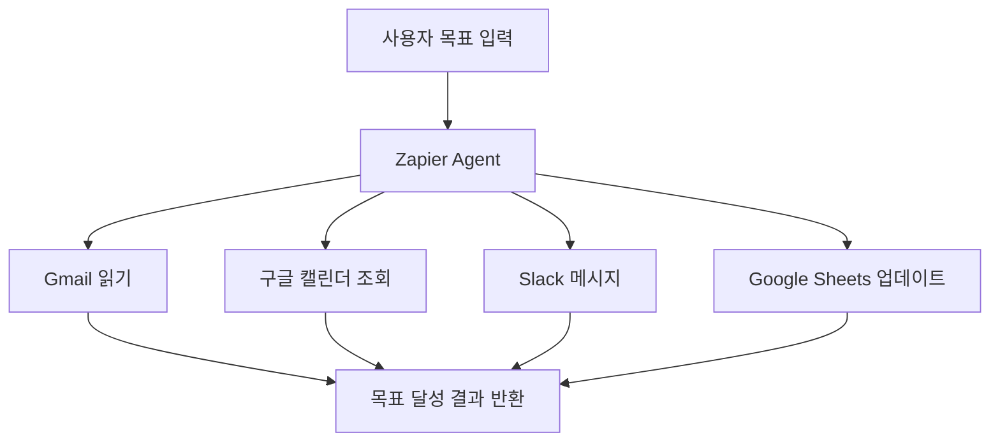
```mermaid
flowchart TD
    U[사용자 목표 입력] --> ZA[Zapier Agent]
    ZA --> T1[Gmail 읽기]
    ZA --> T2[구글 캘린더 조회]
    ZA --> T3[Slack 메시지]
    ZA --> T4[Google Sheets 업데이트]
    T1 --> R[목표 달성 결과 반환]
    T2 --> R
    T3 --> R
    T4 --> R
```

**8,000+ 앱 연동 — 연결 폭이 가장 넓음**

<!-- > **발표자 노트:**
> Zapier는 연결할 수 있는 앱이 8,000개 이상으로 압도적으로 많습니다. 특정 앱 연동이 필요한 경우 Zapier가 가장 빠릅니다. 그러나 모든 데이터가 Zapier 서버를 거칩니다. 내부 보안 정책 확인 후 사용 여부를 결정해야 합니다. -->

---

# 우리 환경에서 선택 기준

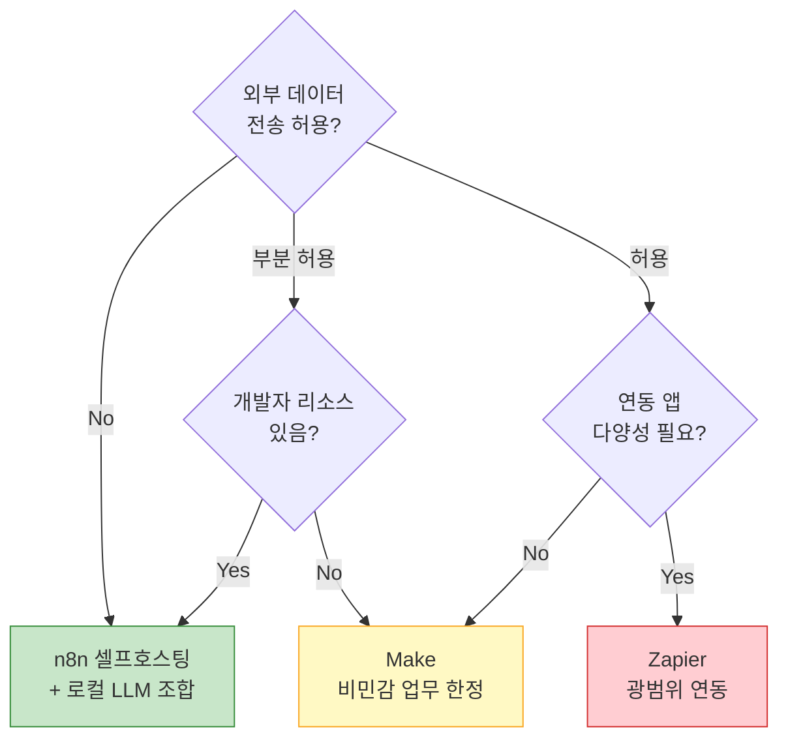
```mermaid
flowchart TD
    Q1{외부 데이터\n전송 허용?}
    Q1 -->|No| N8N[n8n 셀프호스팅\n+ 로컬 LLM 조합]
    Q1 -->|부분 허용| Q2{개발자 리소스\n있음?}
    Q2 -->|Yes| N8N
    Q2 -->|No| MAKE[Make\n비민감 업무 한정]
    Q1 -->|허용| Q3{연동 앱\n다양성 필요?}
    Q3 -->|Yes| ZAP[Zapier\n광범위 연동]
    Q3 -->|No| MAKE

    style N8N fill:#c8e6c9,stroke:#388E3C
    style MAKE fill:#fff9c4,stroke:#F9A825
    style ZAP fill:#ffcdd2,stroke:#D32F2F
```

<!-- > **발표자 노트:**
> 우리 회사 환경을 기준으로 보면, 보안 정책상 외부 데이터 전송이 제한되어 있으므로 n8n 셀프호스팅이 가장 현실적인 선택입니다. 시연에서는 n8n을 기준으로 보여드리겠습니다. -->

---

# PART 4
## 시연
### 보안 환경 내 실제 워크플로우 

---

## 시연 환경 설명

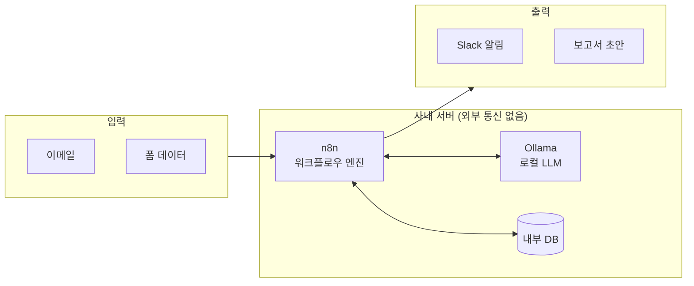
```mermaid
flowchart LR
    subgraph Local["사내 서버 (외부 통신 없음)"]
        N8N[n8n\n워크플로우 엔진]
        OL[Ollama\n로컬 LLM]
        DB[(내부 DB)]
        N8N <--> OL
        N8N <--> DB
    end

    subgraph Input["입력"]
        E[이메일]
        F[폼 데이터]
    end

    subgraph Output["출력"]
        S[Slack 알림]
        R[보고서 초안]
    end

    Input --> N8N
    N8N --> Output
```

**데이터가 로컬 서버를 벗어나지 않음**

<!-- > **발표자 노트:**
> 오늘 시연은 외부 API를 전혀 사용하지 않습니다. n8n과 Ollama 모두 사내 서버에서 구동됩니다. ChatGPT나 Claude 같은 외부 서비스를 쓰지 않아도 AI 에이전트를 운영할 수 있다는 것을 보여드리겠습니다. -->

---

## 시연 1 — 이메일 자동 분류 및 라우팅

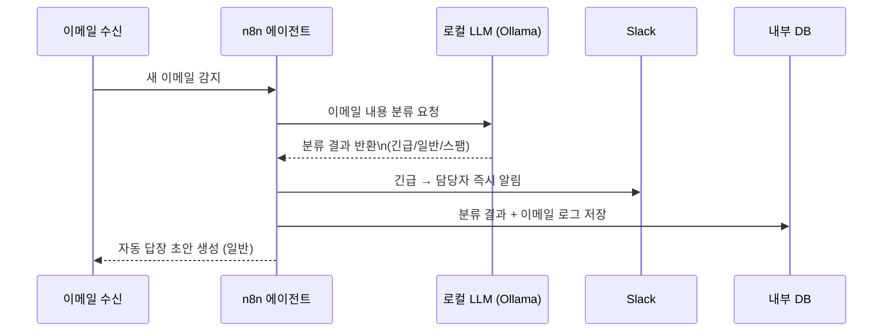
```mermaid
sequenceDiagram
    participant E as 이메일 수신
    participant N as n8n 에이전트
    participant L as 로컬 LLM (Ollama)
    participant S as Slack
    participant D as 내부 DB

    E->>N: 새 이메일 감지
    N->>L: 이메일 내용 분류 요청
    L-->>N: 분류 결과 반환\n(긴급/일반/스팸)
    N->>S: 긴급 → 담당자 즉시 알림
    N->>D: 분류 결과 + 이메일 로그 저장
    N-->>E: 자동 답장 초안 생성 (일반)
```
<!-- 
> **발표자 노트:**
> 실제 동작을 보여드립니다. 이메일이 들어오면 로컬 AI가 내용을 분석해서 긴급도를 판단합니다. 긴급한 경우 Slack으로 즉시 알립니다. 일반적인 문의는 AI가 초안을 작성해서 담당자가 검토 후 발송할 수 있게 합니다. 모든 과정이 사내 서버 안에서만 이루어집니다. -->

---

## 시연 2 — 주간 보고서 자동 초안 생성

```mermaid
sequenceDiagram
    participant T as 매주 월요일\n09:00 트리거
    participant N as n8n 에이전트
    participant D as 내부 DB\n(지난 주 데이터)
    participant L as 로컬 LLM
    participant O as 담당자 이메일

    T->>N: 스케줄 트리거 실행
    N->>D: 지난 주 데이터 조회
    D-->>N: 실적/이슈/완료 항목 반환
    N->>L: 보고서 초안 작성 요청
    L-->>N: 구조화된 보고서 초안
    N->>O: 초안 이메일 발송\n(담당자 검토 후 확정)
```
<!-- 
> **발표자 노트:**
> 두 번째 시연입니다. 매주 월요일 아침 9시에 자동으로 지난 주 데이터를 모아 보고서 초안을 작성합니다. 담당자는 초안을 받아 수정만 하면 됩니다. 보고서 작성에 걸리던 1~2시간이 검토 20분으로 줄어듭니다. 이것이 에이전트의 현실적인 가치입니다. -->

---

## n8n 핵심 노드 — 빠른 참고

| 노드 유형 | 용도 | 예시 |
|----------|------|------|
| **Trigger** | 워크플로우 시작 조건 | 이메일 수신, 시간 예약, 웹훅 |
| **AI Agent** | LLM 기반 판단·생성 | 분류, 요약, 초안 작성 |
| **IF / Switch** | 조건 분기 | 긴급 여부 판단 |
| **HTTP Request** | 외부 API 호출 | 내부 시스템 연동 |
| **Slack** | 메시지 전송 | 알림, 보고 |
| **Email** | 이메일 처리 | 수신·발송 |
| **Database** | 데이터 저장·조회 | 로그, 이력 관리 |
| **Code** | 커스텀 로직 | JS/Python 실행 |

<!-- > **발표자 노트:**
> n8n을 처음 열면 이 노드들을 블록처럼 연결합니다. 코딩 없이 드래그앤드롭으로 구성할 수 있습니다. 개발자가 아니어도 기본적인 워크플로우는 만들 수 있습니다. -->

---

# PART 5
## 한계와 주의점
### 과신하면 위험하다 `15분`

---

## AI 에이전트의 구조적 한계

```mermaid
mindmap
  root((AI 에이전트\n한계))
    환각 Hallucination
      없는 사실 생성
      틀린 수치 제시
      자신 있게 틀림
    컨텍스트 한계
      긴 문서 망각
      이전 대화 혼용
      최신 정보 부재
    실행 오류
      도구 사용 실패
      무한 루프
      의도치 않은 행동
    책임 소재 불명확
      판단 근거 불투명
      오류 추적 어려움
    보안 취약점
      프롬프트 인젝션
      데이터 노출 위험
      권한 초과 실행
```

<!-- > **발표자 노트:**
> AI 에이전트는 강력하지만 맹신해서는 안 됩니다. 가장 위험한 것은 "자신 있게 틀리는" 환각입니다. AI가 틀린 정보를 마치 사실처럼 제시할 때, 사람이 확인하지 않으면 그대로 실행될 수 있습니다. 이것이 중요한 결정에 반드시 사람이 개입해야 하는 이유입니다. -->

---

## 기업 보안 현실 — 경고 수치

```mermaid
xychart-beta
    title "AI 에이전트 보안 관리 현황 (2026)"
    x-axis ["보안 승인\n없이 프로덕션 투입", "AI 에이전트\n미모니터링 운영", "에이전트 간\n통신 가시성 없음"]
    y-axis "해당 기업 비율 (%)" 0 --> 100
    bar [80.9, 52.9, 75.6]
```

<!-- > **발표자 노트:**
> 충격적인 수치입니다. 전 세계 기업의 80.9%가 보안 승인 없이 AI 에이전트를 프로덕션에 투입하고 있습니다. 절반 이상의 기업에서 에이전트가 무엇을 하는지 모니터링조차 안 되고 있습니다. 우리 회사의 보안 제한이 오히려 장점이 될 수 있습니다. 무분별한 도입이 아닌 통제된 도입이 결국 더 안전하고 지속 가능합니다. -->

---

## 주의해야 할 시나리오 3가지

```mermaid
flowchart TD
    subgraph S1["시나리오 1: 환각 + 자동 실행"]
        A1[AI가 틀린 수치 생성] --> B1[검토 없이 자동 발송]
        B1 --> C1[잘못된 보고서\n고객 전달]
    end

    subgraph S2["시나리오 2: 권한 초과"]
        A2[에이전트에 과도한 권한 부여] --> B2[의도치 않은\n파일 삭제·수정]
        B2 --> C2[데이터 손실]
    end

    subgraph S3["시나리오 3: 프롬프트 인젝션"]
        A3[악의적 입력 데이터] --> B3[에이전트 동작\n조작]
        B3 --> C3[내부 정보 유출]
    end

    style S1 fill:#ffebee
    style S2 fill:#fff3e0
    style S3 fill:#fce4ec
```

<!-- > **발표자 노트:**
> 세 가지 실제 위험 시나리오입니다. 첫째, 환각이 자동 실행으로 이어지는 경우. 에이전트가 생성한 내용이 검토 없이 외부에 전달될 때 발생합니다. 둘째, 권한 초과. 에이전트에게 너무 많은 권한을 주면 의도치 않은 행동을 할 수 있습니다. 셋째, 프롬프트 인젝션. 외부 입력을 통해 에이전트의 동작을 조작하는 공격입니다. -->

---

## 안전한 도입을 위한 원칙

```mermaid
flowchart LR
    P1["최소 권한 원칙\n에이전트에게\n필요한 권한만"] --> 
    P2["Human-in-the-Loop\n중요 결정은\n사람이 최종 확인"] --> 
    P3["감사 추적\n모든 실행 기록\n로그 보관"] --> 
    P4["샌드박스 테스트\n실제 환경 전\n격리 환경 검증"] -->
    P5["단계적 확대\n작은 범위부터\n성과 확인 후 확장"]
```

<!-- > **발표자 노트:**
> 이 다섯 가지 원칙을 지키면 위험을 크게 줄일 수 있습니다. 특히 강조하고 싶은 것은 Human-in-the-Loop입니다. AI가 모든 것을 자동으로 처리하게 하는 것이 목표가 아닙니다. 반복적이고 단순한 부분은 AI가, 판단이 필요한 부분은 사람이 맡는 협력 구조가 가장 효과적입니다. -->

---

# PART 6
## 인사이트
### 우리는 무엇을 해야 하는가 `10분`

---

## 지금 당장 vs 준비 필요

```mermaid
quadrantChart
    title 업무별 AI 에이전트 도입 우선순위
    x-axis "준비 기간 필요" --> "즉시 시작 가능"
    y-axis "낮은 임팩트" --> "높은 임팩트"
    quadrant-1 "빠른 시작 고임팩트"
    quadrant-2 "전략적 투자"
    quadrant-3 "낮은 우선순위"
    quadrant-4 "빠른 시작 저임팩트"
    "정기보고서 초안 작성": [0.85, 0.7]
    "이메일 분류 및 라우팅": [0.9, 0.6]
    "회의록 요약": [0.88, 0.55]
    "데이터 수집 자동화": [0.75, 0.65]
    "고객 응대 자동화": [0.5, 0.85]
    "계약서 검토 보조": [0.4, 0.8]
    "예산 예측 에이전트": [0.3, 0.75]
    "HR 채용 스크리닝": [0.35, 0.6]
```
<!-- 
> **발표자 노트:**
> 오른쪽 위 영역이 가장 먼저 시작할 수 있는 업무입니다. 정기 보고서 초안 작성, 이메일 분류, 회의록 요약은 지금 당장 시작할 수 있고 임팩트도 큽니다. 왼쪽 위는 임팩트는 크지만 준비가 필요합니다. 고객 응대 자동화나 계약서 검토는 법적 책임이 있으므로 신중하게 접근해야 합니다. -->

---

## AI 에이전트 도입 3단계 로드맵

```mermaid
flowchart TD
    subgraph S1["1단계: 탐색 (1~3개월)"]
        A1[파일럿 업무 선정\n1~2개 반복 작업] --> 
        A2[n8n 셀프호스팅\n환경 구성] -->
        A3[내부 성과 측정\n시간 절감 계량화]
    end

    subgraph S2["2단계: 확장 (3~6개월)"]
        B1[성공 사례 공유] -->
        B2[적용 부서 확대] -->
        B3[Multi-Agent 시도\n복합 업무 자동화]
    end

    subgraph S3["3단계: 내재화 (6개월~)"]
        C1[에이전트 거버넌스\n내부 정책 수립] -->
        C2[직원 역량 강화\n프롬프트 교육] -->
        C3[AI 에이전트\n조직 인프라화]
    end

    S1 --> S2 --> S3

    style S1 fill:#e8f5e9
    style S2 fill:#e3f2fd
    style S3 fill:#f3e5f5
```
<!-- 
> **발표자 노트:**
> 거창하게 시작할 필요 없습니다. 가장 반복적이고 귀찮은 업무 하나를 골라서 시작하세요. 성과가 확인되면 자연스럽게 확산됩니다. 중요한 건 첫 번째 성공 사례를 만드는 것입니다. -->

---

## 마지막 메시지

```
"AI가 당신의 일자리를 빼앗지 않는다.
 AI를 쓰는 사람이 당신의 일자리를 빼앗는다."

                    — 2026년 HR 컨퍼런스 공통 화두
```

```mermaid
flowchart LR
    A[지금의 나\n반복 업무 80%\n창의 업무 20%] -->|AI 에이전트 도입| B[미래의 나\n반복 업무 20%\n창의 업무 80%]

    style A fill:#ffebee
    style B fill:#e8f5e9
```
<!-- 
> **발표자 노트:**
> AI 에이전트는 여러분의 적이 아닙니다. 반복적인 일을 대신하고, 여러분이 더 창의적이고 판단이 필요한 일에 집중할 수 있게 돕는 도구입니다. 오늘 배운 내용을 바탕으로, 여러분의 업무 중 가장 귀찮은 반복 작업 하나를 떠올려보세요. 그것이 여러분의 첫 번째 에이전트 프로젝트가 될 수 있습니다. -->

---

## Q&A

```mermaid
mindmap
  root((자주 묻는\n질문))
    비용은 얼마나?
      n8n 셀프호스팅 무료
      서버 비용만 발생
      클라우드형 월 9~20달러
    개발자 없이 가능?
      n8n 기본 워크플로우 가능
      복잡한 에이전트는 개발자 필요
    데이터 보안은?
      셀프호스팅 = 완전 통제
      로컬 LLM 조합 권장
    언제부터 시작?
      파일럿 1개부터
      지금 바로 가능
```

<!-- > **발표자 노트:**
> 질문 받겠습니다. 추가로 궁금한 점이 있으시면 말씀해 주세요. 오늘 강의에서 다룬 내용은 슬라이드 파일로 공유해 드리겠습니다. -->

---

## 참고 자료

| 분류 | 링크 |
|------|------|
| n8n 공식 문서 | docs.n8n.io |
| Ollama 로컬 LLM | ollama.com |
| LangChain 시작 가이드 | python.langchain.com |
| CrewAI 공식 | crewai.com |
| AI 에이전트 보안 가이드 | owasp.org/ASI-Top10 |
| 삼성SDS 인사이트 | samsungsds.com/kr/insights |

---

*AI 에이전트 사내 교육 — 2026년 4월*  
*Stack: n8n · Ollama · LangChain · CrewAI · AutoGen*
