<style> 
   .cite-author { 
      text-align        : right; 
   }
   .cite-author:after {   
      color             : #f87ca1;
      font-size         : 130%;
      font-style        : italic;
      font-weight       : bold;
      font-family       : Cambria, Cochin, Georgia, Times, 'Times New Roman', serif;
      padding-right     : 130px;
   }
   .cite-author[data-text]:after {
      content           : " - "attr(data-text) " - ";      
   }
   .cite-author p {    
      padding-bottom : 40px
   } 
   .classReact rect {
    fill: #61dafb;
    stroke: #000;
    stroke-width: 2px;
    rx: 10;
    ry: 10;
    max-width: 350px;
  }

</style>    


<!-- _class: titlepage -->

# AI Agent × 개념부터 실전까지
### AI AGENT 와 업무 재정의

<br><br><br><br><br>


<!-- <div class="title"> HTML, CSS, Javascript  </div>
<div class="subtitle"> 웹과 가까워지기  </div> -->
<div class="author">권 수 정 </div>
<div class="date">2026. 04. 23</div>
<div class="organization">From Insight Inc.  </div>


<!-- 발표자노트

안녕하세요. 오늘은 단순한 챗봇을 넘어, 우리를 대신해 행동하고 판단하는 'AI 에이전트'에 대해 알아보겠습니다. 어떤 업무부터 조심스럽게 검토할 수 있는지 판단하는 기준을 가질 수 있도록 실무적 관점을 다루려 합니다. 

특히 보안제약은? 
-->

---

# Today's Pathway

<div style = "width:90%">

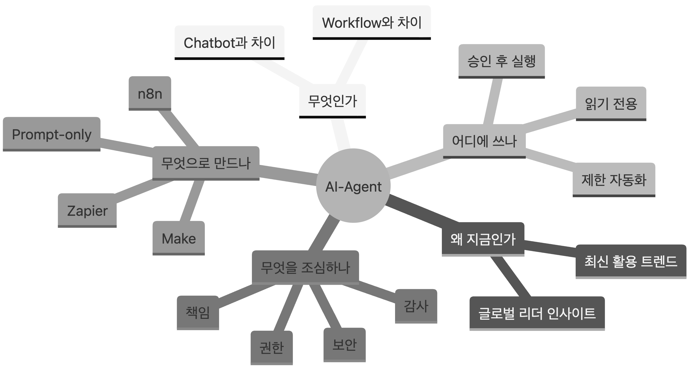
</div>

<!-- 
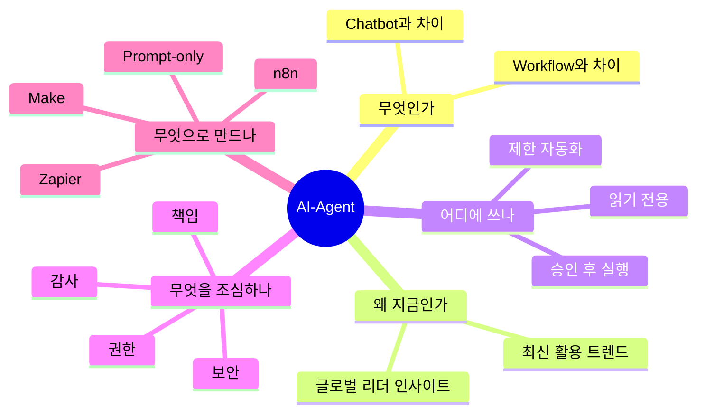
-->

<!-- 발표자노트

오늘은 기술 튜토리얼보다 판단력을 만드는 수업입니다. AI-agent가 무엇인지, 왜 지금 중요한지, 실제 업무에는 어떤 방식으로 들어오는지, 그리고 보안상 무엇을 조심해야 하는지 순서대로 보겠습니다.
-->


<!-- 

| 시간 | 파트 | 키워드 |
|---:|---|---|
| 0:00-0:05 | 오프닝 | 왜 지금 agent인가 |
| 0:05-0:15 | 글로벌 리더 인사이트 | workforce, agent boss, governance |
| 0:15-0:23 | AGI / SGI / Agent | 용어 정리 |
| 0:23-0:38 | AI-agent 개념 | 지시문, 지식, 도구, 실행 |
| 0:38-0:48 | 도구 없는 agent | Prompt-only, manual loop |
| 0:48-1:05 | 최신 트렌드 | 내장형 agent, human-agent team |
| 1:05-1:20 | 업무 사례 | 읽기 전용에서 제한 자동화까지 |
| 1:20-1:35 | 주의점 | 틀린 답변보다 틀린 행동 |
| 1:35-1:50 | 도구 비교 | n8n, Make, Zapier |

-->

---

# AI, AGI, SGI

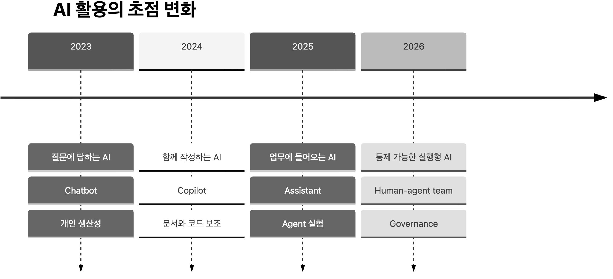


<!-- 발표자노트

처음에는 AI에게 질문하고 답을 받는 방식이 중심이었습니다. 이후 문서, 코드, 회의록을 함께 작성하는 copilot 형태가 확산됐고, 지금은 업무 시스템과 연결되어 일부 작업을 수행하는 agent로 관심이 이동하고 있습니다.


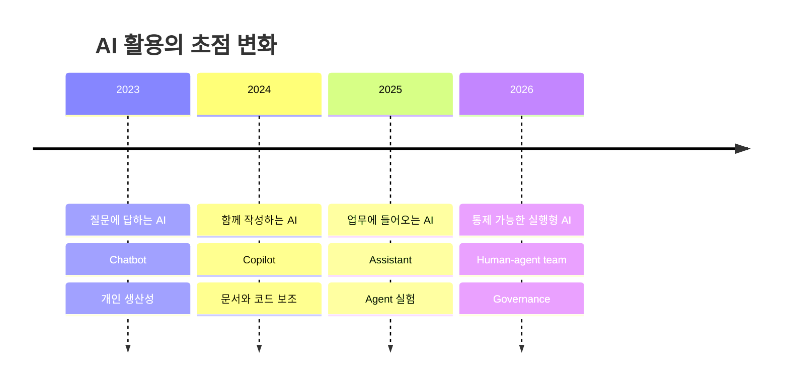
-->

---

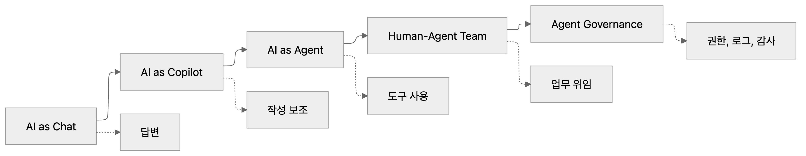

<!-- 발표자노트

핵심은 agent가 더 똑똑한 챗봇이라는 정도가 아니라는 점입니다. agent는 도구를 사용하고, 업무를 위임받고, 그 결과에 대해 관리와 감사가 필요해지는 시스템입니다.
 -->


<!-- 
표현은 다르지만 공통 방향은 비슷합니다. AI가 단순히 답변을 생성하는 도구에서 업무 흐름에 들어와 작업을 수행하는 시스템으로 이동하고 있습니다. 다만 이 흐름은 보안과 통제 문제를 함께 키웁니다.

AGI와 초지능은 중요한 배경이지만, 오늘의 실무 주제는 아닙니다. 오늘 다루는 것은 제한된 목표, 제한된 권한, 제한된 도구 안에서 업무를 보조하는 AI-agent입니다.
 -->

---

# AGI / SGI / AI-Agent

| 용어 | 의미 | 오늘의 위치 |
|---|---|---|
| ANI | 특정 작업을 잘하는 좁은 AI | 현재 대부분의 업무 AI |
| AGI | 다양한 지적 작업을 인간 수준으로 수행하는 범용 AI | 아직 논쟁적 목표 |
| ASI | 인간 지능을 크게 넘어서는 초지능 | 장기적 담론 |
| SGI | 보통 ASI/Superintelligence 의미로 쓰임 | 표준 용어로는 덜 일반적 |
| AI-Agent | 목표를 받고 도구를 사용해 작업하는 시스템 | 오늘의 실무 주제 |

<!-- 발표자노트

SGI라는 표현은 맥락에 따라 superintelligence를 뜻하는 식으로 쓰이지만, 표준적으로는 ASI 또는 Superintelligence라고 부르는 경우가 더 일반적입니다. 강의에서는 혼동을 줄이기 위해 초지능 또는 ASI로 정리하는 편이 좋습니다.
-->

---

# Agent는 AGI가 아니다

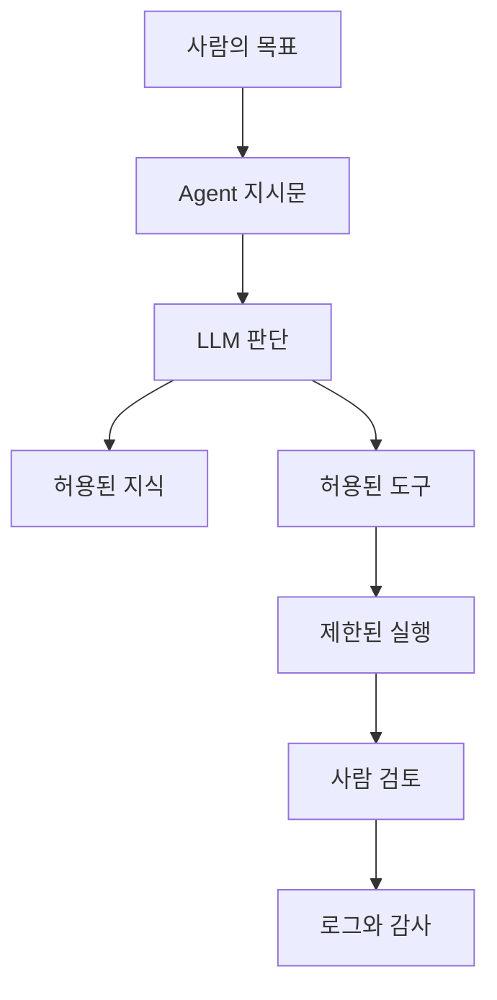

<!-- 발표자노트

업무용 agent는 모든 것을 스스로 이해하고 해결하는 범용 지능이 아닙니다. 사람이 목표와 규칙을 주고, 허용된 지식과 도구 안에서 제한적으로 실행하며, 중요한 순간에는 사람이 검토하는 구조입니다.
-->

---

# AI-Agent의 최소 구성

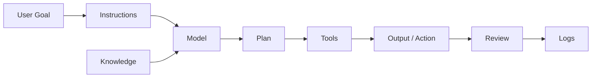

<!-- 발표자노트

agent를 구성하는 핵심은 모델 하나가 아닙니다. 역할과 규칙을 담은 지시문, 참고할 지식, 사용할 도구, 실행 결과, 사람 검토, 로그가 함께 있어야 업무 시스템으로 볼 수 있습니다.
-->

---

# Chatbot vs Workflow vs Agent

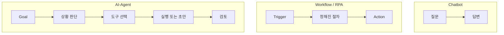

<!-- 발표자노트

챗봇은 답변이 중심이고, workflow는 정해진 절차가 중심입니다. agent는 목표를 받고 상황을 판단한 뒤 어떤 도구를 쓸지 결정합니다. 그래서 유연하지만, 그만큼 통제가 더 중요합니다.
-->

---

# Agent의 업무 등급

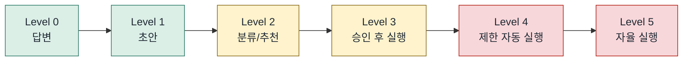

<!-- 발표자노트

보안 제약이 있는 회사라면 처음부터 자율 실행을 목표로 잡으면 안 됩니다. 초안 생성, 분류, 추천, 사람 승인 후 실행까지가 현실적인 출발점입니다.
-->

---

# 도구 없이 Agent를 만들 수 있나?

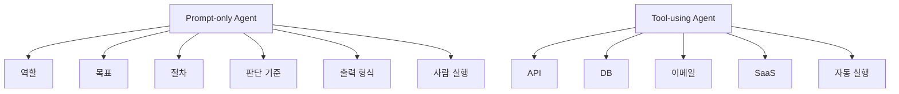

<!-- 발표자노트

가능합니다. 다만 도구 없이 만든 agent는 실제 시스템을 직접 실행하지는 못합니다. 대신 역할, 목표, 절차, 판단 기준, 출력 형식을 잘 정의해서 사람에게 실행 가능한 결과를 주는 prompt-only agent를 만들 수 있습니다.
-->

---

# Prompt-only Agent 템플릿

```zsh
역할:
너는 사내 문서 검토 agent다.

목표:
외부 공유 전 문서에서 보안상 위험한 표현을 찾는다.

절차:
1. 민감정보 후보를 찾는다.
2. 위험도를 낮음/중간/높음으로 분류한다.
3. 수정 문안을 제안한다.
4. 확신이 없으면 "검토 필요"라고 표시한다.

출력:
원문 / 위험 사유 / 위험도 / 수정 제안 / 사람 검토 필요
```

<!-- 발표자노트

이 예시는 외부 도구 연결 없이도 agent의 핵심 사고 방식을 체험하게 해줍니다. 보안상 민감한 회사에서는 이런 방식이 교육과 초기 실험에 특히 적합합니다.
-->

---

# 보안 제한 환경의 출발점

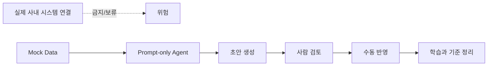

<!-- 발표자노트

보안 제한이 있는 환경에서는 실제 시스템을 연결하지 않아도 충분히 교육할 수 있습니다. 가짜 데이터로 분류, 요약, 검토, 초안 생성 과정을 보여주고, 사람 검토를 거쳐 수동으로 반영하는 흐름을 권장합니다.
-->

---

# 2026.04.20 현재 최신 트렌드

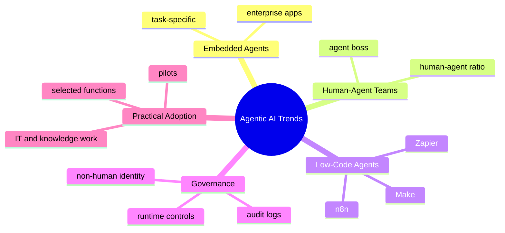

<!-- 발표자노트

2026년 4월 현재 흐름은 다섯 가지로 요약할 수 있습니다. 기업 앱에 agent가 내장되고, 사람과 agent가 함께 일하는 팀 모델이 논의되고, low-code 도구가 확산되고, 보안 governance가 중요해지고, 실제 도입은 아직 pilot과 일부 기능 중심입니다.
-->

---

# 트렌드 1: 내장형 Agent

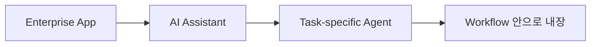

## Gartner 전망

`2026년 말까지 기업 애플리케이션의 40%가 task-specific AI agent를 포함`

<!-- 발표자노트

Gartner는 기업 애플리케이션 안에 특정 업무용 agent가 들어가는 흐름을 전망했습니다. 의미는 agent가 별도의 장난감 같은 실험 도구가 아니라, 우리가 쓰는 업무 소프트웨어 안으로 들어온다는 것입니다.
-->

---

# 트렌드 2: Human-Agent Team

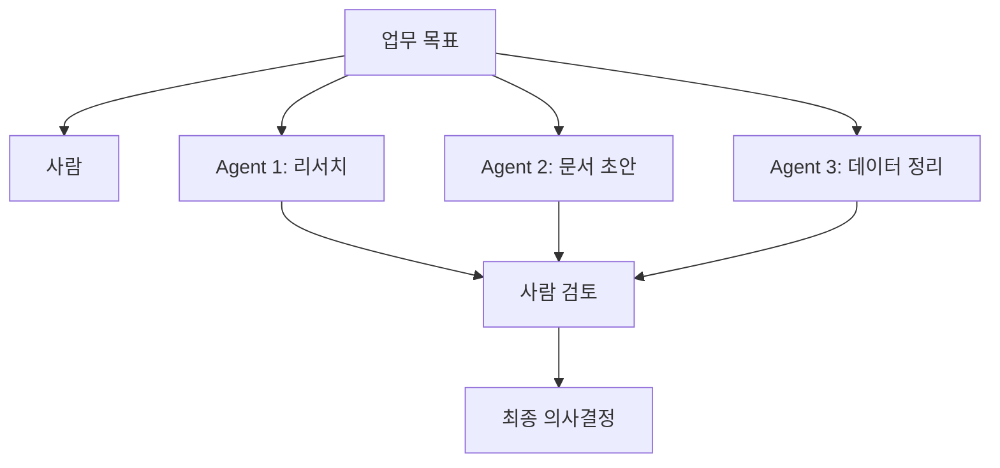

<!-- 발표자노트

Microsoft는 human-agent team과 agent boss라는 표현을 사용합니다. 직원은 agent에게 일을 맡기고, 결과를 검토하고, agent가 어떤 일을 해야 하는지 설계하는 역할을 하게 됩니다.
-->

---

# 트렌드 3: Pilot은 많고 Scale은 제한적

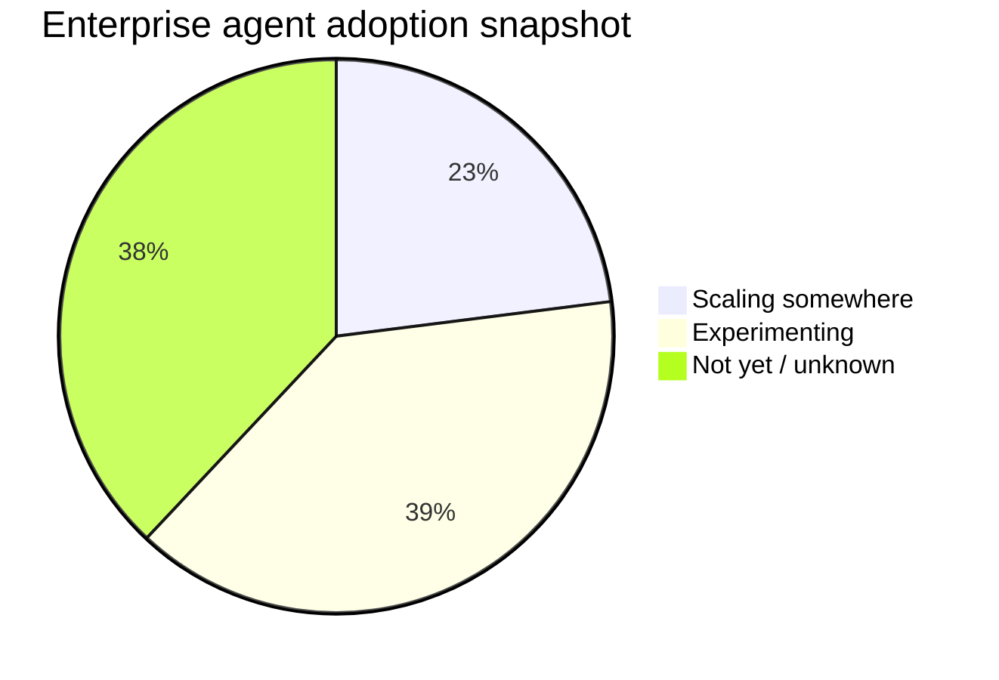

<!-- 발표자노트

McKinsey 2025 조사에서는 응답 기업 중 일부는 agentic AI를 확장하고 있고, 더 많은 조직은 실험을 시작했다고 설명합니다. 하지만 개별 업무 기능별로 널리 확산된 상태는 아닙니다. 즉 지금은 과장과 현실을 구분해야 하는 시점입니다.
-->

---

# 트렌드 4: 보안의 중심 이동

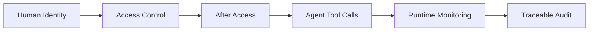

<!-- 발표자노트

agent 시대의 보안은 로그인만 통제해서 끝나지 않습니다. agent가 접근 권한을 받은 뒤 어떤 도구를 호출하고, 어떤 판단을 하고, 어떤 데이터를 옮기는지 실행 중에 관찰해야 합니다. non-human identity 관리가 중요해지는 이유입니다.
-->

---

# 업무 도입 우선순위

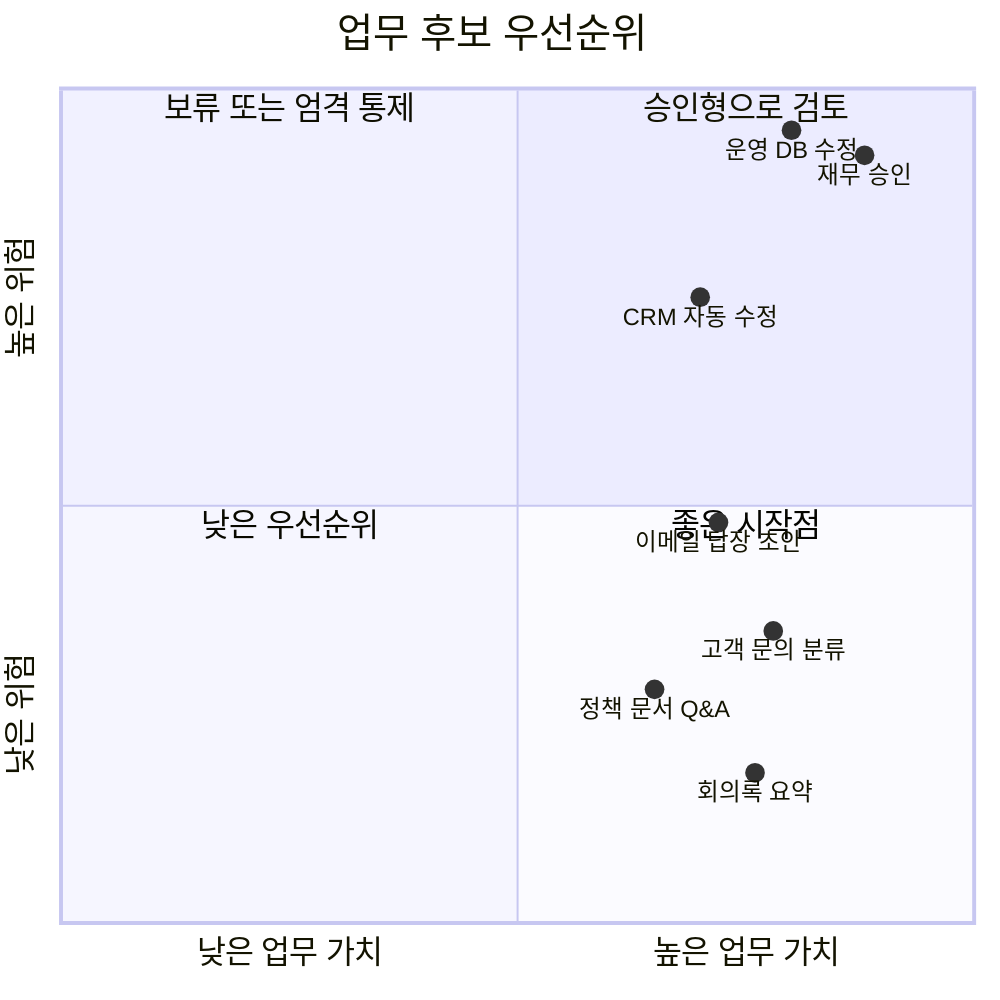

<!-- 발표자노트

도입 후보는 가치와 위험을 함께 봐야 합니다. 가치가 높고 위험이 낮은 업무가 출발점입니다. 가치가 높지만 위험도 높은 업무는 사람 승인, 권한 제한, 로그 체계가 갖춰진 뒤 검토해야 합니다.
-->

---

# 도입 단계

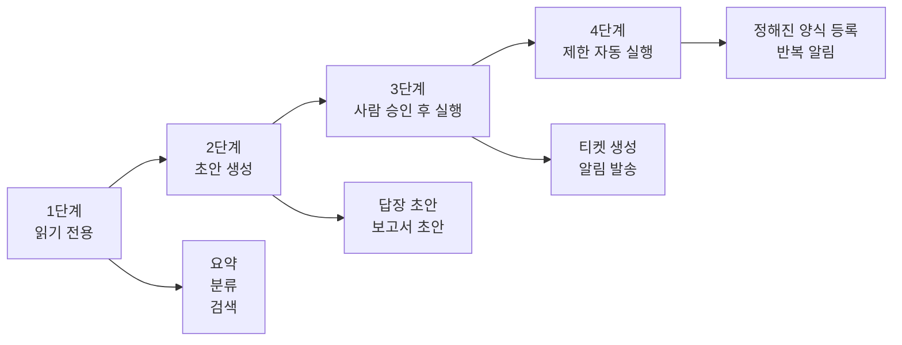

<!-- 발표자노트

우리 같은 보안 제한 환경에서는 읽기 전용과 초안 생성부터 시작하는 것이 좋습니다. 자동 실행은 명확한 정책과 승인 구조가 있을 때만 제한적으로 고려해야 합니다.
-->

---

# 우수 활용 사례 패턴

| 패턴 | 예시 | 권장 통제 |
|---|---|---|
| 분류 | 문의 유형, 티켓 우선순위 | 기준표, 샘플 검증 |
| 요약 | 회의록, 리서치, 정책 문서 | 원문 링크 유지 |
| 초안 | 이메일, 공지, 보고서 | 사람 승인 |
| 검색 | 정책 Q&A, FAQ | 출처 표시 |
| 변환 | CSV 정리, 양식 작성 | 검증 규칙 |
| 알림 | 담당자 라우팅 | 발송 전 확인 |

<!-- 발표자노트

성공 사례는 대부분 마법 같은 완전 자동화가 아닙니다. 반복되는 판단과 문서 작업을 줄이고, 마지막 책임은 사람이 지는 구조가 많습니다.
-->

---

# 위험한 업무

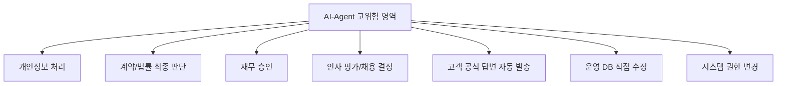

<!-- 발표자노트

이 업무들은 agent를 절대 쓰면 안 된다는 뜻은 아닙니다. 다만 초기 실험 대상으로 적합하지 않고, 쓰더라도 강한 통제와 책임 구조가 필요하다는 뜻입니다.
-->

---

# 구조적 한계

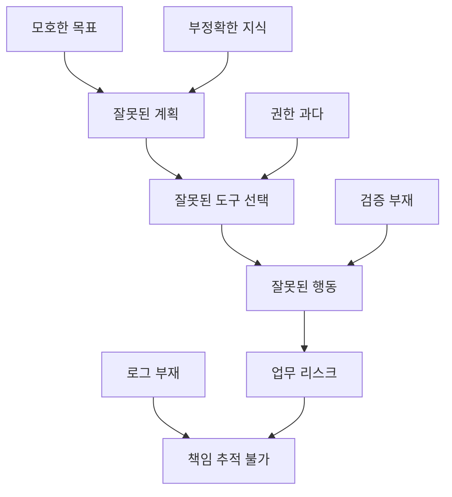

<!-- 발표자노트

agent의 핵심 리스크는 틀린 답변보다 틀린 행동입니다. 잘못된 계획, 잘못된 도구 호출, 과도한 권한, 검증 부재가 결합하면 실제 업무 리스크가 됩니다.
-->

---

# 보안 통제 모델

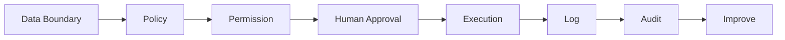

<!-- 발표자노트

보안 통제는 agent를 막기 위한 장치가 아니라 안전하게 쓸 수 있게 만드는 운영 구조입니다. 데이터 경계, 정책, 권한, 승인, 실행 로그, 감사가 하나의 체인으로 이어져야 합니다.
-->

---

# Human-in-the-loop 지점

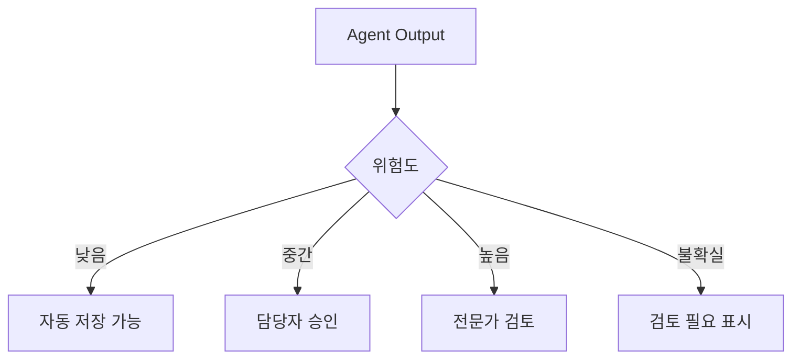

<!-- 발표자노트

모든 결과를 사람이 검토하면 자동화 가치가 줄고, 모든 결과를 자동 실행하면 위험합니다. 그래서 위험도에 따라 승인 단계를 다르게 설계해야 합니다.
-->

---

# Agentic Automation 도구 지도

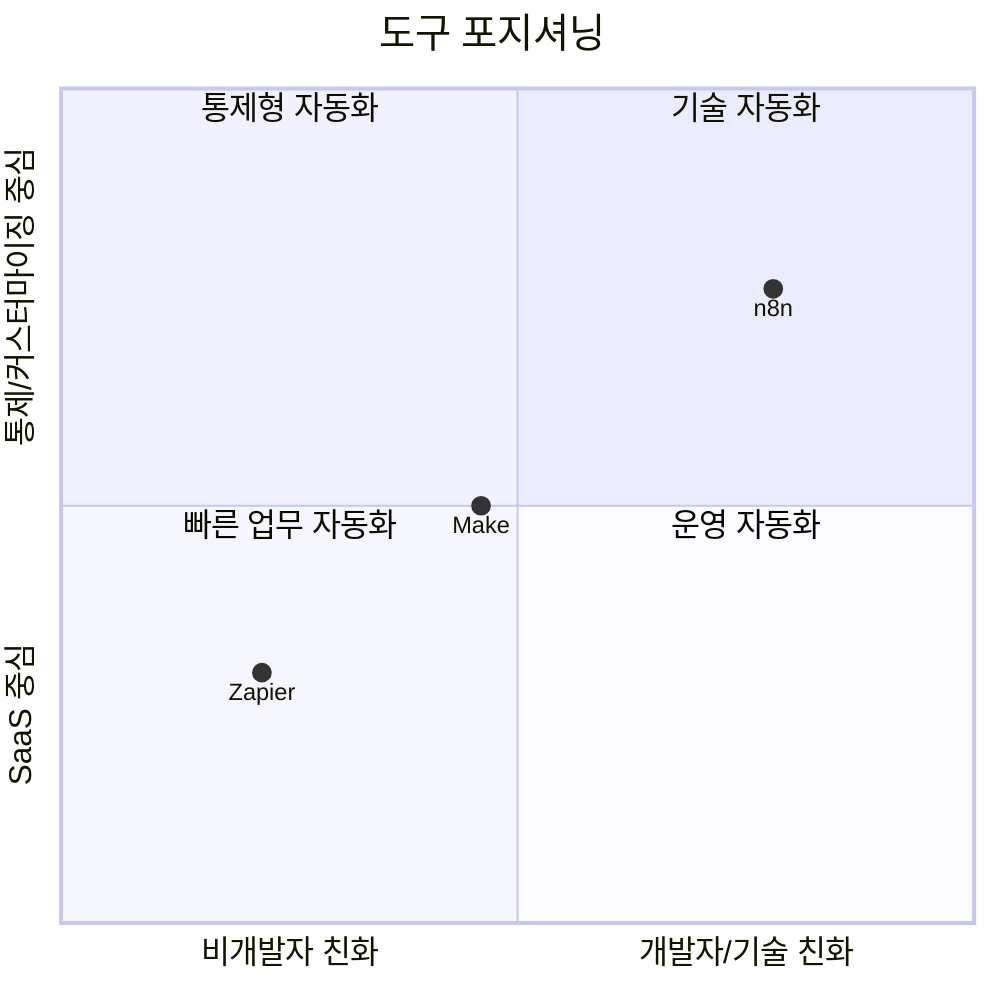

<!-- 발표자노트

이 도구들은 모두 자동화와 agent를 연결하지만 포지션이 다릅니다. Zapier는 SaaS 연결과 쉬운 시작, Make는 시각적 orchestration, n8n은 기술적 유연성과 self-host 검토 가능성이 강점입니다.
-->

---

# n8n / Make / Zapier 비교

| 항목 | n8n | Make | Zapier |
|---|---|---|---|
| 강점 | 기술 유연성, self-host 검토 | 시각적 설계, 투명성 | 앱 연결, 쉬운 시작 |
| 적합 | 개발팀, 자동화 담당 | 운영/마케팅/세일즈 | 비개발 조직, SaaS 업무 |
| Agent 방식 | AI Agent node, tools, memory | Make AI Agents | Zapier Agents |
| 보안 관점 | 운영 책임도 함께 증가 | SaaS 통제 검토 필요 | 데이터 반출 검토 필요 |
| 교육 데모 | 로컬/mock workflow | 시각적 흐름 설명 | 업무 담당자 이해 쉬움 |

<!-- 발표자노트

도구 선택은 기능 목록보다 회사의 보안 정책, 데이터 경계, 운영 책임에 맞춰야 합니다. 특히 외부 SaaS에 데이터를 보내는지, 읽기/쓰기 권한이 어떻게 관리되는지 봐야 합니다.
-->

---

# n8n 개념 그림

```mermaid
flowchart LR
  A["Trigger"] --> B["AI Agent Node"]
  B --> C["Model"]
  B --> D["Tools"]
  D --> E["HTTP/API"]
  D --> F["Database"]
  D --> G["Internal Service"]
  B --> H["Memory"]
  B --> I["Human Review"]
```

<!-- 발표자노트

n8n은 개발자나 자동화 담당자가 workflow를 세밀하게 구성하기 좋습니다. 공식 문서에서도 AI Agent node는 외부 도구와 API를 사용해 정보를 가져오고 행동할 수 있는 구조로 설명됩니다.
-->

---

# Make 개념 그림

```mermaid
flowchart LR
  A["Scenario"] --> B["AI Agent"]
  B --> C["Decision"]
  C --> D["App 1"]
  C --> E["App 2"]
  C --> F["App 3"]
  D --> G["Visible Workflow"]
  E --> G
  F --> G
```

<!-- 발표자노트

Make는 시각적 workflow가 강점입니다. Make는 AI Agents를 3000개 이상의 앱과 연결해 복잡한 workflow를 조율하고, agent의 판단을 볼 수 있다는 점을 강조합니다.
-->

---

# Zapier 개념 그림

```mermaid
flowchart LR
  A["Instructions"] --> B["Zapier Agent"]
  B --> C["Knowledge Sources"]
  B --> D["Actions"]
  D --> E["Gmail"]
  D --> F["Slack"]
  D --> G["Sheets"]
  D --> H["CRM"]
  B --> I["Publish"]
```

<!-- 발표자노트

Zapier는 비개발자에게 친숙한 SaaS 연결이 강점입니다. Zapier Agents는 instructions, knowledge sources, actions를 연결해 agent를 만들고 publish하는 흐름을 제공합니다.
-->

---

# 도구 선택 기준

```mermaid
flowchart TD
  A["도구 선택"] --> B{사내 데이터가 외부로 나가도 되는가}
  B -->|아니오| C["내부 검토 / self-host / mock only"]
  B -->|예| D{비개발자가 운영할 것인가}
  D -->|예| E["Zapier 또는 Make 검토"]
  D -->|아니오| F{API/커스텀이 중요한가}
  F -->|예| G["n8n 검토"]
  F -->|아니오| H["Make 검토"]
```

<!-- 발표자노트

도구를 고를 때 첫 질문은 기능이 아니라 데이터입니다. 어떤 데이터가 어디로 나가는지 답하지 못하면 도구 비교는 의미가 없습니다.
-->

---

# 시연 예제 A: 고객 문의 분류

```mermaid
flowchart LR
  A["Mock CSV"] --> B["Agent: 유형 분류"]
  B --> C["긴급도 판단"]
  C --> D["답변 초안"]
  D --> E["사람 승인"]
  E --> F["Mock Sheet 저장"]
```

<!-- 발표자노트

첫 번째 추천 시연은 고객 문의 분류입니다. 실제 고객 데이터가 아니라 mock CSV를 사용합니다. agent는 문의 유형, 긴급도, 답변 초안을 만들고, 사람 승인 후 mock sheet에 저장하는 구조입니다.
-->

---

# 시연 데이터

| 필드 | 값 |
|---|---|
| 고객명 | 테스트고객01 |
| 문의 | 결제는 완료됐는데 주문 상태가 아직 대기중입니다. |
| 채널 | 이메일 |
| 주문번호 | MOCK-2026-001 |

```mermaid
flowchart TD
  A["입력"] --> B["분류: 결제/주문상태"]
  A --> C["긴급도: 중간"]
  A --> D["답변 초안"]
  A --> E["담당팀: 고객지원"]
  A --> F["승인 필요: 예"]
```

<!-- 발표자노트

실제 데이터가 아니어도 agent의 핵심을 보여줄 수 있습니다. 분류와 초안은 AI가 하되, 고객에게 발송하거나 시스템을 수정하는 행동은 사람이 승인합니다.
-->

---

# 시연 예제 B: 회의록 Action Item

```mermaid
flowchart LR
  A["Mock 회의록"] --> B["요약"]
  B --> C["Action Item 추출"]
  C --> D["담당자/기한 추정"]
  D --> E["확인 필요 항목 표시"]
```

<!-- 발표자노트

두 번째 시연은 회의록에서 action item을 뽑는 것입니다. 이 예제는 보안 위험이 낮고 많은 직원이 체감하기 쉽습니다. 특히 담당자와 기한이 명확하지 않을 때 확정하지 않고 확인 필요로 표시하는 점을 강조합니다.
-->

---

# 시연 예제 C: 정책 문서 Q&A

```mermaid
flowchart TD
  A["Mock 휴가 정책 문서"] --> B["Knowledge"]
  B --> C["Q&A Agent"]
  C --> D{문서에 근거 있음?}
  D -->|예| E["답변 + 출처"]
  D -->|아니오| F["문서에서 확인되지 않음"]
```

<!-- 발표자노트

세 번째 시연은 가짜 사내 정책 문서를 기반으로 한 Q&A입니다. 중요한 포인트는 모를 때 그럴듯하게 답하지 않고 문서에서 확인되지 않는다고 말하게 하는 것입니다.
-->

---

# 실습용 Prompt-only Agent

```txt
너는 고객지원 문의 분류 agent다.

목표:
고객 문의를 읽고 유형, 긴급도, 담당팀, 답변 초안을 작성한다.

규칙:
- 실제 발송 문구가 아니라 초안만 작성한다.
- 개인정보가 있으면 "민감정보 포함"으로 표시한다.
- 확신이 낮으면 "사람 검토 필요"로 표시한다.

출력:
분류 / 긴급도 / 담당팀 / 답변 초안 / 검토 필요 사유
```

<!-- 발표자노트

이 프롬프트는 도구 없이 바로 시연할 수 있습니다. 핵심은 agent에게 역할뿐 아니라 목표, 금지사항, 판단 기준, 출력 형식을 함께 주는 것입니다.
-->

---

# 회사 적용 판단 체크리스트

```mermaid
flowchart TD
  A["업무 후보"] --> B{민감정보 포함?}
  B -->|예| C["보안/법무 검토"]
  B -->|아니오| D{쓰기 권한 필요?}
  D -->|아니오| E["읽기 전용 실험"]
  D -->|예| F{사람 승인 가능?}
  F -->|예| G["승인형 실험"]
  F -->|아니오| H["보류"]
```

<!-- 발표자노트

교육의 마지막에는 이 체크리스트를 기억하면 됩니다. 민감정보가 있는지, 쓰기 권한이 필요한지, 사람 승인을 넣을 수 있는지에 따라 실험 가능성이 달라집니다.
-->

---

# 도입 원칙 5가지

```mermaid
mindmap
  root((Agent 도입 원칙))
    Small
      작은 업무부터
    Safe
      민감정보 제외
    Supervised
      사람 승인
    Specific
      좁은 목표
    Traceable
      로그와 감사
```

<!-- 발표자노트

다섯 단어로 정리하면 small, safe, supervised, specific, traceable입니다. 작은 업무부터, 안전한 데이터로, 사람이 감독하고, 목표를 좁히고, 로그를 남기는 것입니다.
-->

---

# 최종 인사이트

```mermaid
flowchart TD
  A["AI-Agent 도입"] --> B["기술 문제가 아니다"]
  B --> C["업무 위임 설계"]
  C --> D["권한 설계"]
  D --> E["검토 설계"]
  E --> F["책임 설계"]
```

<!-- 발표자노트

오늘의 결론입니다. AI-agent 도입은 모델을 고르는 문제가 아니라 업무 위임 구조를 설계하는 문제입니다. 어떤 일을 맡기고, 어떤 권한을 주고, 누가 검토하고, 문제가 생기면 누가 책임지는지를 정해야 합니다.
-->

---

# 한 문장으로 정리

## AI-agent는 당장 모든 일을 맡길 직원이 아니라,

## 제한된 권한과 명확한 검토 절차 안에서

## 반복 업무를 줄이는 통제 가능한 업무 보조자다.

<!-- 발표자노트

이 문장을 마지막 메시지로 가져가면 좋습니다. 우리 회사에서 AI-agent를 바라보는 올바른 관점은 자율적인 만능 직원이 아니라, 통제 가능한 업무 보조자입니다.
-->

---

# 참고 자료

| 주제 | 자료 |
|---|---|
| OpenAI / AGI / agent | [Sam Altman, Reflections](https://blog.samaltman.com/reflections) |
| Human-agent team | [Microsoft Work Trend Index 2025](https://blogs.microsoft.com/blog/2025/04/23/the-2025-annual-work-trend-index-the-frontier-firm-is-born/) |
| Enterprise app agents | [Gartner AI Agents Forecast](https://www.gartner.com/en/newsroom/press-releases/2025-08-26-gartner-predicts-40-percent-of-enterprise-apps-will-feature-task-specific-ai-agents-by-2026-up-from-less-than-5-percent-in-2025) |
| Agent adoption | [McKinsey State of AI 2025](https://www.mckinsey.com/capabilities/quantumblack/our-insights/the-state-of-ai) |
| Agent security | [McKinsey Agentic Enterprise Security](https://www.mckinsey.com/capabilities/risk-and-resilience/our-insights/securing-the-agentic-enterprise-opportunities-for-cybersecurity-providers) |
| n8n | [n8n AI Agent node](https://docs.n8n.io/integrations/builtin/cluster-nodes/root-nodes/n8n-nodes-langchain.agent/) |
| Make | [Make AI Agents](https://www.make.com/en/ai-agents) |
| Zapier | [Zapier Agents](https://help.zapier.com/hc/en-us/articles/24393442652557-Build-an-agent-in-Zapier-Agents) |

<!-- 발표자노트

자료는 모두 강의 준비일 기준으로 확인한 링크입니다. 기능과 제품 정책은 빠르게 바뀌기 때문에 실제 도입 검토 시점에는 반드시 최신 약관, 보안 문서, 데이터 처리 정책을 다시 확인해야 합니다.
-->

