<style> 
   .cite-author { 
      text-align        : right; 
   }
   .cite-author:after {   
      color             : #f87ca1;
      font-size         : 130%;
      font-style        : italic;
      font-weight       : bold;
      font-family       : Cambria, Cochin, Georgia, Times, 'Times New Roman', serif;
      padding-right     : 130px;
   }
   .cite-author[data-text]:after {
      content           : " - "attr(data-text) " - ";      
   }
   .cite-author p {    
      padding-bottom : 40px
   } 
   .classReact rect {
    fill: #61dafb;
    stroke: #000;
    stroke-width: 2px;
    rx: 10;
    ry: 10;
    max-width: 350px;
  }
  {
   -webkit-user-select: none;  /* Chrome, Safari, Opera */
    -moz-user-select: none;     /* Firefox */
    -ms-user-select: none;      /* IE/Edge */
    user-select: none;          /* Standard */
  }

</style>    

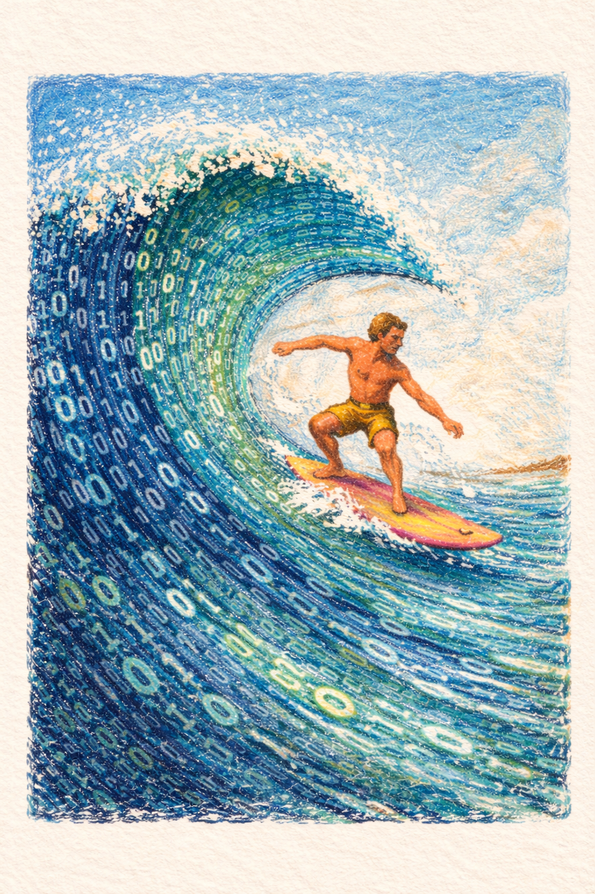

<!-- _class: titlepage -->

# AI Agent × 개념부터 실전까지
### AI AGENT 와 업무 재정의

<br><br><br><br><br>


<!-- <div class="title"> HTML, CSS, Javascript  </div>
<div class="subtitle"> 웹과 가까워지기  </div> -->
<div class="author"> 권 수 정 <a href="https://suekwon.github.io/about/" target="_blank" style="color: #aed6f1;">  
</a></div>

<div class="organization">AI전략 컨설턴트 | <div style="display: inline;">  <a href="http://www.from-insight.com" target="_blank"> From Insight Inc. </a> </div>


<!-- 발표자노트

안녕하세요. 오늘은 단순한 챗봇을 넘어, 우리를 대신해 행동하고 판단하는 'AI 에이전트'에 대해 알아보겠습니다. 어떤 업무부터 조심스럽게 검토할 수 있는지 판단하는 기준을 가질 수 있도록 실무적 관점을 다루려 합니다. 

특히 보안제약은? 
-->

---

## 강사 소개

권수정
AI 전략 컨설턴트 | 프롬인사이트

- 산업공학 박사
- 생성형AI · 강화학습 · 머신러닝
  연구 및 실무 적용 전문
- 공공기관·금융·산업 현장
  AI 기반 의사결정 구현 경험


---

# 글로벌 테크기업 리더들은 지금,

<div class="columns">

<div>
</div>

<div>

```
"AGI는 2026년 도달 가능하다"                    
                    — Elon Musk, xAI CEO

"AI 인프라 구축은 인류 역사상 가장 큰 투자다"
                    — Jensen Huang, NVIDIA CEO

"두뇌(모델)는 준비됐다. 몸이 따라오는 중" 
                    — Demis Hassabis, Google DeepMind CEO
```

</div>
</div>

```
"수천 일 안에 초지능이 온다.
 앞으로 4년 내 대부분의 인지 노동을
 AI가 대체할 것이다."
                    — Sam Altman, OpenAI CEO


"AI 인지 능력은 4~12개월마다 2배 성장 중"    
                    — Dario Amodei, Anthropic CEO

```
<!-- > **발표자 노트:**
> 여기서 중요한 포인트는, 이 사람들이 단순한 테크 낙관론자가 아니라 실제로 AI를 만들고 있는 사람들이라는 점입니다. Dario Amodei는 Claude를 만든 Anthropic의 CEO입니다. Jensen Huang은 AI 칩의 90%를 공급하는 NVIDIA의 CEO입니다. 이들의 말은 예측이 아니라 실제 관찰에서 나온 발언입니다. -->

---

```
"2026년은 AI 발견의 시대가 끝나고
 확산의 시대가 시작되는 해다.
 에이전트 퍼스트 경제로 전환 중이다."

                    — Satya Nadella, Microsoft CEO


"AI의 지능에는 상한선이 없다.
 인간 수준을 넘기 전에 멈추지 않을 것이다.
 주 4일제를 준비하라."

                    — Bill Gates, Microsoft Founder
```

<!-- > **발표자 노트:**
> Satya Nadella는 매우 현실적인 사람입니다. 그는 AGI라는 단어 자체를 "의미 없는 벤치마크 게임"이라고 했습니다. 중요한 건 실제로 얼마나 많은 인지 노동이 자동화되느냐라고 말합니다. Bill Gates의 주 4일제 발언은 흥미롭습니다. AI가 생산성을 높이면 인간의 노동 시간 자체가 줄어들 수 있다는 얘기입니다. -->

---

# 낙관론 vs 신중론 — 그러나 방향은 하나

<div class="columns">
<div style = "width:100%">

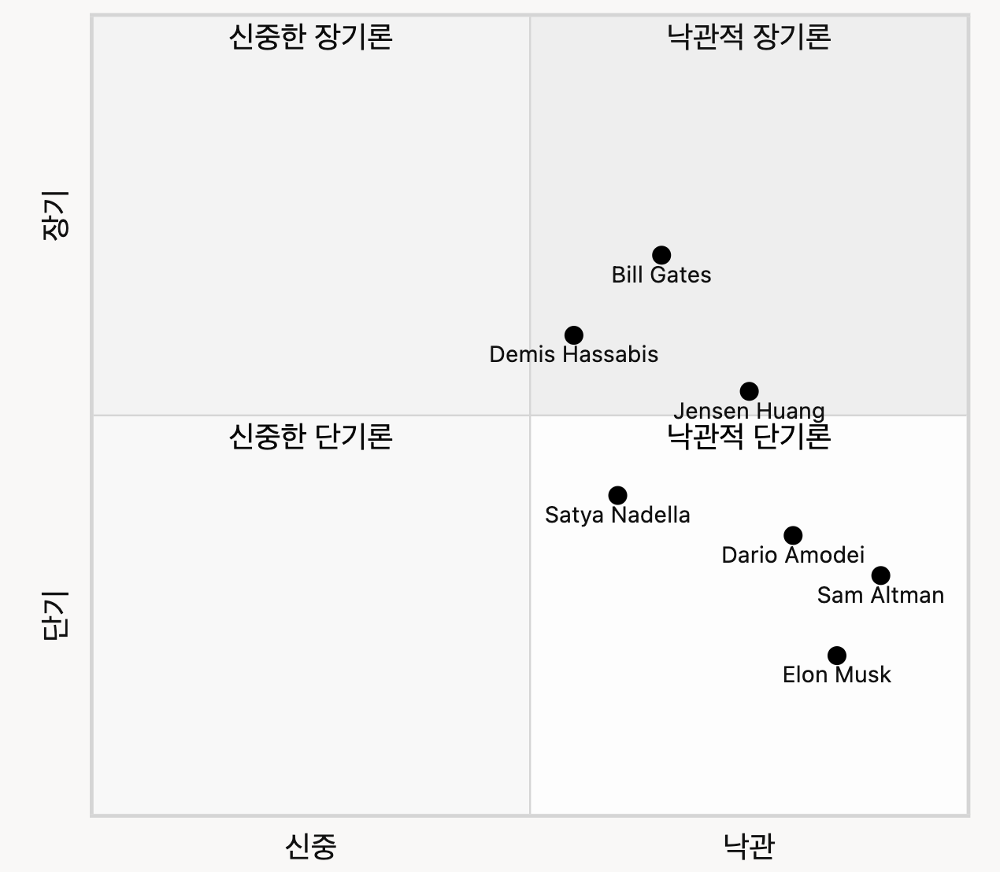
</div>

<div>

<br><br><br> 

**공통 결론** 
- **시점에 대한 이견만, 방향에 대한 이견 없음**
- 누가 더 빠를지는 모르겠지만, AI가 인간의 지적 노동을 대체한다는 것에는 모두 동의

<br><br><br>

> [2025.12 Jeffery Hinton 인터뷰](https://www.ainet.link/24091)
</div>
</div>


<!-- > **발표자 노트:**
> 이 차트가 오늘 강의의 핵심 전제입니다. 누가 더 빠르게 올 것인지에 대해서는 의견이 갈립니다. 하지만 AI가 인간의 지적 노동을 상당 부분 대체하는 방향으로 가고 있다는 것에 이견을 가진 리더는 없습니다. 오늘 강의는 이 방향을 전제로 합니다. -->

---

# Today's Pathway

<div style = "width:70%; margin: 0 auto">

   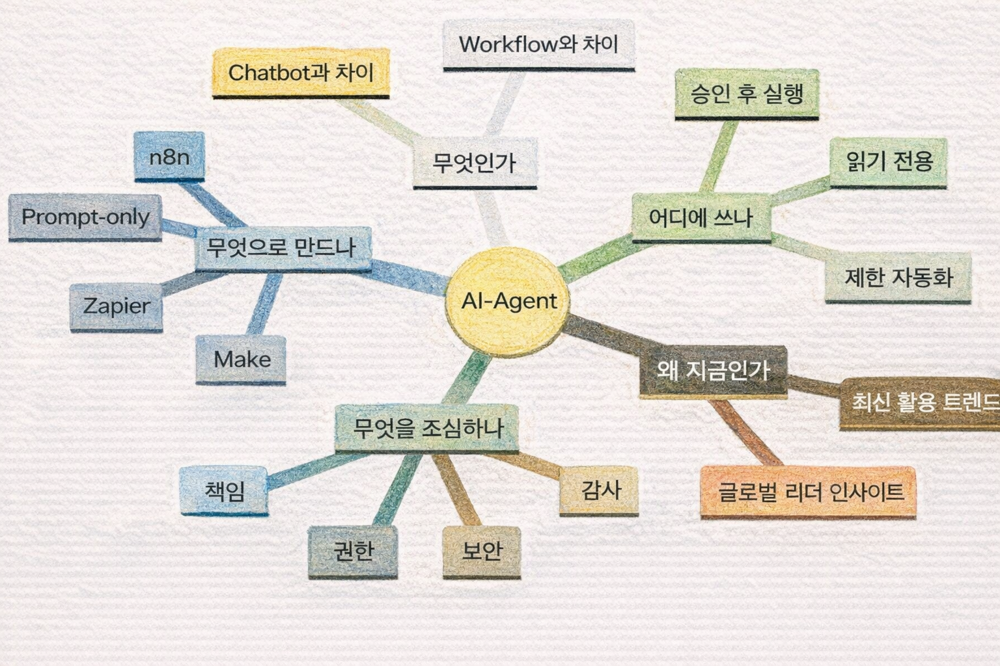
</div>

---

# PART 1. So, *What* is it? 

---

# AI의 진화 — AI · AGI · SGI

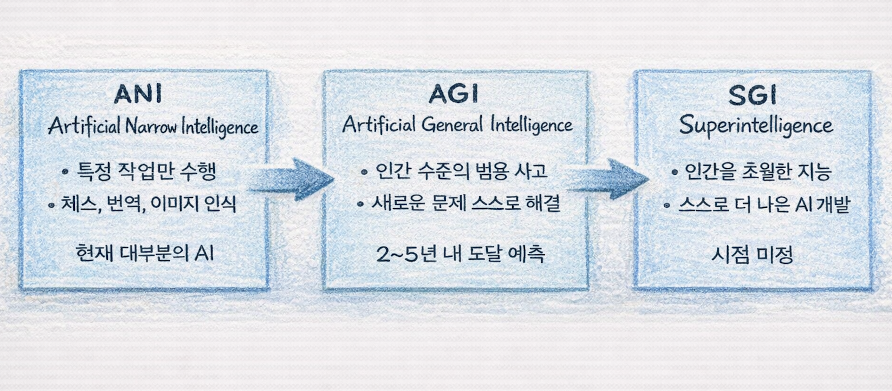


<!-- > **발표자 노트:**
> ANI는 Artificial Narrow Intelligence. 지금 우리가 쓰는 ChatGPT, 번역기, 추천 알고리즘이 모두 ANI입니다. 매우 뛰어나지만 딱 그 일만 합니다. AGI는 인간처럼 어떤 문제도 스스로 생각하고 해결하는 AI입니다. SGI는 Superintelligence로, 인간보다 모든 면에서 뛰어난 AI입니다. 오늘 우리가 다룰 AI 에이전트는 ANI와 AGI 사이 어딘가에 위치합니다. 단순 도구에서 목표를 이해하고 스스로 계획하는 방향으로 진화하는 중입니다. -->

---

## 현재 AI, 우리의 위치 

<div style = "width:72%; margin: 0 auto">

   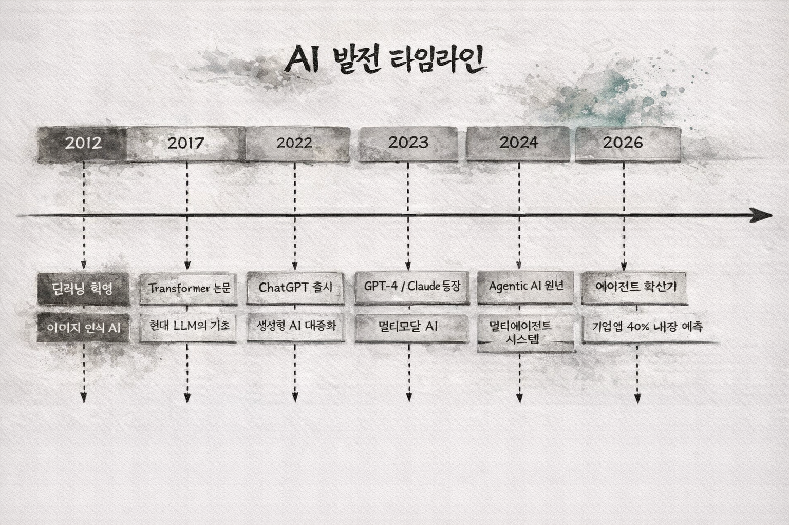

</div>


<!-- > **발표자 노트:**
> 2022년 ChatGPT가 나온 지 불과 4년이 지났습니다. 그 사이 AI는 "질문에 답하는 것"에서 "스스로 행동하는 것"으로 진화했습니다. 오늘 여러분이 배울 AI 에이전트는 바로 이 "스스로 행동하는 AI"입니다. -->

---

# 챗봇 vs AI 에이전트

<div style = "width:70%; margin: 0 auto">

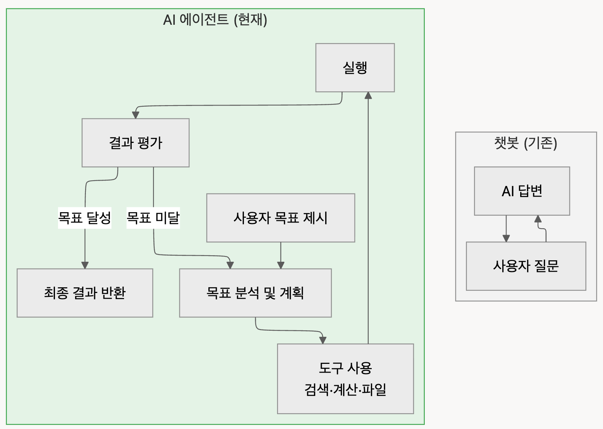

</div>

<!-- > **발표자 노트:**
> 챗봇은 질문-답변의 1회성 상호작용입니다. "오늘 날씨 어때?"라고 물으면 답을 줍니다. AI 에이전트는 다릅니다. "다음 주 출장 준비해줘"라고 하면, 스스로 일정을 확인하고, 호텔을 검색하고, 비용을 계산하고, 예약을 진행합니다. 중간에 문제가 생기면 다시 계획을 세웁니다. 이 차이가 핵심입니다. -->
---

## 싱글 vs. 멀티 에이전트 

<div style = "width:73%; margin: 0 auto">

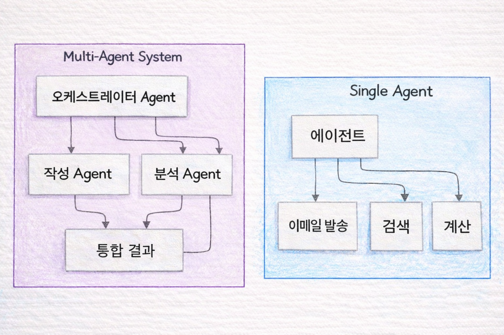

</div>

<!-- 
> Single Agent는 혼자 모든 것을 처리합니다. 간단한 작업에 적합합니다. Multi-Agent는 여러 에이전트가 팀처럼 협력합니다. 한 명이 조사하고, 한 명이 분석하고, 한 명이 보고서를 씁니다. 복잡한 업무일수록 Multi-Agent가 더 효과적입니다. 우리가 팀으로 일하는 것처럼요. -->

---

## 에이전트의 일하는 방식 — ReAct 루프

<div style = "width:75%; margin: 0 auto">

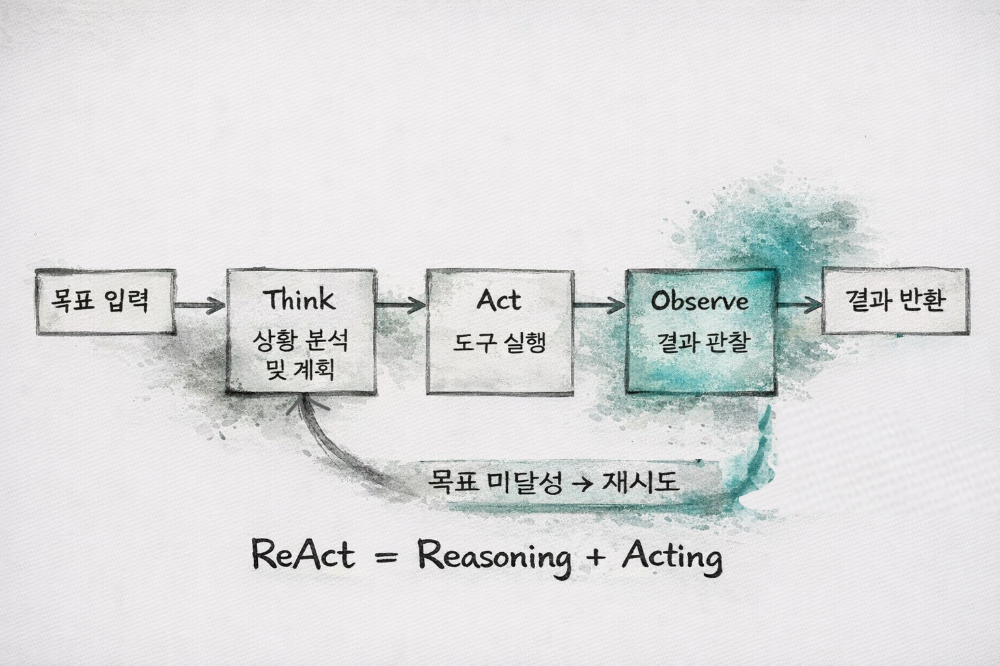

</div>


<!-- > **발표자 노트:**
> ReAct는 AI 에이전트가 작동하는 핵심 원리입니다. 생각하고(Think), 행동하고(Act), 결과를 보고(Observe), 다시 생각합니다. 이 루프가 목표를 달성할 때까지 반복됩니다. 사람이 문제를 해결할 때와 동일한 방식입니다. -->


--- 

# PART 2. Then, *How* to use is it? 
## [AWS bedrock 대안 ? ](https://aws.amazon.com/ko/bedrock/agents/)

---

# 어디서 부터 시작할까? 

<div style = "width:75%; margin: 0 auto">

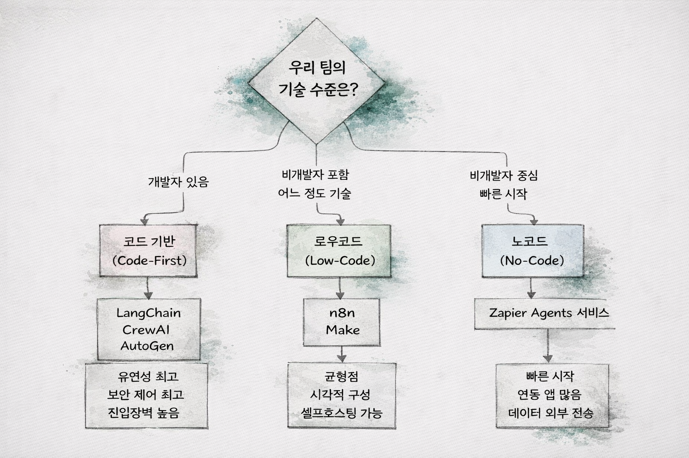

</div>

<!-- 
> 에이전트를 만드는 방법은 크게 세 가지입니다. 코드로 직접 짜거나, 시각적 도구로 구성하거나, 완성된 SaaS를 쓰거나. 보안이 중요한 우리 환경에서는 데이터가 외부로 나가지 않는 코드 기반 또는 로우코드 방식이 현실적입니다. -->
---

# Without Tools - *코드 기반* 

### 보안 환경 핵심 조합: **n8n 셀프호스팅** + **Ollama 로컬 LLM**

<div style = "width:70%; margin: 0 auto">

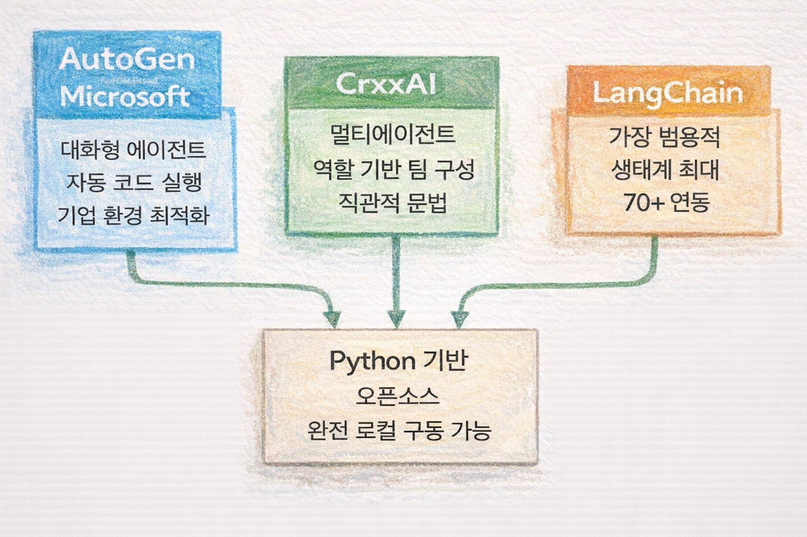

</div>

<!-- 코드 기반 접근의 가장 큰 장점은 데이터가 외부로 전혀 나가지 않는다는 점입니다. Ollama라는 도구를 쓰면 사내 서버에서 AI 모델을 직접 구동할 수 있습니다. LangChain, CrewAI, AutoGen 모두 오픈소스라 라이선스 비용이 없습니다. 개발자가 있는 팀이라면 가장 강력한 선택지입니다.  -->
---

# With Tools - 대표 *도구들*

| 항목 | n8n | Make | Zapier |
|------|-----|------|--------|
| **시각적 편집** | 중간 | 최고 | 중간 |
| **MCP 서버** | 가능 | 가능 | 가능 |
| **연동 앱 수** | 500+ | 3,000+ | 9,000+ |
| **가격 (월)** |  cloud 버전 €20~ <br> 셀프호스팅 시 무료 | $9~ | $19.99~ |
| **기술 난이도** | 중~고 | 낮~중 | 낮 |
| **데이터 주권** | 완전 통제 가능 | 클라우드 저장 | 클라우드 저장 |
| **보안 환경 적합성** | 높음 | 낮음 | 낮음 |

<!-- 
> 보안 환경에서 가장 중요한 기준은 "데이터가 어디에 저장되는가"입니다. Make와 Zapier는 클라우드 기반이라 데이터가 외부 서버를 거칩니다. n8n은 사내 서버에 직접 설치할 수 있어서 데이터가 외부로 나가지 않습니다. 이것이 우리 환경에서 n8n이 가장 현실적인 선택인 이유입니다. -->

---

<h2> 예제1. n8n  이용
</h2>

<div style="width:40%; margin: 0 auto">

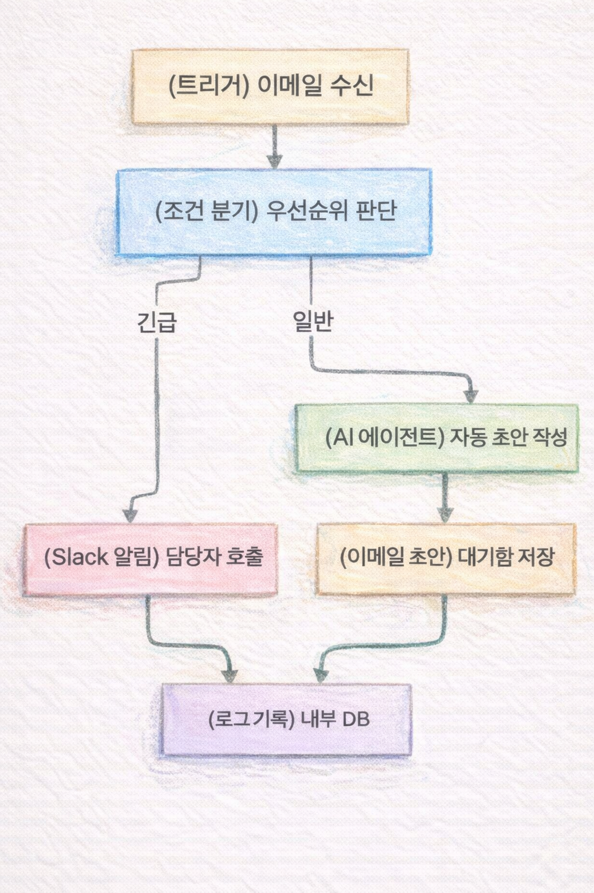

</div>

<!-- 이것이 n8n의 실제 워크플로우 구조입니다. 왼쪽부터 오른쪽으로 흐릅니다. 이메일이 들어오면, 조건을 판단하고, 긴급하면 즉시 알림을 보내고, 일반이면 AI가 초안을 작성합니다. 모든 결과는 내부 DB에 기록됩니다. 외부 API 없이 사내에서만 동작합니다.  -->

---

<h2> 예제2. Make  이용
</h2>


<div style="width:68%; margin: 0 auto">

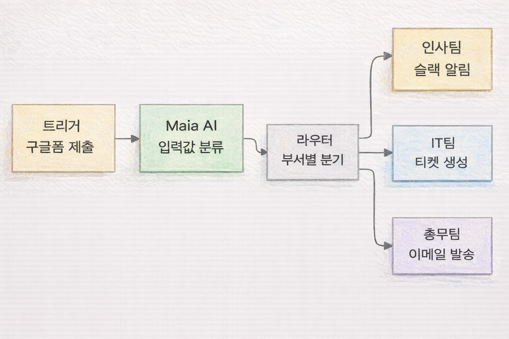

</div>

> [cloude native data integration tool](https://www.maia.ai/)

<!-- 
 Make는 시각적으로 가장 예쁘고 직관적입니다. Maia라는 AI 어시스턴트가 자연어로 시나리오를 만들어줍니다. 단, 클라우드 기반이라 민감한 데이터를 다룰 때 주의가 필요합니다. 외부 공개 데이터나 비민감 업무 자동화에 적합합니다.
 -->
---

<h2> 예제3. Zapier 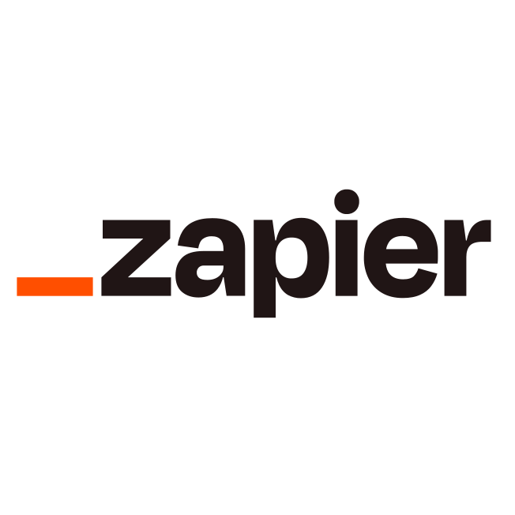 이용
</h2>

<div style="width:70%; margin: 0 auto">

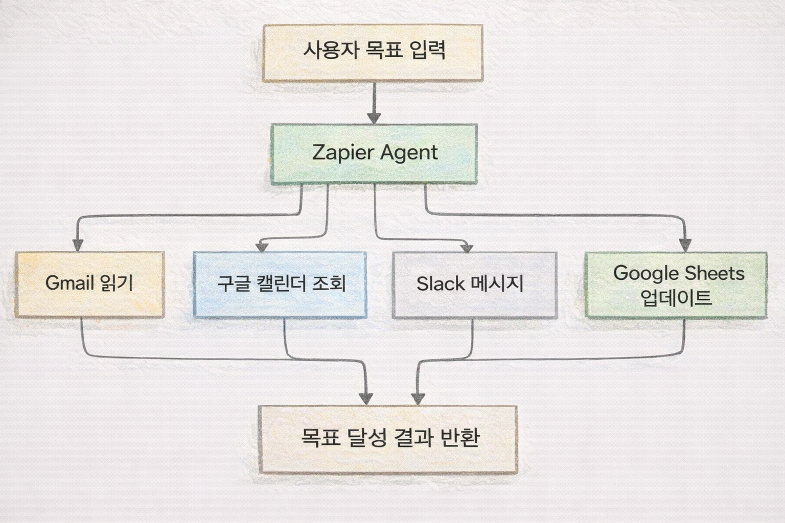

</div>

<!-- Zapier는 연결할 수 있는 앱이 8,000개 이상으로 압도적으로 많습니다. 특정 앱 연동이 필요한 경우 Zapier가 가장 빠릅니다. 그러나 모든 데이터가 Zapier 서버를 거칩니다. 내부 보안 정책 확인 후 사용 여부를 결정해야 합니다.
 -->

---

# 우리 환경에서 선택 기준

<div style="width:70%; margin: 0 auto">


</div>

<!-- 
우리 회사 환경을 기준으로 보면, 보안 정책상 외부 데이터 전송이 제한되어 있으므로 n8n 셀프호스팅이 가장 현실적인 선택입니다. 시연에서는 n8n을 기준으로 보여드리겠습니다
 -->

---

## 이벤트 기반에서 스케줄링

<div style="width:80%; margin: 0 auto">

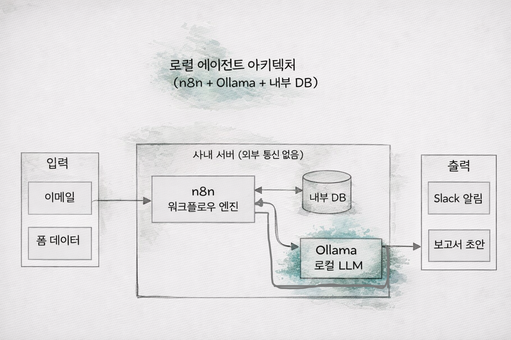

</div>

---

# PART 3. 특히 고려할 점
## 한계와 주의사항 중심으로
---

## 어떻게 코딩하고 계신가요?

<div class="columns">
<div >

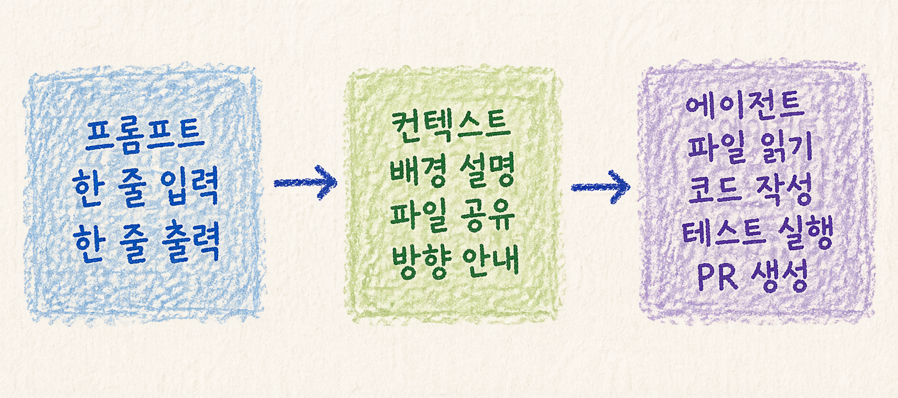

</div>
<div >

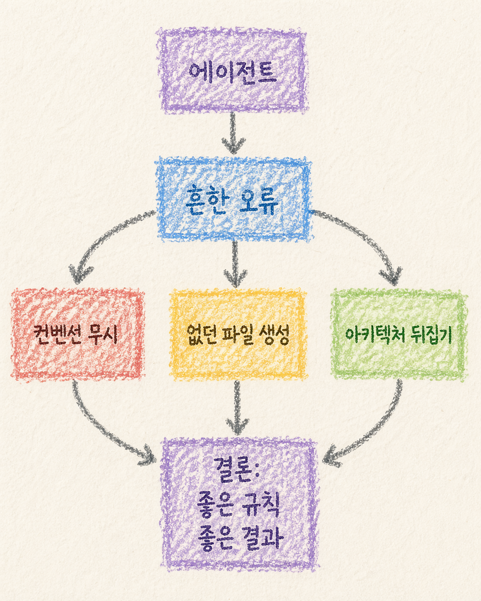

</div>
</div>

---

# LLM 구조: 강점과 구조적 한계 


<div class="columns">
<div>

   ### 생성형 AI란 무엇인가?
   - **G**enerative **P**re-trained **T**ransformer
   - 방대한 텍스트 학습 → 패턴 파악 → **다음 단어 예측·생성**
   - 텍스트, 이미지, 음성, 영상 모두 생성 가능

   <div class="mt-4 warn-box" style="transform: scale(0.85); transform-origin: top center; font-size: 0.9em;">
   📖 <strong>GPT는 백과사전이 아님</strong><br>
   "가장 자연스러운 다음 단어"를 확률적으로 고르는<br>
   <strong>언어 패턴 예측기</strong><br>
   → 이것이 가끔 틀리는 이유이자 활용법의 핵심!
   </div>

   > *테슬라 내비게이션 시스템 LLM이 부적절하게 사용된 사례
   > *[특정 나라의 LLM](https://openrouter.ai/)은 위험할까?
   > *그 다음은? 

</div>
<div style="width: 60%; margin: 0 auto">

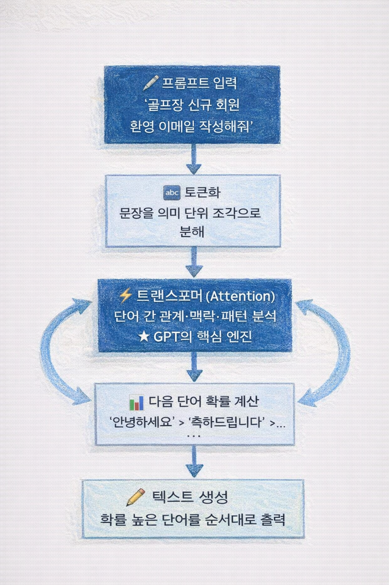

</div>
</div>

<!-- 
가장 위험한 것은 "자신 있게 틀리는" 환각입니다. AI가 틀린 정보를 마치 사실처럼 제시할 때, 사람이 확인하지 않으면 그대로 실행될 수 있습니다. 이것이 중요한 결정에 반드시 사람이 개입해야 하는 이유입니다.
 -->

---

# AI 보안 및 윤리

<div style="width:70%; margin: 0 auto">

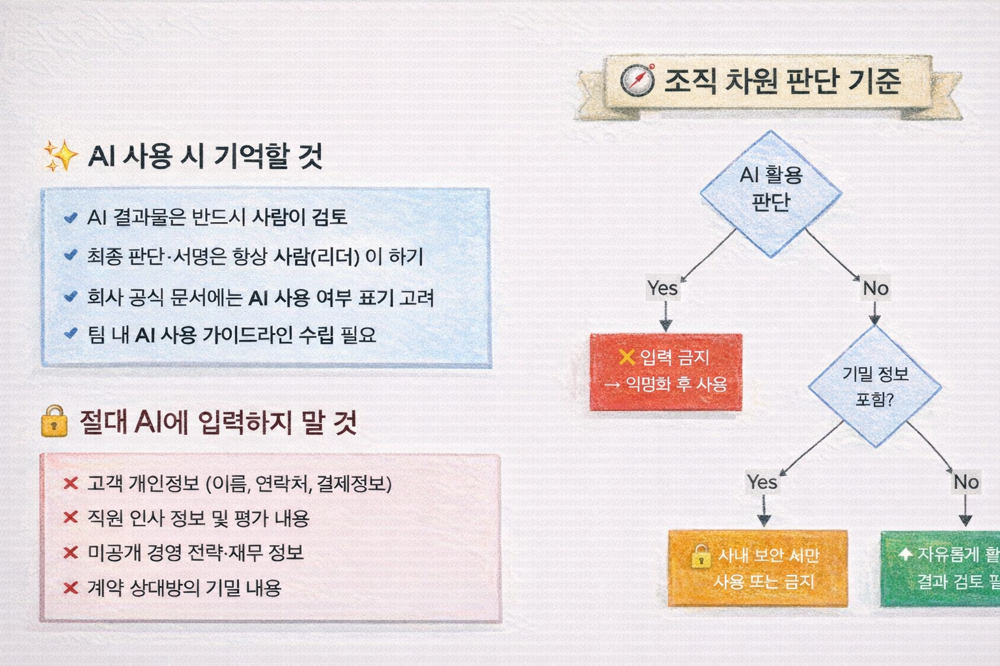

</div>

---

# 안전한 도입을 위한 원칙

<div style="width:80%; margin: 0 auto">

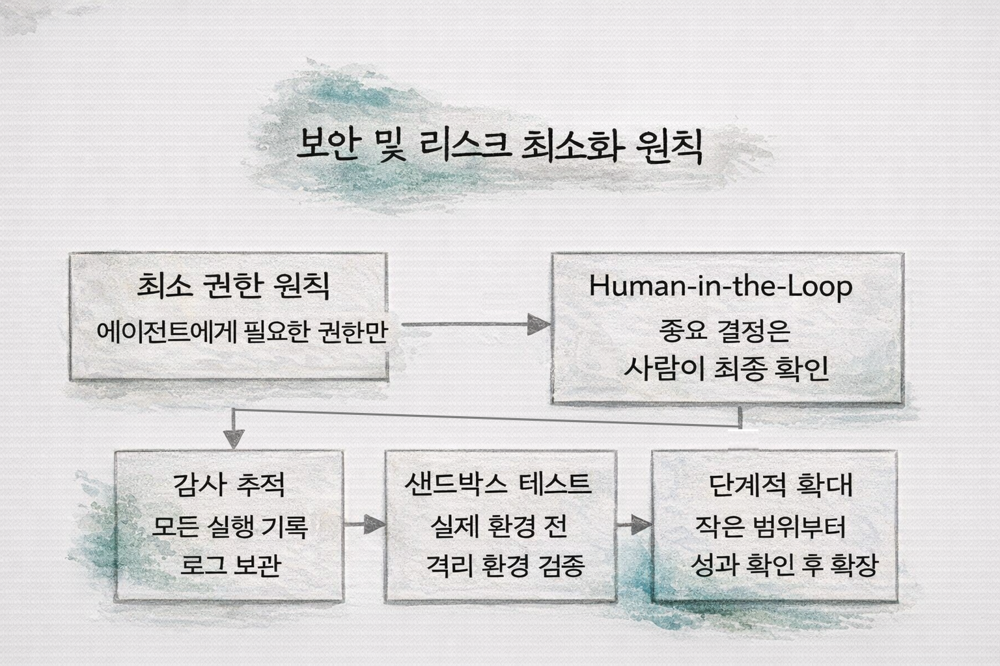

</div>

--- 

# AGENT 활용 사고 방지 시나리오


<div style="width:80%; margin: 0 auto">

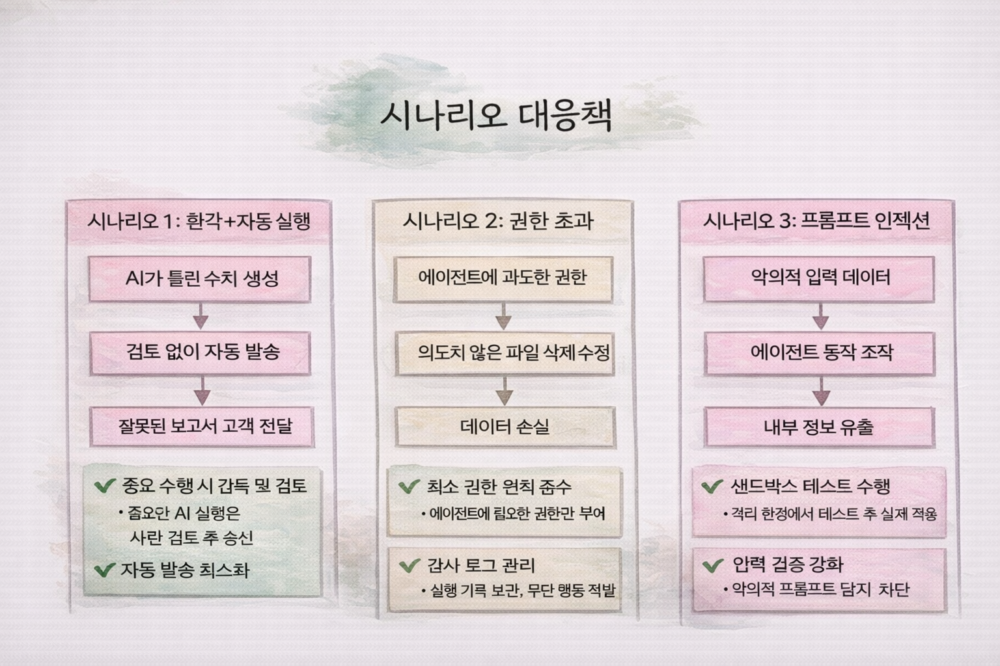

</div>

<!-- 
세 가지 실제 위험 시나리오입니다. 첫째, 환각이 자동 실행으로 이어지는 경우. 에이전트가 생성한 내용이 검토 없이 외부에 전달될 때 발생합니다. 둘째, 권한 초과. 에이전트에게 너무 많은 권한을 주면 의도치 않은 행동을 할 수 있습니다. 셋째, 프롬프트 인젝션. 외부 입력을 통해 에이전트의 동작을 조작하는 공격 -->

---

# PART 4. Insight & Implementation
## 그래서 우리는 이제 무엇을 해야 할까?

---

# *Done is Better than Perfect* 

<br><br>

<div class="columns"> 

<div>

- ## 가장 효율적으로 시작할 수 있는 것
- ## 시간이 걸려도 해야하는 것

</div>
<div>

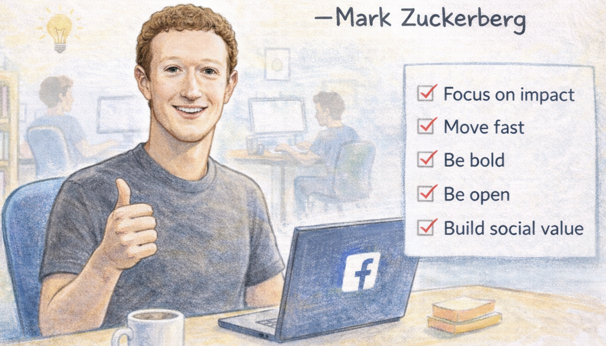

</div>
</div>

---

# AI는 어디로 가는가?
<br>

<div class="columns">

<div>

- ### 변화는 과거부터 있었음 
- ### 노동의 미래 : [생성형AI와 산업의 변화: 의료, 법률, 교육, 기술, 창작 + ??](https://product.kyobobook.co.kr/detail/S000213501853)
- ### [토큰 사용량과 업무](https://www.weeklypost.kr/news/articleView.html?idxno=11035)
- ### 위험, 기회, 규제, [글로벌 경쟁](https://v.daum.net/v/20260418060408707)

<br>
<br>
<br>

> [Ray Kurzweil](https://product.kyobobook.co.kr/detail/S000216740028)
</div>
<div style="width: 60%; margin: 0 auto">

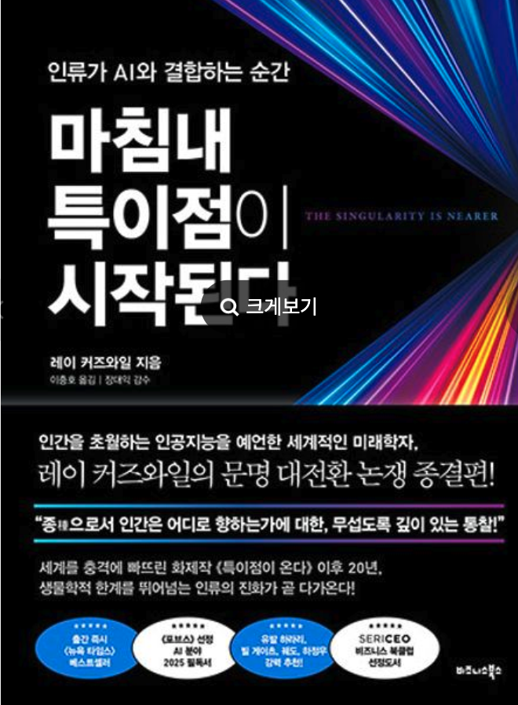

</div>
</div>

---

## 회사의 변화 시도 

<div style="width: 80%; margin: 0 auto">

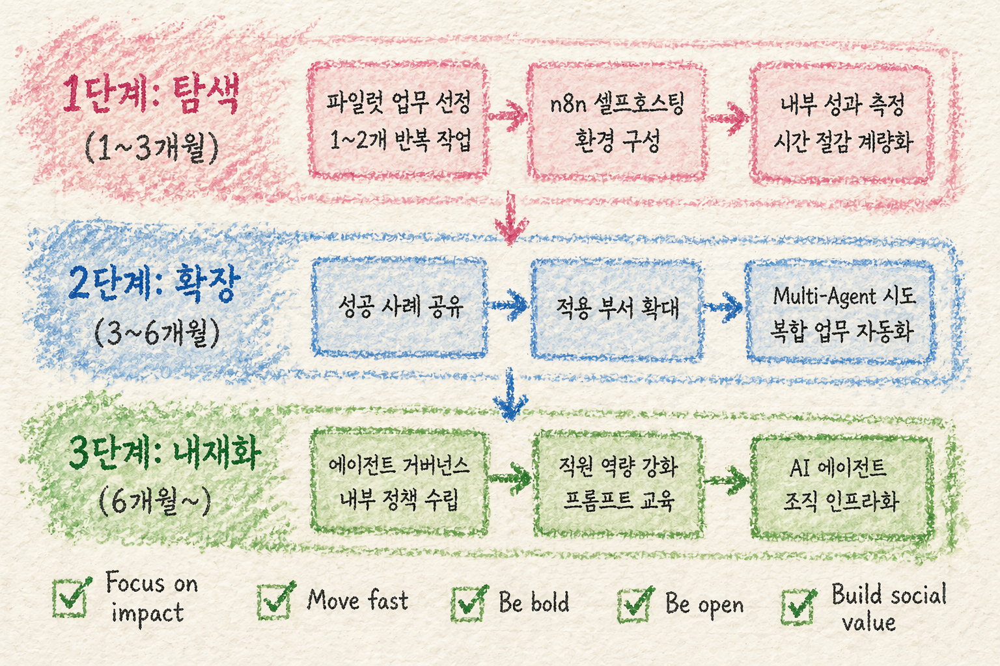

</div>

---

## 나의 업무 방식 변화

<div style="width: 80%; margin: 0 auto">

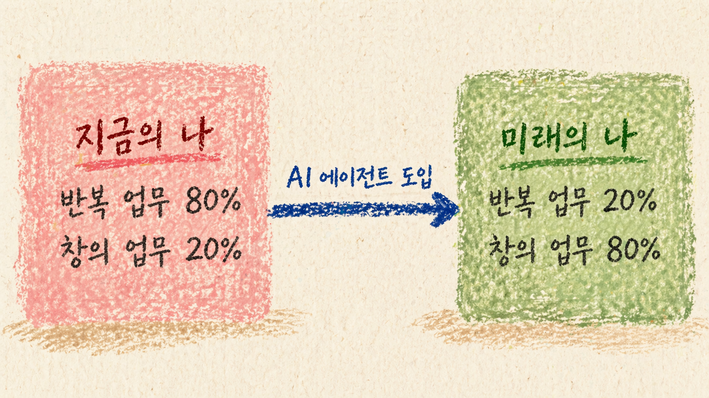

</div>

---

<div class="text-3xl font-bold mt-4" style="color: #1a5276; line-height: 1.4em;">
  "AI를 쓰는 사람이<br>쓰지 않는 사람을 대체한다"
</div>

<div class="text-2xl mt-8 text-gray-500">
  <a href="https://www.nobelprize.org/prizes/physics/2024/hinton/speech/" target="_blank">AI를 세상에 준 사람이, 이제 세상에 AI를 조심하라고 말합니다.</a> 
</div>
<br>

<div align="right">by Geoffrey Hinton </div>
<br><br>

<div align="text-center">
"우리는 AI를 개발자들에게만 맡겨둘 수 없다" <br>
(we cannot leave AI only to developers) <br>
 
<div align="right">by <a href="https://www.google.com/search?q=Lawrence+H.+Summers&oq=Lawrence+H.+Summers&gs_lcrp=EgZjaHJvbWUyBggAEEUYOTIGCAEQLhhA0gEHMjIyajBqNKgCALACAQ&sourceid=chrome&ie=UTF-8" target="_blank">Lawrence H. Summers</a> </div>
</div>

---

# References

|      |
|------|
| OpenAI / AGI / agent:  [Sam Altman, Reflections](https://blog.samaltman.com/reflections) |
| Human-agent team:  [Microsoft Work Trend Index 2025](https://blogs.microsoft.com/blog/2025/04/23/the-2025-annual-work-trend-index-the-frontier-firm-is-born/) |
| Enterprise app agents:  [Gartner AI Agents Forecast](https://www.gartner.com/en/newsroom/press-releases/2025-08-26-gartner-predicts-40-percent-of-enterprise-apps-will-feature-task-specific-ai-agents-by-2026-up-from-less-than-5-percent-in-2025) |
| Agent adoption:  [McKinsey State of AI 2025](https://www.mckinsey.com/capabilities/quantumblack/our-insights/the-state-of-ai) |
| Agent security:  [McKinsey Agentic Enterprise Security](https://www.mckinsey.com/capabilities/risk-and-resilience/our-insights/securing-the-agentic-enterprise-opportunities-for-cybersecurity-providers) |
| n8n:  [n8n AI Agent node](https://docs.n8n.io/integrations/builtin/cluster-nodes/root-nodes/n8n-nodes-langchain.agent/) |
| Make:  [Make AI Agents](https://www.make.com/en/ai-agents) |
| Zapier:  [Zapier Agents](https://help.zapier.com/hc/en-us/articles/24393442652557-Build-an-agent-in-Zapier-Agents) |

---

# Q&A

---

# 교육 후기 & 소통

<br>

<div class="columns">


<div>

## 추가 질문

   💌 : sue.kwon@from-insight.com
   👾   : http://www.from-insight.com

</div>


<div>

## 강의 설문

피드백을 남겨주세요!
더 좋은 강의로 돌아오겠습니다.

<div style="width:50%">

   
</div>

</div>
</div>