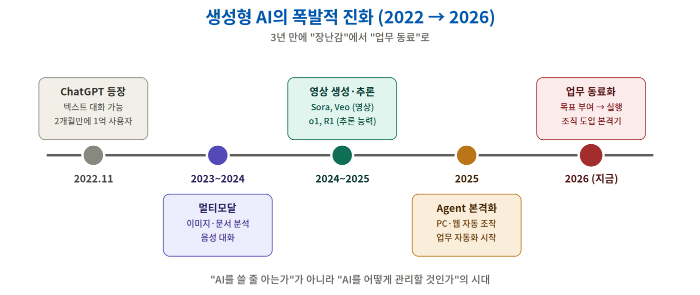
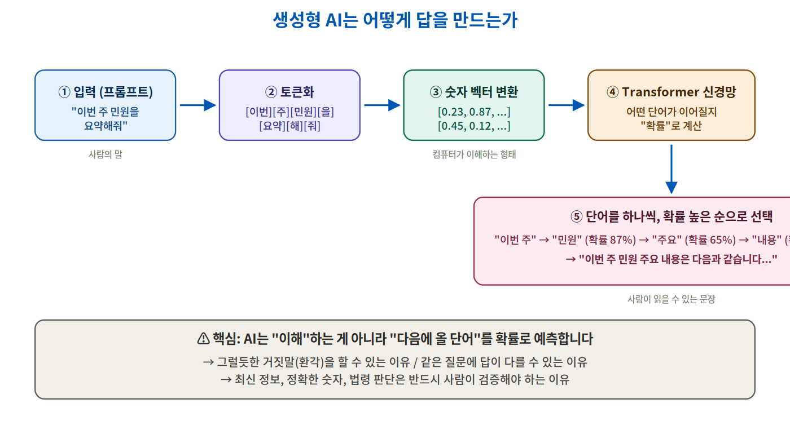
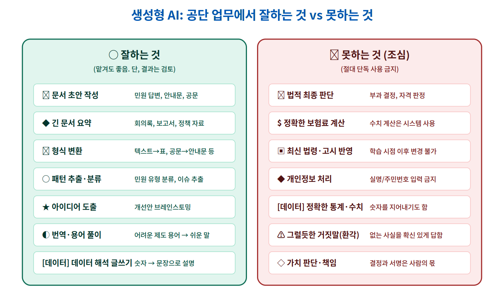
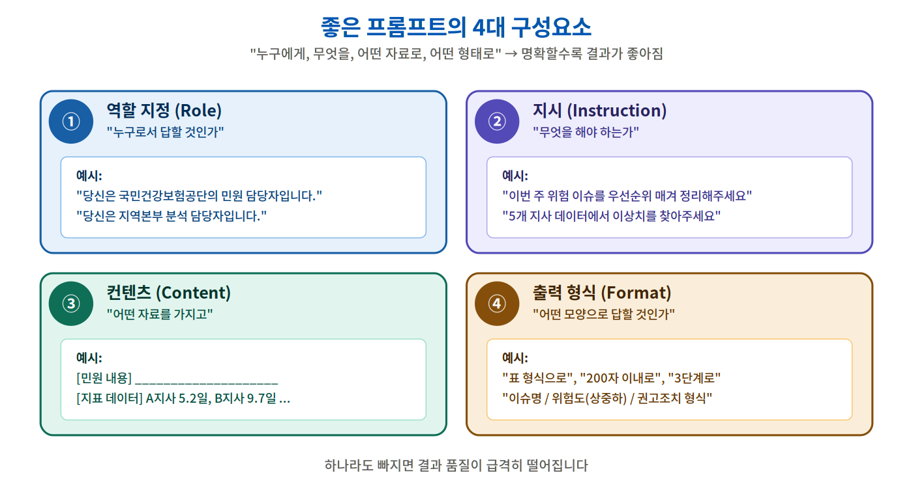
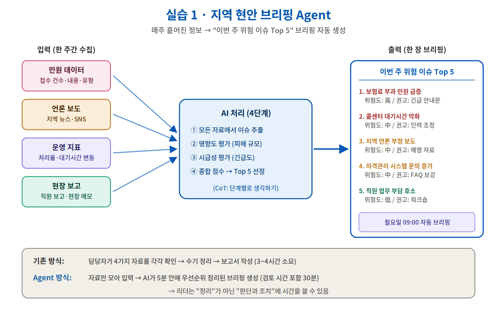
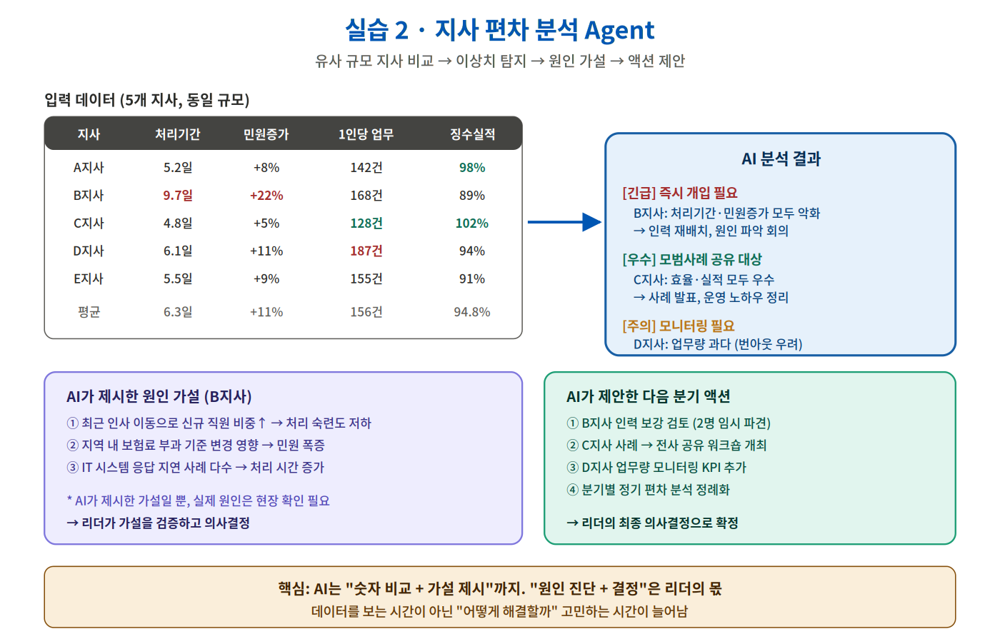
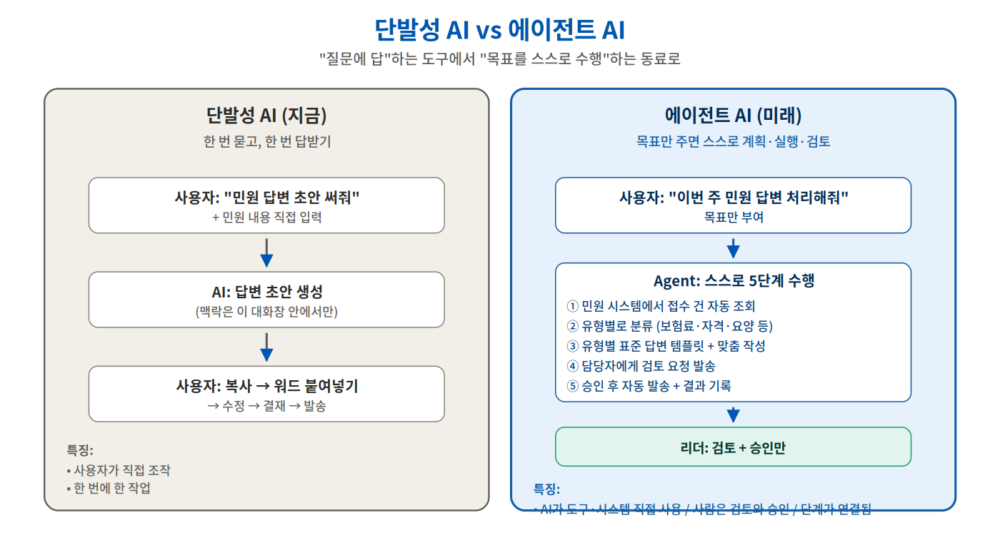

<style>
  .font-family {
    font-family: 'Pretendard', -apple-system, BlinkMacSystemFont, 'Segoe UI', Roboto, Oxygen;
  }
  .h1 {
    color: #0056b3;
  }
  .columns {
      display: grid;
      grid-template-columns: repeat(2, 1fr);
      gap: 1em;
    }
  h2 {
    color: #0056b3;
  }
  .cite {
    font-size: 0.7em;
    color: #777;
    margin-top: 10px;
  }
  blockquote {
    position: absolute;
    bottom: 2.5em;
    left: 1em;
    right: 1em;
  }
  .small {
    font-size: 0.85em;
  }
  .highlight-box {
    background: #FFF8E1;
    border-left: 4px solid #FFA000;
    padding: 0.8em 1em;
    margin: 0.5em 0;
    border-radius: 4px;
  }
  .danger-box {
    background: #FFEBEE;
    border-left: 4px solid #C62828;
    padding: 0.8em 1em;
    margin: 0.5em 0;
    border-radius: 4px;
  }
  .info-box {
    background: #E3F2FD;
    border-left: 4px solid #1976D2;
    padding: 0.8em 1em;
    margin: 0.5em 0;
    border-radius: 4px;
  }
</style>

<h1 style="font-size: 2.5em; margin-top: -40px;">AI 시대, 공단 리더의 업무전환 전략</h1>

<div @click="$slidev.nav.next" class="mt-4 py-1" hover:bg="white op-10">
  <div class="text-2xl font-bold text-gray-400"> 생성형 AI와 Agent를 활용한 실무 적용 <carbon:arrow-right /></div>
</div>

<div class="abs-br m-6 text-sm">
  <div style="text-align: left;">
  <h3>
    <div>권수정 <a href="https://suekwon.github.io/about/" target="_blank" class="slidev-icon-btn"> <carbon:logo-github /> </a></div>
    <div>AI 전략 컨설턴트 | 프롬인사이트</div>
  </h3>
  </div>
</div>

<!--
저는 산업공학 박사로, 생성형 AI·강화학습·머신러닝을 활용해서 연구하고 실무에 적용하고 있는 전문가입니다. 
오늘 2시간 동안 공단 리더분들이 "AI를 직접 써보고, 한계를 이해하고, 우리 업무에 어떻게 적용할지" 
구체적으로 가져갈 수 있도록 준비했습니다. 휴대폰만 있으면 됩니다.
-->

---
layout: default
transition: fade
---

## 오늘 강의의 약속

<br>

<div class="columns">
<div>

### ✅ 이렇게 합니다
- **휴대폰으로 직접 실습**합니다
- **공단 업무 사례**로 진행합니다
- 보고 듣는 것보다 **만져보는 시간**이 깁니다
- "이걸 내 업무에 어떻게?" 질문을 환영합니다

</div>
<div>

### ❌ 이렇게 안 합니다
- 어려운 기술 용어로 설명하지 않습니다
- "AI가 대단해요" 식의 홍보 안 합니다
- 실명/주민번호 같은 **개인정보는 절대 입력 안 합니다**
- 완벽한 결과를 기대하지 않습니다

</div>
</div>

<br>

<div class="highlight-box">
<b>오늘의 목표</b><br>
① 생성형 AI가 어떻게 동작하는지 <b>구조</b>를 안다<br>
② 두 가지 Agent 실습으로 <b>업무 변화</b>를 체감한다<br>
③ 내 업무에 적용할 <b>한 가지 아이디어</b>를 가져간다
</div>

---
layout: two-cols-header
title: AI Icebreaking
transition: fade-out
---

## 아이스브레이킹 (2026 AI 현주소)

- 질문에 **해당되면 손가락 1개 접기**
- 총 **5개 질문**, **5개 모두 접으면 우승**

| *`정답은 없습니다. 솔직하게 해주세요.`*

::left::

<v-click>

- #### 질문 ① 최근 한 달 내
  **ChatGPT, 클로바X, 뤼튼, 제미나이 등 AI에게 <br> 보고서·메일·자료 초안을 부탁해본 적 있다**

  ☝️ 해당되면 손가락 접기
</v-click>

<v-click>

- #### 질문 ② **3가지 이상의 다른 AI**를 사용해본 적 있다
  (ChatGPT / Gemini / Claude / 클로바X / 뤼튼 / Copilot 등)

  ☝️ 해당되면 손가락 접기

</v-click>

::right::
<div v-click="[1, 6]">

<v-click>

- #### 질문 ③ AI에게 **음성으로 질문**하거나
  **AI가 만든 이미지·영상**을 본 적이 있다 *(Sora, Veo 등)*

  ☝️ 해당되면 손가락 접기

</v-click>

<v-click>

- #### 질문 ④ "이거 AI로 자동화하면 좋겠다"라고
  **업무 중 생각해본 적이 있다**

  ☝️ 해당되면 손가락 접기

</v-click>

<v-click>

- #### 질문 ⑤ AI를 **공식 업무에 써도 되는지**
  **애매하다고 느낀 적**이 있다

  ☝️ 해당되면 손가락 접기

</v-click>

</div>

<!--
2026년 5월 기준 AI 현주소를 반영한 질문입니다.

채점:
5개 다 접음 → "AI 리더, 오늘은 응용편으로 받아가세요"
3~4개 접음 → "오늘 강의 끝나면 5개가 됩니다"  
0~2개 → "오늘 가장 얻어갈 게 많은 분, 환영합니다"

1등: 프롬프트 카드 3선 선물
꼴등: 다음 질문에 우선 발언권

핵심: 'AI를 아느냐'가 아니라 '이미 AI 시대에 살고 있다는 사실을 인식했느냐'
-->

---
layout: center
transition: fade
---

# Part 1
## 생성형 AI, 도대체 어떻게 동작하는가?

<br>

<div class="text-gray-500">
"검색"도 아니고 "정답 데이터베이스"도 아닙니다.<br>
구조를 알면 <b>어디까지 믿을 수 있는지</b> 보입니다.
</div>

---
layout: default
transition: fade
---

## AI는 3년 만에 어디까지 왔는가

<br>

<div style="width:95%; margin: 0 auto;">



</div>

<!--
- 2022년 ChatGPT 등장: 그저 신기한 챗봇
- 2026년 현재: 업무를 함께하는 "동료" 수준
- 이 변화의 속도가 무서운 이유: 3년 뒤를 누구도 모름
- 그래서 "지금" 이해해두어야 함

50대 리더분들께 강조: 
"여러분이 IT 시스템 처음 도입하던 80~90년대를 떠올려보세요. 
그때 컴퓨터를 외면한 사람과 받아들인 사람의 차이가 지금 다시 생기고 있습니다."
-->

---
layout: two-cols-header
transition: fade
---

## 생성형 AI(Generative AI)란?

::left::

<div class="flex items-center h-full sm:text-2xl text-lg">
<div>

- **G**enerative **P**re-trained **T**ransformer
  - **G**enerative: 콘텐츠를 **생성**한다
  - **P**re-trained: 미리 학습된
  - **T**ransformer: 신경망 구조 이름

<br>

- 기존 AI: "분류·예측" 중심
- 생성형 AI: **새로운 텍스트·이미지·코드**를 만듦

</div>
</div>

::right::

<div style="padding: 1em;">

### 우리가 흔히 쓰는 생성형 AI

| 도구 | 만든 곳 | 특징 |
|---|---|---|
| ChatGPT | OpenAI | 가장 유명 |
| Claude | Anthropic | 긴 문서 |
| Gemini | Google | 검색 결합 |
| **클로바X** | 네이버 | **한국어 특화** |
| **뤼튼** | 뤼튼테크 | **국내 무료** |
| Copilot | Microsoft | 오피스 결합 |

<div class="cite" style="margin-top: 1em;">
* 오늘 실습은 클로바X 또는 뤼튼으로 진행합니다
</div>

</div>

---
layout: default
transition: fade
---

## AI는 "이해"하는 게 아닙니다 — 동작 원리

<br>

<div style="width:90%; margin: 0 auto;">



</div>

<!--
핵심 메시지 3가지:
1. AI는 단어를 "확률"로 예측합니다. 진짜로 의미를 이해하는 게 아닙니다.
2. 그래서 "환각(없는 사실을 그럴듯하게 말하는 것)"이 생깁니다.
3. 같은 질문에 답이 매번 조금씩 다를 수 있습니다.

50대 리더에게 비유로 설명:
"여러분이 옆 사람 말을 듣고 다음에 무슨 말을 할지 예상하는 것과 비슷합니다.
대화가 매끄럽지만, '확신'할 수는 없죠. AI도 똑같습니다."
-->

---
layout: two-cols-header
transition: fade
---

## 세 가지 핵심 개념 (외울 필요 없음)

::left::

### ① 토큰(Token)
- 문장을 **잘게 쪼갠 단위**
- "건강보험공단" → [건강][보험][공단]
- AI는 토큰 단위로 일함
- *비용·속도가 토큰 수에 비례*

<br>

### ② 임베딩(Embedding)
- 단어를 **숫자 벡터**로 바꿈
- "민원"과 "고객 문의"는 가까운 숫자
- 의미가 비슷한 단어끼리 가까이 모임

::right::

### ③ 확률 예측
- 다음에 올 단어를 **확률**로 고름
- "이번 주" 다음 → "민원"(87%), "회의"(45%), "보고서"(38%)...
- 가장 확률 높은 걸 골라서 이어붙임

<br>

<div class="info-box">
<b>왜 이걸 알아야 할까?</b><br>
- 확률이라 → <b>매번 답이 조금씩 다름</b><br>
- 학습된 데이터 안에서만 → <b>최신 정보 모름</b><br>
- 의미가 아닌 패턴 → <b>그럴듯하지만 틀릴 수 있음</b>
</div>

---
layout: default
transition: fade
---

## 생성형 AI: 잘하는 것 vs 못하는 것 (공단 업무 관점)

<br>

<div style="width:95%; margin: 0 auto;">



</div>

<!--
강조 포인트:
"잘하는 것"에 분류된 일들은 평소 **시간을 가장 많이 잡아먹는** 일입니다.
"못하는 것"에 분류된 일들은 **공단의 본질적 업무**입니다.

즉, AI에게 "잡일"을 맡기고 사람은 "판단과 책임"에 집중하는 구조가 가능합니다.
-->

---
layout: default
transition: fade
---

## "환각(Hallucination)" — 가장 위험한 약점

<br>

<div class="danger-box">
<b>환각이란?</b> AI가 <b>없는 사실을 그럴듯하게 지어내는 현상</b>
</div>

<br>

### 실제로 일어나는 사례

| 질문 | AI 답변 (환각) | 실제 |
|---|---|---|
| 건강보험법 제○조 내용은? | 그럴듯한 조문 인용 | **존재하지 않는 조항** |
| 2024년 보험료율은? | 7.49% | **학습 시점 이후 변경됨** |
| ○○지사 작년 처리 건수는? | 구체적 숫자 답변 | **AI는 알 수 없는 정보** |

<br>

<div class="info-box">
<b>리더의 원칙</b><br>
① <b>사실 확인</b>: 숫자·법령·인용은 반드시 원본 확인<br>
② <b>이중 검증</b>: 중요한 결정은 다른 AI나 검색으로 교차 확인<br>
③ <b>출처 명시 요구</b>: "어디서 본 정보냐"고 물어보면 가짜 출처를 만들기도 함 → 직접 확인
</div>

---
layout: center
transition: fade
---

# Part 2
## 프롬프트 엔지니어링 — AI에게 잘 시키는 법

<br>

<div class="text-gray-500">
같은 AI라도 <b>어떻게 물어보느냐</b>에 따라 결과가 천지차이입니다.
</div>

---
layout: two-cols-header
transition: fade
---

## 같은 AI, 다른 결과

<br>

::left::

### 😞 나쁜 프롬프트
```
민원 답변 써줘
```

**결과:**
> "민원에 대한 답변입니다. 안녕하세요. 
> 문의 주신 내용에 대해 답변드립니다. 
> 자세한 사항은 관련 부서로 문의 바랍니다..."

→ **두루뭉술, 어디에도 못 씀**

::right::

### 😊 좋은 프롬프트
```
당신은 국민건강보험공단 민원 담당자입니다.

[민원 내용]
직장 퇴직 후 지역가입자로 전환됐는데
보험료가 직장 때보다 3배 올랐습니다.
이의신청 절차를 알려주세요.

조건:
- 200자 이내
- 공감 표현으로 시작
- 절차 3단계로 안내
- 마지막에 추가 문의처
```

→ **바로 검토·발송 가능한 초안**

---
layout: default
transition: fade
---

## 좋은 프롬프트의 4대 구성요소

<br>

<div style="width:90%; margin: 0 auto;">



</div>

---
layout: two-cols-header
transition: fade
---

## 고급 기법 ① 단계별 사고 유도 (CoT)

<br>

::left::

### Chain of Thought (생각의 사슬)
- **"단계별로 생각해주세요"** 한 줄
- AI가 답을 바로 내지 않고 **추론 과정**을 거침
- 복잡한 분석·계산·판단에 효과적

<br>

### 언제 쓰나?
- 데이터 비교·분석
- 우선순위 매기기
- 다단계 의사결정
- 인과관계 파악

::right::

### 예시 비교

**일반:**
```
이 5개 지사 데이터를 보고
어디가 가장 문제인지 알려줘
```
→ "B지사가 안 좋습니다" *(왜?)*

<br>

**CoT:**
```
이 5개 지사 데이터를
다음 단계로 분석해주세요:
1. 각 지표별 평균과 편차 계산
2. 평균 대비 -1.5σ 이상 이탈 지사 찾기
3. 여러 지표가 동시에 나쁜 지사 식별
4. 종합 위험도 순위
5. 각각의 가능한 원인 가설
```
→ **근거 있는 분석 결과**

---
layout: two-cols-header
transition: fade
---

## 고급 기법 ② 예시 제공 (Few-shot)

<br>

::left::

### 원리
- **원하는 출력 형태**의 예시 1~3개를 보여줌
- AI가 패턴을 모방함
- 일관된 형식이 필요할 때 강력

<br>

### 공단 활용
- 민원 답변 톤·매너 통일
- 보고서 형식 일관성
- 안내문 스타일 유지

::right::

### 예시
```
다음 형식으로 민원을 분류해주세요.

예시 1:
민원: "보험료가 너무 비싸요"
분류: [부과] / 긴급도: 중

예시 2:
민원: "병원에서 환급받을 수 있나요?"
분류: [급여] / 긴급도: 하

이제 분류:
민원: "어머니 장기요양 등급 신청 절차 알려주세요"
분류: ?
```

→ AI가 패턴대로 답변

---
layout: two-cols-header
transition: fade
---

## 결과가 만족스럽지 않을 때

<br>

::left::

### 점검 순서
1. **역할이 명확한가?** (누구로서 답할지)
2. **목표가 구체적인가?** (무엇을 원하는지)
3. **자료가 충분한가?** (배경 정보)
4. **형식을 지정했는가?** (어떻게 답할지)
5. **예시가 도움될까?** (Few-shot)
6. **단계별로 시킬까?** (CoT)

::right::

### 자주 하는 실수
<div class="danger-box">

❌ **하지 말 것**을 나열  
"이런 거 쓰지 마, 저런 거 쓰지 마"  
→ AI는 부정문을 잘 이해 못함

✅ **해야 할 것**을 명시  
"공식적인 어조로, 구체적인 절차 위주로"

</div>

<div class="highlight-box">

💡 **한 번에 완벽한 답을 기대하지 마세요**  
- 2~3번 대화하며 다듬는 게 정상  
- "더 짧게", "표 형식으로", "예시 추가" 등으로 수정  
- AI는 **대화 상대**이지 검색엔진이 아님

</div>

---
layout: center
transition: slide-up
---

# Part 3
## 실습: 휴대폰으로 직접 해봅시다

<br>

<div class="text-2xl text-gray-600">
2가지 Agent를 만들어봅니다
</div>

<br>

<div class="text-xl text-gray-500">
① 지역 현안 브리핑 Agent<br>
② 지사 편차 분석 Agent
</div>

---
layout: default
transition: fade
---

## 실습 준비 — 모바일 앱 설치

<br>

<div class="columns">
<div>

### 🟢 추천 1: 뤼튼 (Wrtn)
- 한국 서비스, **완전 무료**
- 한국어 자연스러움
- 회원가입만 하면 바로 사용
- [Play 스토어 / App Store에서 "뤼튼"]

<br>

### 🟢 추천 2: 클로바X (HyperCLOVA X)
- **네이버 한국어 모델**
- 공공 도메인 친화적
- 네이버 계정으로 로그인
- [Play 스토어 / App Store에서 "CLOVA X"]

</div>
<div>

### 사용 시 절대 지킬 것 ⚠️

<div class="danger-box">
<b>❌ 입력하면 안 되는 정보</b><br><br>
• 실명, 주민번호, 자격번호<br>
• 실제 민원인의 개인 정보<br>
• 비공개 내부 자료<br>
• 미공개 통계 수치<br>
• 인사·평가 관련 실명 정보
</div>

<div class="info-box">
<b>✅ 가상 데이터로 실습합니다</b><br>
강사가 제공하는 모든 데이터는 <br>
실습용 가공 데이터입니다.<br>
이 원칙은 <b>실제 업무에서도 동일</b>합니다.
</div>

</div>
</div>

---
layout: default
transition: fade
---

## 잠깐, 페인포인트부터 정리하고 갑시다

<br>

### 조별 토론 (5분)
**"우리 업무에서 가장 시간이 아까운 일은 무엇인가?"**

<br>

<div class="columns">
<div>

### 공단 리더 공통 페인포인트 예시

| 영역 | 페인포인트 |
|---|---|
| 민원 응대 | 유사 민원 반복 답변 |
| 회의 운영 | 회의록 작성·배포 |
| 보고 | 부서별 자료 취합·정리 |
| 데이터 | 통계를 글로 풀어 쓰기 |
| 안내 | 제도 변경 직원 전달 |
| 모니터링 | **지역 현안 파악**|
| 관리 | **지사 간 성과 비교**|

</div>
<div>

### 어떤 일이 AI에게 잘 맞는가?

<div class="highlight-box">
✅ 적합:<br>
• <b>반복적</b>인가?<br>
• <b>언어 기반</b>인가? (읽기/쓰기/요약)<br>
• <b>초안 60%</b>면 충분한가?
</div>

<div class="danger-box">
❌ 부적합:<br>
• 법적 <b>최종 판단</b><br>
• 개인정보 <b>실데이터</b><br>
• <b>정확한 수치 계산</b> (시스템이 함)
</div>

오늘 실습할 두 Agent는<br>
**위 페인포인트의 마지막 두 줄**입니다.

</div>
</div>

---
layout: center
transition: slide-up
---

## 실습 1
# 지역 현안 브리핑 Agent

<br>

<div class="text-xl text-gray-600">
매주 흩어진 정보 → "이번 주 위험 이슈 Top 5" 브리핑
</div>

---
layout: default
transition: fade
---

## 실습 1: 무엇을 만드는가?

<br>

<div style="width:90%; margin: 0 auto;">



</div>

<!--
시연 시 강조:
- "이번 주 위험 이슈 Top 5"는 지사장/지역본부장의 매주 고민
- 4가지 자료 출처를 사람이 일일이 보던 일을 AI가 한 번에
- 핵심: AI는 "정리"를 하고, 사람은 "판단"을 함
-->

---
layout: default
transition: fade
---

## 실습 1 자료 — 가상의 한 주간 데이터

<div class="text-sm">

```
[이번 주 민원 (가상 데이터)]
- 보험료 부과 관련 민원: 142건 (전주 대비 +35%)
- 자격 변경 문의: 89건 (전주 대비 +12%)
- 장기요양 등급 관련: 34건 (전주와 비슷)
- 환급 관련 문의: 28건 (전주 대비 -8%)

주요 민원 내용:
1) "직장 퇴직 후 보험료가 3배 올랐다, 산정 방식 알려달라"가 가장 많음
2) 65세 이상 어르신의 장기요양 등급 재신청 절차 문의 증가
3) 외국인 가입자 보험료 부과 기준 변경 관련 항의성 민원 발생
```

```
[이번 주 지역 언론 보도 (가상)]
- A일보(월): "○○지역 보험료 산정 오류 의혹" - 부정적 톤
- B방송(수): "건강보험 부정수급 단속 강화" - 중립
- C신문(금): "공단 직원 친절도 1위 △△지사" - 긍정적
```

```
[운영 지표 (가상)]
- 콜센터 평균 대기시간: 8분 12초 (목표 5분 초과)
- 민원 처리 평균: 6.5일 (목표 5일 초과)
- 직원 1인당 처리량: 158건/주 (평균 대비 +18%)
- 시스템 응답 지연 사고: 2건 (월요일, 목요일)
```

```
[현장 보고 (가상)]
- 김주임: "보험료 부과 관련 항의 민원 대응에 하루 평균 4시간 소요됨"
- 이대리: "외국인 가입자 안내자료가 한국어밖에 없어 응대 어려움"
- 박과장: "신입직원 3명, 처리 속도 적응 중 — 6월까지 추가 교육 필요"
```

</div>

<!--
이 자료는 강사가 미리 출력해서 나눠주거나, 화면에 띄워두고 참가자가 휴대폰으로 입력하게 함.
실습용이므로 모두 가상 데이터임을 명확히 함.
-->

---
layout: two-cols-header
transition: fade
---

## 실습 1 - 1라운드: 단순 프롬프트

::left::

### 입력
```
이 자료를 요약해줘
```

(위 4종 자료 붙여넣기)

::right::

### 예상 결과
- 평범한 요약
- **우선순위 없음**
- 무엇이 위험한지 모름
- 어떤 조치가 필요한지 모름

<br>

<div class="danger-box">
"AI가 별것 아니네"라고 느끼는 단계입니다.<br>
<b>여기서 멈추면 안 됩니다.</b>
</div>

---
layout: two-cols-header
transition: fade
---

## 실습 1 - 2라운드: 역할 + 형식 추가

::left::

### 입력
```
당신은 국민건강보험공단 ○○지사장입니다.

다음 4종 자료를 보고
[이번 주 위험 이슈 Top 5]를 정리해주세요.

형식:
1. 이슈명 (한 줄)
2. 위험도 (상/중/하)
3. 핵심 내용 (2줄)
4. 권고 조치 (1줄)

[민원 데이터] ...
[언론 보도] ...
[운영 지표] ...
[현장 보고] ...
```

::right::

### 예상 결과 
- **우선순위가 매겨진 5개 이슈**
- 위험도 표시
- 권고 조치 포함

<br>

<div class="highlight-box">
바로 <b>월요일 회의 안건</b>으로 쓸 수 있음.<br>
이게 1단계 → 2단계 변화의 위력입니다.
</div>

<v-click>

<div class="info-box">
💡 <b>한 걸음 더 가봅시다</b><br>
"왜 그렇게 판단했지?"가 궁금하다면 → 3라운드 CoT
</div>

</v-click>

---
layout: default
transition: fade
---

## 실습 1 - 3라운드: 단계별 사고 (CoT)

<br>

```
당신은 국민건강보험공단 ○○지사장입니다.

다음 4종 자료에서 [이번 주 위험 이슈 Top 5]를 단계별로 분석해주세요.

[1단계] 4종 자료에서 발견되는 모든 이슈를 추출 (10개 이상)
[2단계] 각 이슈의 영향도 평가 (피해 규모, 영향받는 대상 수)
[3단계] 각 이슈의 시급성 평가 (지금 조치하지 않으면 어떻게 될지)
[4단계] 영향도 × 시급성 종합 점수로 Top 5 선정
[5단계] 각 이슈별 권고 조치 (이번 주 / 다음 주 / 한 달 내)

마지막에 [Top 5 한 장 요약]을 표 형식으로 제시해주세요.

[자료]
...
```

<v-click>

<div class="highlight-box" style="margin-top: 1em;">
<b>차이점:</b> AI가 <b>"왜 그게 1순위인지" 근거를 보여줍니다.</b><br>
리더가 검증하고 의사결정하기 훨씬 쉬워집니다.
</div>

</v-click>

---
layout: default
transition: fade
---

## 실습 1 정리 — 무엇이 달라졌나

<br>

| 단계 | 시간 | 결과 품질 | 사용 가능성 |
|---|---|---|---|
| **기존 (수기)** | 3~4시간 | 사람마다 다름 | 그대로 사용 가능 |
| **1라운드 AI** | 1분 | 평범 | 그대로는 못 씀 |
| **2라운드 AI** | 3분 | 우선순위 있음 | 검토 후 사용 가능 |
| **3라운드 AI (CoT)** | 5분 | 근거까지 포함 | 즉시 보고용 |

<br>

<div class="info-box">
<b>리더 관점에서의 변화:</b><br>
• <b>정리</b>에 쓰던 3시간 → <b>판단·실행</b>에 쓰는 3시간으로 전환<br>
• 매주 월요일 09:00에 <b>위험 이슈 브리핑</b>을 받아보는 운영 가능
</div>

<div class="danger-box">
<b>주의:</b> AI 결과물은 <b>반드시 사람이 검토</b>합니다.<br>
숫자·인용은 원본 확인, 권고 조치는 실행 가능성 점검 필요.
</div>

---
layout: center
transition: slide-up
---

## 실습 2
# 지사 편차 분석 Agent

<br>

<div class="text-xl text-gray-600">
유사 규모 지사 비교 → 이상치 탐지 → 원인 가설 → 액션 제안
</div>

---
layout: default
transition: fade
---

## 실습 2: 무엇을 만드는가?

<br>

<div style="width:90%; margin: 0 auto;">



</div>

---
layout: default
transition: fade
---

## 실습 2 자료 — 가상 5개 지사 데이터

<div class="small">

```
[비교 대상] 가상의 비슷한 규모(직원 30~35명) 5개 지사

지사    처리기간    민원증가율    1인당 업무량   징수실적
        (민원→완료)  (전월대비)    (주간 건수)    (목표대비)
─────────────────────────────────────────────────────────
A지사   5.2일       +8%           142건          98%
B지사   9.7일       +22%          168건          89%
C지사   4.8일       +5%           128건          102%
D지사   6.1일       +11%          187건          94%
E지사   5.5일       +9%           155건          91%
─────────────────────────────────────────────────────────
평균    6.3일       +11%          156건          94.8%
```

```
[참고 정보]
- 5개 지사 모두 도시형 지사로 분류
- A·C·E지사: 최근 2년간 인사 이동 없음
- B지사: 3개월 전 지사장 교체, 신규 직원 2명 합류
- D지사: 인근 사업장 폐업으로 자격 변경 민원 증가
- 모든 지사 IT 시스템 동일
```

</div>

<!--
표 형태로 깔끔하게 보여줘서 시각적으로 쉽게 파악되도록.
B지사가 명백한 이상치인데, AI가 이를 어떻게 분석하는지 보여주는 게 핵심.
-->

---
layout: two-cols-header
transition: fade
---

## 실습 2 - 1라운드: 단순 비교

::left::

### 입력
```
이 5개 지사 데이터를 비교해줘

[데이터 표 붙여넣기]
```

::right::

### 예상 결과
- A는 좋고 B는 안 좋고...
- **수치 나열만**
- 무엇이 진짜 문제인지 흐릿
- 액션이 없음

---
layout: two-cols-header
transition: fade
---

## 실습 2 - 2라운드: 분석 관점 명시

::left::

### 입력
```
당신은 지역본부 분석 담당자입니다.

다음 5개 지사 데이터에서:

1. 평균 대비 크게 이탈한 "이상치 지사"를 
   찾아주세요 (어떤 지표에서, 얼마나)

2. 우수 지사와 부진 지사를 구분하고
   각각의 특징을 정리해주세요

3. B지사가 부진하다면 
   "참고 정보"를 활용해 
   가능한 원인 가설 3가지를 제시해주세요

[데이터] + [참고 정보]
```

::right::

### 예상 결과
- B지사 = 이상치 (처리기간·민원증가율↑)
- C지사 = 우수 사례
- 원인 가설 (지사장 교체, 신규직원, 자격변경 등)

<br>

<div class="highlight-box">
"숫자 비교" → "<b>인사이트</b>"로 한 단계 점프
</div>

---
layout: default
transition: fade
---

## 실습 2 - 3라운드: 액션까지 도출

<br>

```
앞선 분석 결과를 바탕으로 다음을 도출해주세요.

[1] 즉시 개입이 필요한 지사 — 무엇을, 누가, 언제까지?
[2] 모범 사례로 공유받을 지사 — 어떤 노하우를 전파할지?
[3] 다음 분기 KPI에 추가할 모니터링 지표 (최대 3개)
[4] 분기별 정기 분석 운영 방안 — 주기, 주관 부서, 보고 대상

각 항목은 표 형식으로 작성해주세요.
실행 가능성과 우선순위를 함께 표기해주세요.
```

<br>

<v-click>

<div class="info-box">
이 결과물은 <b>다음 본부장 보고 자료의 80% 초안</b>이 됩니다.<br>
리더는 이를 검토·검증하고 의사결정·서명만 하면 됩니다.
</div>

</v-click>

---
layout: default
transition: fade
---

## 실습 2 정리 — 분석의 패러다임 변화

<br>

<div class="columns">
<div>

### 기존 방식
1. 엑셀에서 데이터 정렬
2. 평균·편차 계산
3. 차트 만들기
4. "어디가 문제인가" 고민
5. 원인 추정 (경험에 의존)
6. 액션 회의 후 정리
7. 보고서 작성

**총 소요: 반나절 ~ 1일**

</div>
<div>

### Agent 방식
1. 데이터 + 참고정보 입력
2. AI가 이상치 탐지
3. AI가 원인 가설 제시
4. AI가 액션 제안
5. **리더가 검증 + 의사결정**

**총 소요: 30분 (검토 포함)**

<br>

<div class="highlight-box">
"분석하는 시간"이 줄고<br>
<b>"판단하는 시간"</b>이 늘어남
</div>

</div>
</div>

<br>

<div class="danger-box">
<b>중요:</b> AI의 "원인 가설"은 <b>가설일 뿐</b>입니다.<br>
실제 원인은 <b>현장 확인과 리더의 판단</b>으로 검증해야 합니다.
</div>

---
layout: default
transition: fade
---

## 조별 결과 공유 (15분)

<br>

### 각 조에서 발표 (3분 × 5조)

<div class="columns">
<div>

#### 발표 내용
1. 어떤 Agent를 실습했나
2. 1·2·3라운드 결과가 어떻게 달라졌나
3. **놀란 점 / 한계로 느낀 점**
4. **내 업무에 적용한다면?**

</div>
<div>

#### 강사 피드백 포인트
- 프롬프트 차이가 만든 결과 차이
- AI가 잘 한 부분 / 보완해야 할 부분
- 다른 부서로 확장 가능한 아이디어

</div>
</div>

<br>

<div class="info-box">
조별 발표에서 가장 좋은 적용 아이디어를 낸 조에게 — <br>
<b>프롬프트 카드 모음집</b> 증정 🎁
</div>

---
layout: center
transition: slide-up
---

# Part 4
## 더 멀리 — 에이전트(Agent)의 가능성

<br>

<div class="text-xl text-gray-600">
오늘 실습한 것은 시작에 불과합니다
</div>

---
layout: default
transition: fade
---

## 단발성 AI vs 에이전트 AI

<br>

<div style="width:88%; margin: 0 auto;">



</div>

---
layout: two-cols-header
transition: fade
---

## 공단에 도입 가능한 Agent 시나리오

::left::

### 🤖 민원 처리 Agent
1. 민원 시스템에서 신규 건 자동 조회
2. 유형별 자동 분류 (부과/자격/급여 등)
3. 표준 답변 + 맞춤 작성
4. 담당자 검토 요청 발송
5. 승인 후 자동 발송

<br>

### 🤖 회의 운영 Agent
1. 회의 녹취 → 자동 회의록
2. 액션 아이템 추출
3. 담당자별 작업 알림
4. 다음 회의 전 진행 상황 점검

::right::

### 🤖 보고서 Agent  
1. 부서별 자료 자동 수집
2. 핵심 지표 추출·요약
3. 본부장 보고용 1페이지 작성
4. 변동 사항 강조

<br>

### 🤖 정책 변경 안내 Agent
1. 정책 변경 감지 (고시·보도자료)
2. 영향 받는 대상자 분석
3. 부서별 맞춤 안내문 생성
4. 검토 후 일괄 발송

<br>

<div class="info-box">
<b>지금 가능한 수준</b>: 일부 단계 (1~2단계)<br>
<b>2026~2028 전망</b>: 시스템 연동 시 전체 자동화 가능
</div>

---
layout: default
transition: fade
---

## 현실적 한계 (2026 기준)

<br>

<div class="columns">
<div>

### ✅ 지금 할 수 있는 것
- 텍스트 입력 → 결과 받기
- 정형 데이터 분석
- 문서 자동 작성·요약
- 분류·우선순위 매기기
- 패턴 추출

</div>
<div>

### ⚠️ 아직 어려운 것
- **내부 시스템 직접 연동** (보안)
- **개인정보 포함 실데이터 처리**
- **자율적 의사결정과 실행**
- 실시간 대량 정보 통합
- 법적 책임이 따르는 자동화

</div>
</div>

<br>

<div class="highlight-box">
<b>리더가 해야 할 일</b><br>
① <b>지금 가능한 것</b>부터 시작 (개인 업무, 비공개 정보 제외)<br>
② <b>안전한 환경</b> 구축 (사내 AI 도입, 보안 가이드라인)<br>
③ <b>직원 교육</b>으로 AI 리터러시 확산<br>
④ <b>단계적 확장</b> 계획 수립
</div>

---
layout: center
transition: slide-up
---

# Part 5
## AI 시대, 리더의 역할

---
layout: two-cols-header
transition: fade
---

## AI 한계 = 리더의 책임 영역

<br>

::left::

### 1. 검증 책임
- AI 결과물은 **사람이 검토** 후 사용
- 숫자·인용·법령은 **반드시 원본 확인**
- 환각 가능성 항상 인지

<br>

### 2. 개인정보 보호
- **실명·주민번호 입력 금지**
- 가상·익명화 데이터 사용
- 직원 교육 필수

::right::

### 3. 의사결정 책임
- AI는 **가설·초안** 제공
- 최종 판단·서명은 **사람**
- "AI가 그렇게 답했다"는 책임 회피 안 됨

<br>

### 4. 조직 관리
- 팀의 AI 사용 기준 마련
- 새로운 업무 방식 정착 지원
- 변화 거부감 있는 직원 동기부여

---
layout: default
transition: fade
---

## 보안 가이드라인 (공단 적용 권고)

<br>

<div class="danger-box">
<b>절대 입력 금지</b><br>
• 가입자 실명, 주민등록번호, 자격번호<br>
• 진료 기록, 검진 결과, 처방 내역<br>
• 미공개 내부 자료, 인사·재무 정보<br>
• 보안 등급 부여된 모든 문서
</div>

<br>

<div class="info-box">
<b>안전하게 사용하는 법</b><br>
① <b>익명화</b>: "○○○씨", "A지사", "X민원인" 형태로 변환<br>
② <b>합성 데이터</b>: 실제 수치 대신 비율·경향만 활용<br>
③ <b>공개 자료</b>: 보도자료, 공개 통계는 자유롭게 활용<br>
④ <b>로컬 LLM 검토</b>: 향후 사내망에 자체 AI 도입 검토
</div>

<br>

<div class="highlight-box">
<b>리더의 한 마디:</b> "이거 AI에 넣어도 되는 자료야?"가 팀의 문화가 되어야 함
</div>

---
layout: two-cols-header
transition: fade
---

## AI 윤리: 책임 있는 사용

<br>

::left::

### AI를 쓰는 이유는?
- 더 좋은 **공공 서비스** 제공
- 직원의 **반복 업무 해소**
- 데이터 기반 **합리적 의사결정**

<br>

### AI를 쓰면 안 되는 이유?
- **차별·편향** 강화 위험
- **개인정보 침해**
- **잘못된 판단**에 따른 피해

::right::

### 공공기관의 특별한 책임
- **모든 국민**이 영향받음
- **공정성**·**투명성** 요구 높음
- **설명 가능**한 의사결정 필요

<br>

<div class="info-box">
<b>리더의 질문 3가지</b><br>
① 이 AI 사용이 <b>국민에게 이로운가?</b><br>
② 결과를 <b>누구에게 설명</b>할 수 있는가?<br>
③ 문제 생기면 <b>누가 책임</b>지는가?
</div>

---
layout: default
transition: fade
---

## 오늘 내가 가져갈 것 — 1분 작성

<br>

### 📝 각자 적어보세요

<div class="info-box">

**[내 업무에서 AI를 적용하고 싶은 것]**

1. 어떤 업무에? _____________________________

2. 어떤 식으로? _____________________________

3. 주의할 점 1가지: _____________________________

4. 첫걸음 — 다음 주에 할 수 있는 1가지: _____________________________

</div>

<br>

<v-click>

<div class="highlight-box">
<b>완벽한 계획을 짜지 마세요.</b><br>
다음 주에 <b>딱 한 번 AI에게 무언가를 시켜보기</b> — 그것이 시작입니다.
</div>

</v-click>

---
layout: default
transition: fade
---

## 마무리 — 50대 리더께 드리는 말씀

<br>

<div class="text-lg" style="line-height: 1.8;">

여러분이 IT 시스템을 처음 도입하던 시기를 떠올려보세요.<br>
그때 컴퓨터를 외면한 분과 받아들인 분의 차이가 지금 다시 만들어지고 있습니다.

<br>

AI는 **여러분의 자리를 뺏는 도구**가 아니라,<br>
**여러분의 시간을 돌려주는 동료**입니다.

<br>

오늘 실습한 두 Agent — **지역 현안 브리핑**과 **지사 편차 분석** —<br>
은 이미 가능한 일입니다. 시작은 휴대폰 하나면 됩니다.

</div>

<br>

<div class="text-center text-2xl font-bold text-blue-700" style="margin-top: 1em;">
"DONE IS BETTER THAN PERFECT"
</div>

<div class="text-center text-gray-500" style="margin-top: 0.3em;">
완벽한 도입보다, 작게라도 시작하는 게 낫습니다
</div>

---
layout: default
---

## 교육 설문 & Q&A

<br>

<div class="columns">
<div>

### 설문 링크
[https://forms.gle/DZhv4ZqWLAsbjanG7](https://forms.gle/DZhv4ZqWLAsbjanG7)

<div style="width:60%; margin-top: 1em;">

  
  
</div>

</div>
<div>

### 강사 연락처
- 권수정 (AI 전략 컨설턴트)
- 프롬인사이트
- [GitHub](https://suekwon.github.io/about/)

<br>

### 추가 학습 자료
- 프롬프트 카드 모음 (PDF)
- 공단 적용 사례 (요청 시)
- Agent 도입 로드맵 (컨설팅)

</div>
</div>

<br>

<div class="text-center text-3xl font-bold text-blue-700" style="margin-top: 1em;">
감사합니다 🙏
</div>
