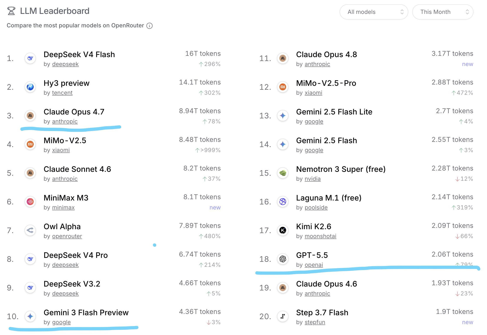
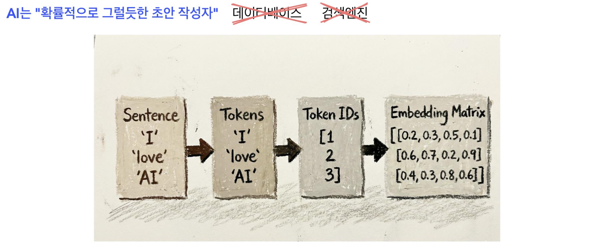
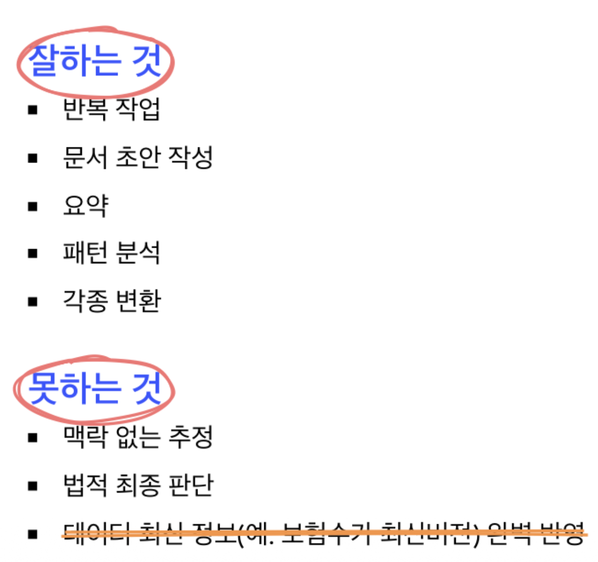
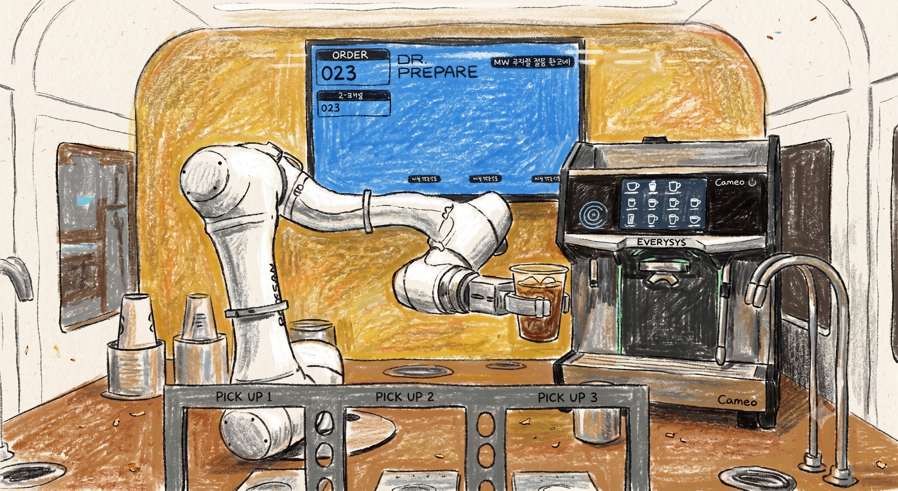
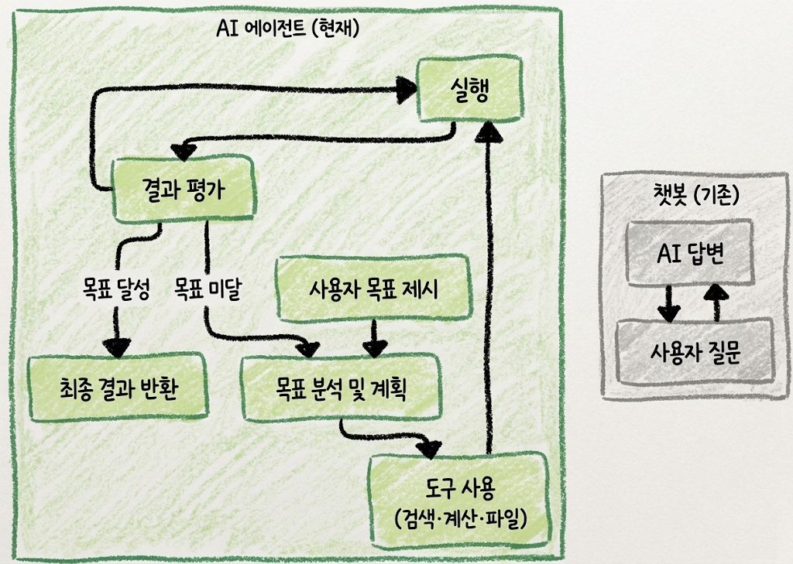
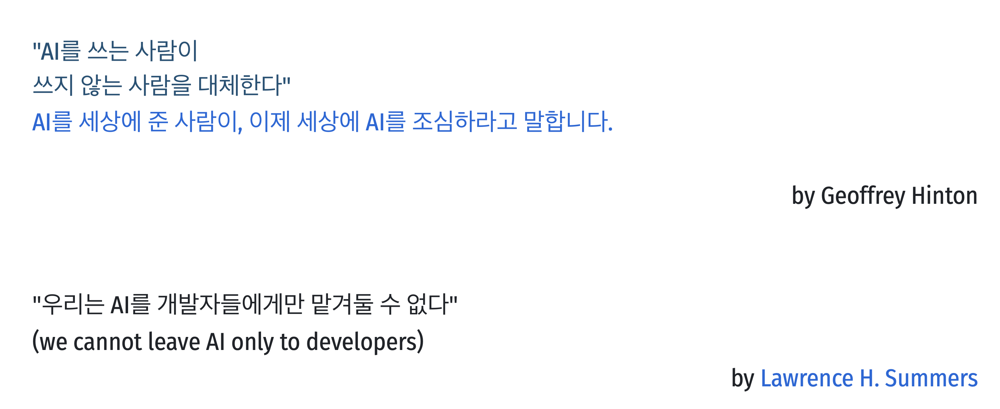

<div class="columns">
  <div class="title-bg"></div>
  <div></div>
  <div style="font-size: 2em; margin-top: -30px; color: #1a5276; text-align: center;">
    생성형 AI로 높이는 업무 효율
    <div class="mt-4 text-lg" style="color: #1a5276;">
      AX 개념부터 실전까지<br>고려대 안암병원 간담회
    </div>
  </div>
</div>

<div class="abs-br m-6 text-sm text-left">
  <h3 style="color: #1a5276;">
    <div>권 수 정 <a href="https://suekwon.github.io/about/" target="_blank" style="color: #1a5276;"> <carbon:logo-github /> </a></div>
    <div style="color: #3669ad; font-size: 0.85em">AI전략 컨설턴트 | <a href="https://from-insight.com" target="_blank" style="color: #1a5276;">From Insight Inc.</a></div>
  </h3>
</div>

<!--
오늘 강의의 핵심은 "AI가 무엇인가"가 아니라 "내 업무 방식이 어떻게 바뀌는가"입니다.
건강보험공단 리더 업무는 민원, 지표, 현장보고, 법령, 회의자료가 결합된 복합 업무입니다.
따라서 단순 챗봇이 아니라 리더의 판단을 보조하는 업무 Agent 관점으로 접근합니다.
-->

---
layout: two-cols-header
transition: fade
---

::left::

<br>

### 강사 소개

**권 수 정**
AI 전략 컨설턴트 | 프롬인사이트

- 산업공학 박사, 최적화 전공
- 생성형AI · 강화학습 · 머신러닝
  연구 및 실무 적용 전문
- 공공기관·금융·산업 현장
  AI 기반 의사결정 구현 경험

📧 [sue.kwon@from-insight.com](mailto:sue.kwon@from-insight.com)

::right::

<div style="width:70%">


</div>

---
layout: center
transition: fade
---


<div class="col-vcenter">

<span style="color:#f87ca1; font-size: 8em; font-weight: bold;">

[81](https://www.ama-assn.org/practice-management/digital-health/more-80-physicians-use-ai-professionally-ama-survey)


</span>

</div>


---
layout: center
transition: fade
---

# "AI에게 일을 맡기기" vs. "AI 처리 가능 형태로 재설계"

<div class="three-cols">
<div class="card">
<h3>1. 이해</h3>
생성형 AI가 왜 그럴듯하게 답하고, 왜 틀릴 수 있는지 이해한다.
</div>
<div class="card">
<h3>2. 적용</h3>
현재 업무 중 바로 적용 가능한 예시를 발견한다.
</div>
<div class="card">
<h3>3. 확장</h3>
의료협력 현안 처리 Agent와 의료업무 특성에 맞는 안전한 Agent 설계한다.
</div>
</div>

---
layout: two-cols
transition: fade
---

::left::

<div class="col-vcenter">

<span style="color:#f87ca1; font-size: 8em; font-weight: bold;">436</span>

</div>

::right::



#### [https://openrouter.ai/models](https://openrouter.ai/models)

---
layout: center
transition: fade
---

# 생성형 AI 구조를 확실히 알고 쓰기

## "AI가 똑똑하다" → "AI가 어떤 방식으로 작동한다"

---
layout: default
transition: fade
---

# 생성형 AI는 어떻게 답을 만드는가

<div style="width:100%; margin: 0 auto;">



**토큰화**, **숫자벡터**, **임베딩**, 다음 토큰 예측, 답변 생성, &nbsp; [변환기(Transformer)](https://www.google.com/search?q=transformer+abstract+diagram)

</div>

<!--
Token ID는 도서관 책 번호와 같습니다.
"532번 책"이라는 말만으로는 책 내용을 알 수 없습니다.
하지만 그 책을 꺼내서 보면 제목, 주제, 등장인물, 분위기를 알 수 있습니다. Embedding은 바로 그 책의 내용을 숫자로 요약한 카드
-->

---
layout: two-cols-header
transition: fade
---

# 생성형 AI는 무엇을 잘하고 무엇을 못할까?

#### **원칙: AI로 초안·분류·요약·비교 후, 최종 판단은 사람이 한다.**

::left::

<br> 

### 적용 분야

- 긴 문서 요약
- 반복 민원 분류
- 회의록 정리
- 표 비교와 패턴 찾기
- 보고서 초안 작성
- 체크리스트 생성
- 쉬운 설명문 작성

::right::

<div style = "width:85%; margin: 0 auto;">



</div>

---
layout: image
transition: fade
---

<div style="width:90%; margin: 0 auto;">



</div>

---
layout: default
transition: fade
---

# 최신 AI 흐름: 챗봇에서 Agent로

<div class="columns">
<div>

### 과거: 질문하면 답하는 AI

- "이 문서 요약해줘"
- "회의자료 초안 써줘"
- "민원 답변문 만들어줘"

</div>
<div>

### 현재: 도구를 쓰는 AI

- 파일을 읽는다
- 웹이나 내부 자료를 검색한다
- 표를 계산한다
- 시스템 화면을 보며 작업 순서를 제안한다
- 여러 단계를 나눠 실행한다

</div>
</div>

<div class="flow-diagram">


<!-- 클릭마다 단계별 v-mark (이미지 위 절대 위치 오버레이) -->

<span class="flow-mark" style="left:36%; top:30%; width:14%; height:30%;" v-mark.circle.red="1">도구 사용</span>

</div>

<!--
- Agentic, Harnessing the Power of AI
> OpenAI: Responses API와 Agents SDK에서 web search, file search, computer use 같은 도구 결합을 Agent 구축의 핵심 기능
> Anthropic: MCP로 AI 애플리케이션과 외부 데이터·도구를 연결하는 표준으로 제시
-->

---
layout: center
transition: fade
---

# 챗봇 vs AI Agent

<div style="width:60%; margin: 0 auto;">



</div>

---
layout: center
transition: fade
---

# AI 활용 핵심 기술!

---
layout: two-cols-header
transition: fade
---

# 업무용 프롬프트 템플릿

::left::

### 템플릿

<div class="prompt-template">

<pre>
당신은 병원에서 진료협력 업무분석 담당자입니다.
아래 자료를 기준으로 핵심 이슈를 정리하세요.

분석 기준:
1. 위중도 판별
2. 처리 지연 가능성
3. 취약계층 영향
4. 내부 후속조치 필요성
5. 언론·대외 리스크

출력 형식:
- 이번 주 위험 이슈 TOP 5
- 각 이슈별 근거
- 담당부서 확인사항
- 리더가 회의에서 물어볼 질문
- 확인 필요 정보

<span class="prompt-warn">주의:
개인정보는 사용하지 말고, 자료에 없는 내용은 추정하지 마세요.</span>
</pre>

</div>

::right::

### 이 템플릿이 좋은 이유

- 역할이 명확하다
- 판단 기준이 있다
- 출력 형식이 정해져 있다
- "확인 필요"를 허용한다
- 개인정보 사용 금지를 명시한다

<br>

**질문에서 업무지시로 프롬프트 활용**

---
layout: center
transition: fade
---

# 진료협력 업무에 AI 적용하기

## 4가지 영역 · 함께 하는 예제

<!--
안암병원 진료협력 업무를 4개 영역으로 나눠
각 영역에서 AI가 무엇을 대신하고, 사람이 무엇을 판단하는지 보여줍니다.
모든 수치는 교육용 자리표시자([ ])이며, 실제(또는 교육용) 데이터로 교체합니다.
예제 데이터는 별도 파일로 생성합니다.
-->

---
layout: two-cols-header
transition: fade
---

# 진료협력 업무에 도입한 AI

### [파일럿에서 업무 시행 정착까지](https://digitalchosun.dizzo.com/site/data/html_dir/2025/07/16/2025071680170.html?utm_source=chatgpt.com)

<span style="color: purple; font-weight: bold;">문서화, 예약, 콜센터, 환자 메시지, 요약, 통역, 보험/자격확인, 회의록, 교육자료 생성</span>

<br>

::left::

### 진료협력 업무의 특징

<br>

- 공공성·책임성·보안성이 높은 업무
- 최종 판단 전 방대한 자료 검토 시간을 요함
- **빠른 답변**과 **정확한 답변** 요구 환자
- 치료, 이송, 보고, 업무들 동시 발생

::right::

### AI가 먼저 도와줄 수 있는 일

<br>

| 업무 | AI 활용 방식 |
|---|---|
| 현안 파악 | 여러 차트를 읽고 주요 항목 추출 |
| 환자 분석 | 유형·긴급도·반복성 분류 |
| 협력 병원 | 협진 병원 가용 여부 분석 |
| 회의 준비 | 안건, 쟁점, 질문 목록 작성 |
| 보고 초안 | 1페이지 브리핑 초안 작성 |

::center::

# asd

---
layout: default
transition: fade
---

# 한눈에 보는 4가지 적용 영역
### **공통 원칙: AI는 초안·분류·요약, 최종 판단은 의료진**

<br>
<div class="columns">
<div>

## ① 의뢰·회송 분류 및 문서작성
[분류 기관에 의뢰서·회송문서 작성](https://ef.hira.or.kr/efweb/index.do?sso=ok)

<br>

## ② 데이터 분석
협력병원·진료과별 패턴 분석

</div>
<div>

## ③ 문서·보고서 자동화
간담회·협력병원 보고서 생성·시각화

<br>

## ④ 교육 지원
협력병원 의료진 맞춤 교육자료

</div>
</div>

<!-- 
🧠 왜 사람의 개입이 필요한가?
위생은 자동화만으로 관리 불가: 커피머신 내부는 습기·찌꺼기·세균 번식 가능성이 높기 때문에, 일정 주기로 직접 해체·세척이 필요합니다.
법적 규제 대응: 식품안전법 및 위생관리기준은 현재까지 인간의 점검·기록을 요구하는 조항이 존재합니다.
예외 상황 대응: 컵 불량, 고객 오작동, 결제 오류 등은 로봇만으로 처리할 수 없는 상황이며, 원격 관리자나 현장 지원 인력이 필요합니다.


위생 관리	커피머신 내부 세척, 로봇팔 위생 소독, 컵 보관함 청소 등 위생 기준 충족 필수
재료 리필	원두, 우유, 시럽, 물, 컵 등 소모품은 정기적으로 사람이 보충
고장 시 수리 및 점검	기계 고장, 부품 마모, 센서 오류 등은 전문 기술자가 수리
정기 정비	윤활유 주입, 부품 마모 교체 등 기계 성능 유지 위한 월별 또는 분기별 점검
매장 청결 및 시설관리	주변 쓰레기 정리, 바닥 청소, 쓰레기통 비우기 등은 여전히 사람의 영역
 -->

---
layout: two-cols-header
transition: fade
---

# ① AI 활용 방식 - 환자 의뢰·회송


::left::

### AI가 하는 일

<br>

- 의뢰 사유 → 진료과 자동 분류
- 의뢰서·회송문서 초안 작성
- 필수 항목 누락 체크

<br>

### 사람이 하는 일

- 진료 서식 필드 매핑
- 의학적 판단 · 최종 서명

::right::

### 프롬프트 (요약)

<br>

- **역할** 진료협력 문서 보조 AI
- **입력** 환자 의뢰 메모(비식별)
- **출력** 회송문서 초안 + 진료과 분류

<br>

### 예제 데이터

- [ 비식별 의뢰 메모 샘플 ]

<!--
[전체 프롬프트 원문 — 자리표시자]
당신은 진료협력센터의 문서 작성을 보조하는 AI입니다.
아래 비식별 의뢰 메모를 바탕으로 회송문서 초안과 진료과 분류를 작성하세요.
(제공/생성 예정)
-->

---
layout: two-cols-header
transition: fade
---

# ② AI 활용 방식 - 데이터 분석

::left::

### AI가 하는 일

<br>

- 협력병원별 의뢰 패턴 분석
- 진료과별 회송 현황 비교
- 이상치·증감 추세 탐지

<br>

### 사람이 하는 일

- 전략적 협력 방향 결정

::right::

### 프롬프트 (요약)

<br>

- **역할** 진료협력 데이터 분석가
- **입력** 의뢰·회송 통계표(비식별)
- **출력** 패턴 요약 + 협력 제안 3가지

<br>

### 예제 데이터

- [ 협력병원·진료과별 의뢰/회송 표 ]

---
layout: default
transition: fade
---

# ③ AI 활용 방식 - 문서·보고서 

<div class="columns">
<div>

### AI가 하는 일

<br>

- 협력병원 대상 보고서와 통계 자료 작성
- 통계 자료 표·차트 자동 생성
- 핵심 메시지 시각화

<br>

### 사람이 하는 일

- 사실 검증 · 최종 승인

</div>
<div>

### 프롬프트 (요약)

<br>

- **역할** 협력 보고서 작성 보조
- **입력** 의뢰·회송 통계(비식별)
- **출력** 1페이지 보고서 + 차트 설명

<br>

### 예제 데이터

- [ 분기 협력 실적 요약표 ]

</div>
</div>

---
layout: two-cols-header
transition: fade
---

# ④ AI 활용 방식 - 교육 지원

::left::

### AI가 하는 일

<br>

- 대상별 맞춤 교육자료 초안
- 난이도·분량 자동 조정
- 핵심 요약·퀴즈 생성

<br>

### 사람이 하는 일

- 의학적 정확성 검수

::right::

### 프롬프트 (요약)

<br>

- **역할** 의료진 교육자료 제작 보조
- **입력** 주제 · 대상 · 분량
- **출력** 슬라이드 개요 + 강의 노트

<br>

### 예제 데이터

- [ 교육 주제·대상 정의서 ]


---
layout: default
transition: fade
---

# 병원 업무 자동화 데모 만들기

의뢰·회송 문서, 통계 보고서, 교육자료 자동화를 인터랙티브 페이지로 시연

#### <a href="./hospital_ai_demo.html" target="_blank" style="color: purple;">자동화 예시 (hospital_ai_demo.html)</a>

<details>
<summary>📄 HTML 일부 미리보기 (펼쳐 보기)</summary>

```html
<header class="top">
  <div class="wrap">
    <div class="eyebrow">Hospital Workflow Automation · AI Demo</div>
    <h1>병원 업무 자동화 AI 시연</h1>
    <p>의뢰·회송 문서 작성, 통계 보고서 생성, 교육자료 제작 —
      어느 조직에서나 쓰이는 자동화를 병원 업무에 적용한 예제입니다.</p>
    <div class="demo-badge">● 시연용 데모 · 가상 샘플 데이터</div>
  </div>
</header>

<div class="tabs">
  <div class="tab active" onclick="showTab(0)">의뢰·회송 문서 자동화</div>
  <div class="tab" onclick="showTab(1)">데이터 분석·보고서 자동화</div>
  <div class="tab" onclick="showTab(2)">맞춤형 교육자료 제작</div>
</div>
```

</details>
<br>


#### <a href="./vibe_coding_walkthrough.html" target="_blank" style="color: purple;">따라하기 (vibe_coding_walkthrough.html)</a>

<details>
<summary>📄 HTML 일부 미리보기 (펼쳐 보기)</summary>

```html
<!-- STEP 1: 챗봇에 그냥 물어보기 -->
<div class="prompt">
  <button class="copy" onclick="cp(this)">복사</button>
  <pre>아래 환자 메모를 진료의뢰서로 작성해줘.

환자: 김정호, 58세 남
메모: 운동 시 흉부 압박감, 좌측 어깨 방사통.
흡연 30갑년, 고혈압 병력.</pre>
</div>
```

</details>


---
layout: center
transition: fade
---

# 실습 3. 안전한 AI 활용

공공기관에서 중요한 것은 "AI를 많이 쓰는 것" 보다,
"책임 있게 쓸 수 있는 경계선을 정하는 것" 이 우선

---
layout: image
transition: fade
---

<div style="width:90%">


</div>

---
layout: default
transition: fade
---

# 개인정보 제거 예시

<br>

| 원문 | AI 입력용 변환 |
|---|---|
| 홍길동, 580101-1******, 장기요양 등급 이의신청 | 70대 남성, 장기요양 등급 이의신청 사례 |
| 서울 ○○구 ○○아파트 101동 1203호 | 수도권 거주 고령 민원인 |
| 계좌번호 123-456-789 | 계좌정보 삭제 |
| 특정 병명과 진료내역 포함 | 건강정보 삭제 후 제도 문의 유형만 남김 |
| 담당 직원 실명 비판 | 담당부서 또는 업무유형으로 대체 |


---
layout: two-cols-header
transition: fade
---

# AI 사용 금지·주의·실전

::left::

<h3 style="color: red; font-weight: bold;">금지</h3>

- 주민등록번호, 계좌번호, 진료·요양 상세정보
- 특정 민원인 개인정보를 외부 AI에 입력
- AI 답변을 검토 없이 민원인에게 발송
- 제재·불이익 판단을 AI에게 자동 결정시킴

<br>

<h3 style="color: red; font-weight: bold;">주의</h3>

- 내부 결재 전 문서
- AI 진단 해석
- 민감 분류 질병 

::right::

<h3 style="color: blue; font-weight: bold;">권장</h3>

- 가상 데이터 실습
- 비식별화된 통계 분석
- 공개 자료 요약
- 회의 안건 초안
- 직원 교육자료 초안
- 체크리스트 작성

<div class="card">
<b>AI활용 원칙</b><br>
AI 활용의 <span v-mark.line.red="1"> 책임은 AI가 아니라 조직과 사용자</span>에게 있음 <br><br> <span v-mark.line.orange="2">"자동화"보다 "검토 가능한 흐름"</span>으로 설계해야 함!
</div>


---
layout: center
transition: fade
---

# 마무리: 업무방식 변화

---
layout: two-cols-header
transition: fade
---

# Before → After

### 완벽한 AI 시스템보다 중요한 것은, 오늘 당장 업무 하나를 20% 줄이는 첫 실험입니다.

<br>

::left::

## Before

- 자료를 사람이 하나씩 읽는다
- 엑셀을 열어 직접 비교한다
- 보고서 초안을 처음부터 쓴다
- 회의 후 후속조치가 흩어진다
- 바쁜 리더가 맥락을 모두 떠안는다

::right::

## After

- AI가 먼저 읽고 분류한다
- Agent가 편차와 이상징후를 제시한다
- 리더는 초안을 검토하고 판단한다
- 회의 질문과 후속조치가 자동 정리된다
- 리더는 반복 업무보다 의사결정에 집중한다

---
layout: image
transition: fade
---

<div style="width:105%">



</div>


---
layout: default
transition: fade
---

# References

| <span style="color: purple"> _ </span> |
|---|
| OpenAI API Docs, Computer use. |
| OpenAI, The next evolution of the Agents SDK. |
| Anthropic, Introducing the Model Context Protocol. |
| Model Context Protocol Specification. |
| 건강보험 심사평가원 ([ HIRA 소식](https://ef.hira.or.kr/efweb/index.do?sso=ok) )|
| [More than 80% of physicians use AI professionally, AMA Survey](https://www.ama-assn.org/practice-management/digital-health/more-80-physicians-use-ai-professionally-ama-survey)|
| 국민건강보험공단 홈페이지 및 공공기관 경영정보 공개자료. |
| 보건복지부, 사회보험징수통합 및 장기요양보험 관련 안내. |

<br>

> 본 강의자료의 실습 데이터는 교육용 가상 데이터입니다. 실제 민원, 개인 건강정보, 주민등록번호, 계좌정보, 내부 미공개 자료를 외부 AI 서비스에 입력하지 않습니다.
