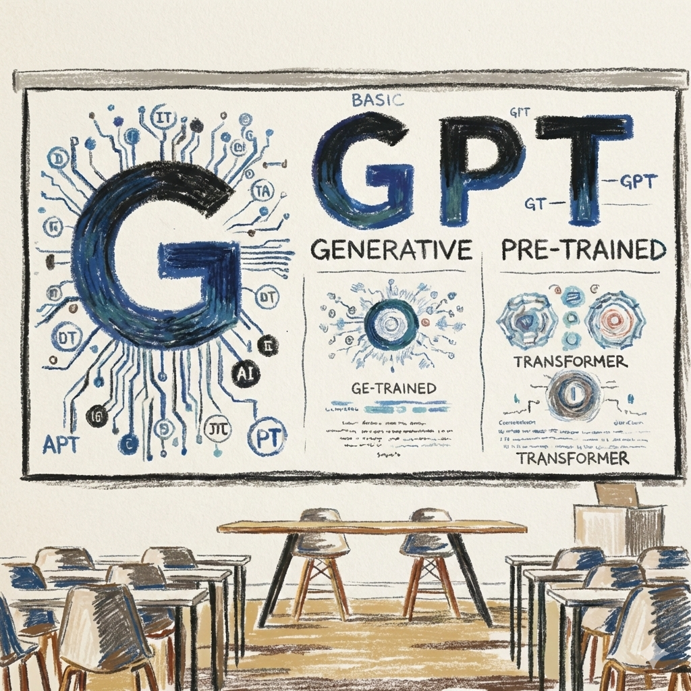
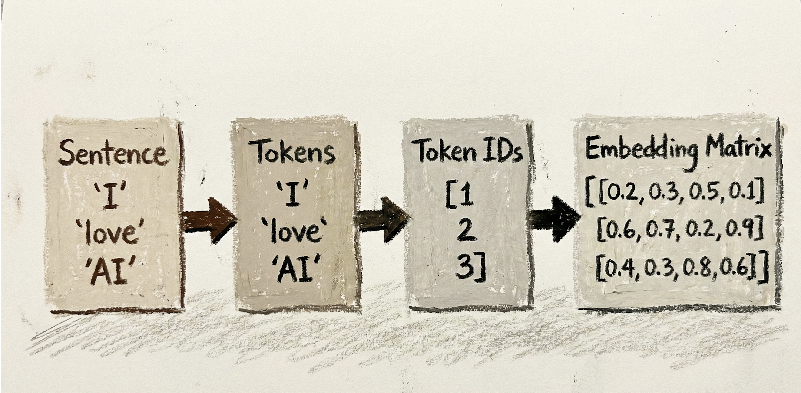
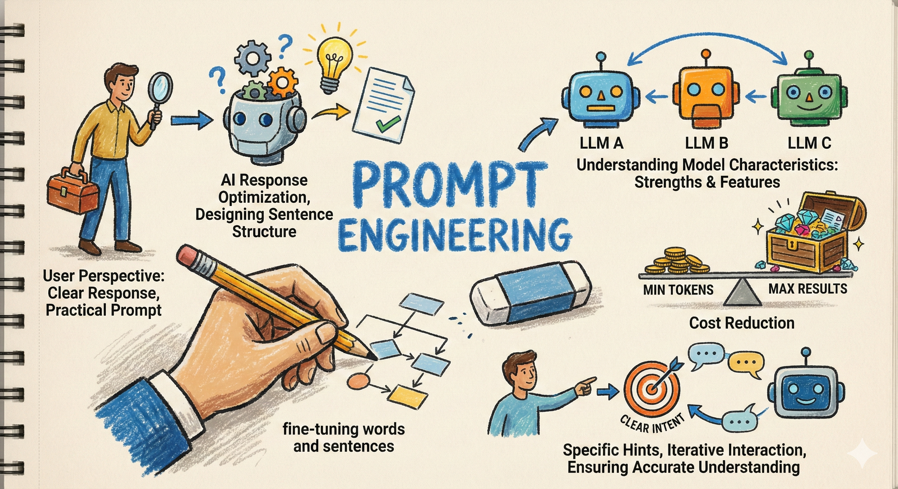
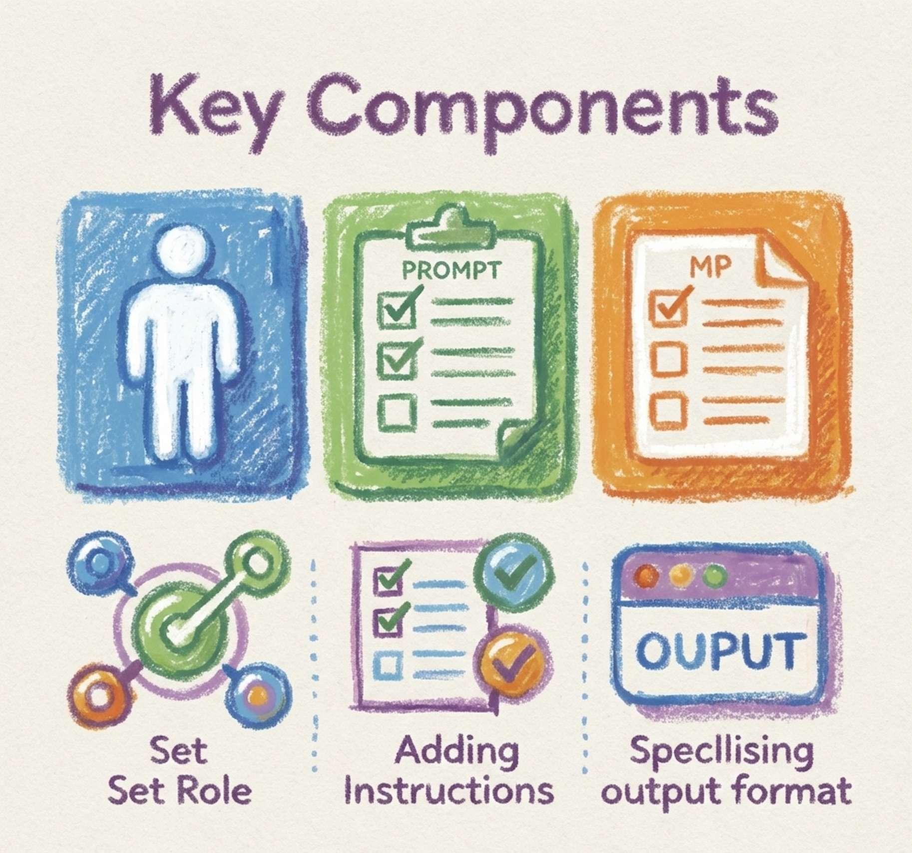
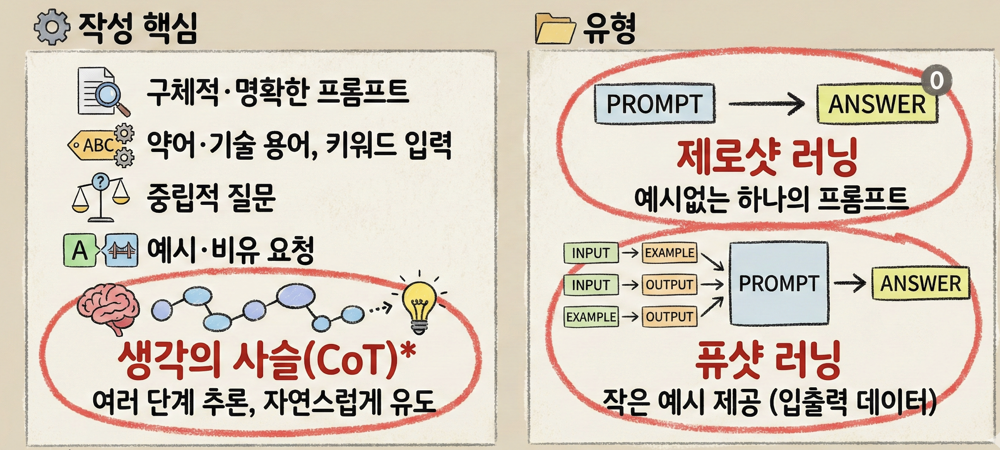
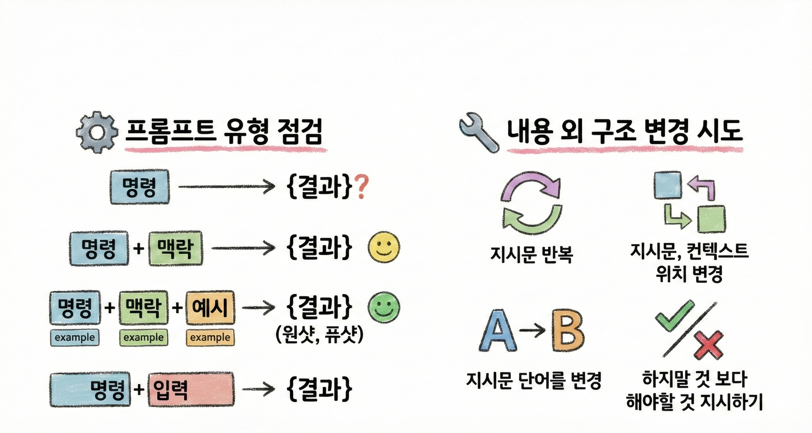
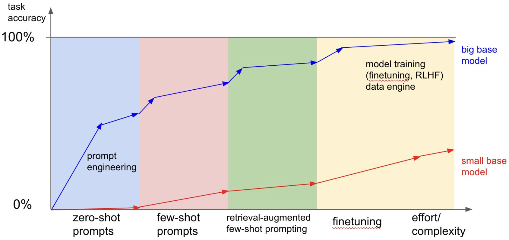

---
# try also 'default' to start simple
theme: default
aspectRatio: 16/9
canvasWidth: 980

# random image from a curated Unsplash collection by Anthony
# like them? see https://unsplash.com/collections/94734566/slidev
# https://cover.sli.dev
background: https://cdn.jsdelivr.net/gh/slidevjs/slidev-covers@main/static/d34DtRp1bqo.webp
# some information about your slides (markdown enabled)
title: From-insight AI world !
info: |
  ## Presentation slides for 전국지방의료원연합회

author: 권 수 정 
# apply UnoCSS classes to the current slide
class: text-center
# https://sli.dev/features/drawing
drawings:
  persist: false
# slide transition: https://sli.dev/guide/animations.html#slide-transitions
transition: slide-left
# enable MDC Syntax: https://sli.dev/features/mdc
mdc: true
# duration of the presentation
duration: 35min
download: true
---

<h1 style="font-size: 2.5em; margin-top: -40px;">AI 전환 시대, 의료계 혁신 전략</h1>

  
  
 안전한 생성형AI 활용 가이드  <carbon:arrow-right />

  

  <h3>
    
권수정 <a href="https://suekwon.github.io/about/" target="_blank" class="slidev-icon-btn"> <carbon:logo-github /> </a>

    
AI 전략 컨설턴트 | 프롬인사이트

  </h3>
  

<!--
The last comment block of each slide will be treated as slide notes. It will be visible and editable in Presenter Mode along with the slide. [Read more in the docs](https://sli.dev/guide/syntax.html#notes)
-->

<!-- 
저는 산업공학 박사로, 생성형 AI·강화학습·머신러닝을 활용해서 연구하고, 실무에 적용하고 있는 전문가입니다. 공공기관과 금융·산업 현장에서 AI 기반 의사결정 분석 고도화를 실제로 구현해 온 경험을 바탕으로, 기존 업무에 현실적으로 적용하는 방법 중심으로 강의합니다. 기관 특성을 고려한 단계적 AI 도입과 활용 방향을 제시해보려 합니다.

 -->
---
layout: two-cols-header
title: AI Icebreaking
transition: fade-out
---

## 게임 규칙

- 질문에 **해당되면 손가락 1개 접기**
- 총 **5개 질문**
- **5개 모두 접으면 우승**

| *`정답은 없습니다. 솔직하게 해주세요.`*

::left::

<v-click>

- #### 질문 ① 최근 한 달 내  
  **ChatGPT 등 AI에 질문하거나, 보고서·메일·자료   초안 작성에  AI 도움을 받아본 적 있다**
  
  ☝️ 해당되면 손가락 접기
</v-click>

<v-click>

- #### 질문 ② **최소 3개 이상** 
  다른 AI를 사용해본 적이 있다.
  
  ☝️ 해당되면 손가락 접기

</v-click>

::right::

<v-click>

- #### 질문 ③ 다음과 같이 생각해본 적 있다 
  **"이거 AI로 자동화하면 훨씬 덜 귀찮을 텐데**"

  ☝️ 해당되면 손가락 접기

</v-click>

<v-click>

- #### 질문 ④ 엑셀 · 시스템 · 수기 입력 등
  **반복 작업이 많다고 느낀다** 

  ☝️ 해당되면 손가락 접기

</v-click>

<v-click>

- #### 질문 ⑤ AI **어디까지 써도 되는지 애매**하다고 느낀다
  ☝️ 해당되면 손가락 접기

</v-click>

<!-- 
1. 핵심 메시지: AI는 이미 진입 장벽이 없다
2. 공기업 공감 포인트 상투적 문구 “보고서/회의자료/대외문서”
3. AI 전환은 기술 문제가 아니라 문제 인식의 문제
4. AI의 첫 타깃은 ‘잘 돌아가지만 비효율적인 업무’
5. 보안, 책임, 내부 규정 등 기관 특성 반영

5개 다 접음
→ “이미 AI 전환의 출발선에 서 계신 분”

2~3개 접음
→ “오늘 강의 끝나면 5개가 됩니다”

0~1개
→ “오늘 가장 얻어갈 게 많은 분”

1등은 프롬프트 3선
뒤에서 1등은 다음 질문에 우선 발언권

지금 게임에서 중요한 건 ‘AI를 아느냐’가 아니라
이미 쓰고 있다는 사실을 인식했느냐였습니다.
 -->

---
layout: center
transition: fade
---

# 언어모델 이해하기(동작 원리 및 발전 과정)

## 1. 언어모델 기초 개념(개요, 주요 요소, 발전 단계)

<v-clicks>

</v-clicks>

---
layout: two-cols-header
transition: fade
---

## 생성형AI

::left::

- **G**enerative **P**re-trained **T**ransformer
  - 스스로 `콘텐츠`를 생성하는 AI 기술

::right::

---
layout: two-cols-header
transition: fade-out
---

::left::
## AI 현주소
 

- [생성형AI 종류 3가지](https://openrouter.ai/models)
- [생성형AI는 왜 거짓말을 하는가?](https://www.google.com/search?q=transformer+abstract+diagram&newwindow=1&sca_esv=0941c5488d98d8af&udm=2&biw=1434&bih=1071&aic=0&sxsrf=ANbL-n4mFitsI2HLQ1YrqfhMGVtU7eNEug%3A1769868367139&ei=Twx-adCdCJfd2roP5b7F0Aw&ved=0ahUKEwiQgcq6-bWSAxWXrlYBHWVfEcoQ4dUDCBI&uact=5&oq=transformer+abstract+diagram&gs_lp=Egtnd3Mtd2l6LWltZyIcdHJhbnNmb3JtZXIgYWJzdHJhY3QgZGlhZ3JhbUidPFDOBFjKOnAGeACQAQCYAYgBoAGFFaoBBDAuMjO4AQPIAQD4AQGYAg2gAt4LwgIFEAAYgATCAgcQIxjJAhgnwgIEEAAYHsICBhAAGAgYHpgDAIgGAZIHBDEuMTKgB5E5sgcEMC4xMrgH2wvCBwcwLjMuOS4xyAc9gAgB&sclient=gws-wiz-img#sv=CAMSVhoyKhBlLVZzNHdNcDB2TTFuSmlNMg5WczR3TXAwdk0xbkppTToOYUxQX2YzdF94WkVvSU0gBCocCgZtb3NhaWMSEGUtVnM0d01wMHZNMW5KaU0YADABGAcg5_-0hQ8wAkoKCAEQAhgCIAIoAg)
- [OpenAI 와 chatGPT](https://openai.com/ko-KR/open-models/)
- AI로 할 수 있는 업무 종류
- AI, agent, AGI, Physical AI

<v-click>
   

"우리는 AI를 개발자들에게만 맡겨둘 수 없다"  
(we cannot leave AI only to developers)  

by <a href="https://www.google.com/search?q=Lawrence+H.+Summers&oq=Lawrence+H.+Summers&gs_lcrp=EgZjaHJvbWUyBggAEEUYOTIGCAEQLhhA0gEHMjIyajBqNKgCALACAQ&sourceid=chrome&ie=UTF-8" target="_blank">Lawrence H. Summers</a> 

</v-click>

::right::
 

---
transition: fade
---

## 생성형AI 특성: 발자취 및 핵심 원리

  

- 인공지능 역사와 함께 해 옴
  - 1950, 1960년대 챗봇: 통계이론 활용(Hidden Markov Model:HMM, Gaussian Mixture Model: GMM)
  - 1950: [튜링테스트(Computing machinery and intelligence)](https://phil415.pbworks.com/f/TuringComputing.pdf)

- **G**enerative **A**dversarial **N**etwork $^{*}$
  - real + fake(생성) -> 판별
  - 정교한 생성, 판별력 증대
  -  진짜 같아 보이는 가짜 생성 

- **V**ariational **A**uto**E**ncoder $^{**}$
  -  Encoder  +  Decoder
  - *Latent space(잠재 영역)*
    - 주요 특성만 추출한 압축형태
  - *Reparameterization*
    - 원본과 유사하게 재생성

> $^{*}$ [Goodfellow, Ian, et al. "Generative Adversarial Networks." COMMUNICATIONS OF THE ACM 63.11 (2020).](https://d1wqtxts1xzle7.cloudfront.net/96484772/3422622-libre.pdf?1672244858=&response-content-disposition=inline%3B+filename%3DGenerative_adversarial_networks.pdf&Expires=1730881839&Signature=Lq6n4gvdXmaVrQoFzo6arYC1JePl6KTuehLd5nK67sngpp3KCj52mPmk5wYNkYmgtpXxOEEH22jU2e1OVrJsAWiV-8~NjZKIpKcJJFSZ2-ctPEtFHszZOkH6D9zaIVN57iFSZcumDtU6zpWnxkv~qHNttBOjS2zRClc0ysl81R2e7LHUTX4q1yA989Duv2KZc5TU9e-m4crrLjeratIOJJ~UbBjldWkR7HpMTVPR0AAmg7hVUu0VcyZX5JeU4Bfk4Kp4EWLlznewZLthA5wMXMevOuX2v~r1q6kZ5BMuLDh4C0XjBD09xR84Gf~xoG1L7F723~MUJGTNf7jibJdnsg__&Key-Pair-Id=APKAJLOHF5GGSLRBV4ZA)
> 
> $^{**}$ [Kingma, Diederik P. "Auto-encoding variational bayes." arXiv preprint arXiv:1312.6114 (2013).](https://www.ee.bgu.ac.il/~rrtammy/DNN/StudentPresentations/2018/AUTOEN~2.PDF)

---
transition: fade
---

## 토큰화
- 문자열(텍스트) -> 압축 기호(정수 벡터)
- 각 토큰은 유티크ID 로 매핑
- 임베딩: 정수를 특정 크기 벡터로 변환

    
  
  <b> Figure</b>: 입력문장 토큰화, 임베딩 매트릭스 생성 과정.
  

---
layout: two-cols-header
transition: fade
---

## 생성형AI는 무엇을 잘하고 무엇을 못하는가

::left::

-  **잘하는 것** 
  - 반복 작업
  - 문서 초안 작성
  - 요약
  - 패턴 분석
  - 각종 변환 

-  **못하는 것** 
  - 맥락 없는 추정
  - 법적 최종 판단
  - 최신 정보(예. 보험수가 최신버전) 완벽 반영  
  
::right::

  

    

  <!-- 
  잘하는 것의 예시: 알파고 2016
  - 경우의 수가 많은 복잡한 게임
  - 4:1 승리

- 사람의 통찰력?
- 글쓰기??
  - 사람이 더 잘하는 영역?
   -->

---
layout: center
transition: fade
---

# 실무 활용 사례 소개 - 프롬프트 엔지니어링

---
layout: two-cols-header
transition: fade
---

## 프롬프트 엔지니어링이란? 

  

::left::
- 단어와 문장을 미세하게 조정해 AI 응답 최적화
- 사용 목적에 적합한 문장 구조 설계
- 사용자 입장
  - 명확한 응답
  - 실용성 높은 프롬프트
- **모델별 특성 이해**: 여러 LLM 강점 및 특성
- **비용 절감**: 최소 토큰, 최대 결과

::right::
- LLM이 질문 의도를 정확히 이해하도록 신중하게 작성
- *구체적 힌트와 추가 정보 제공*
  - 명확한 의도 전달을 통해 원하는 답변 유도
- *반복적 상호작용*
  - 필요 시 원하는 답변 얻을 때 까지 질문 수정

---
layout: two-cols-header
transition: fade
---

## 프롬프트 주요 구성요소

 

::left::
- **역할지정** (or 대상명시)    
- **지시**
  - 최소 하나 이상 : *지식과 정보* 제공
  - 단, 너무 많은 지시는 혼란한 답변
  - 지시 유형 
    - 요약, 분류, 제안, 현지화
- **컨텐츠** (수행할 작업 or 목표)
  - 입력데이터 특수기호 사용
- **출력형식 지정** (정책, 규칙, 스타일 가이드, 제약)
  - ex) 테이블, 목록, 마크다운(HTML), 계층구조, 서식(Markdown, LaTex) 등

::right::

---
layout: two-cols-header
transition: fade
---

## 좋은 프롬프트 작성 핵심

  

::left::
- 구체적이고 명확한 프롬프트
- 약어 및 기술 용어
- 키워드 입력
- **생각의 사슬(CoT)** ${^*}$ 접근법
  - 여러 단계 세분화해서 추론 능력 향상
  - 자연스럽고 간접적으로 유도
- 의도를 반영하지 않는 중립적 질문
- 예시, 비유 요청

::right::

- 유형  
  - **제로샷 러닝**: 예시없는 하나의 프롬프트로 답 요청
  - **퓨샷 러닝**: 작은 예시 제공, 입력 출력 예시 데이터  

> ${^*}$ Wei, Jason, et al. "Chain-of-thought prompting elicits reasoning in large language models." Advances in neural information processing systems 35 (2022): 24824-24837.

---
layout: two-cols-header
transition: fade
---

## 상황에 맞는 프롬프트 형식 활용하기

 

::left::
- 제로샷 러닝으로 답변의 품질이 적정한 경우
  * 데이터가 충분할 때  
    - ex) 코딩, 번역 등
- LLM 조정해야 하는 경우 
  * 데이터 부족할 때,
    - 퓨샷예시 or 학습데이터 제공해 작업 이해 후 수행
    - ex) 전문가 역할극 or `위키피디아에 따르면`  
  * 패턴, 규칙 알려주고 판단하도록 지시

::right::

 - **CoT** : 생각하는 방법 알려주기 
    * ex) 정황을 이해하고 숫자 계산하기 
 - **제로샷 CoT** 
    * 생각의 단계, 논리 순서 가이드 없음
    * 스스로 분석, 단계적 사고 후 해답 제공
    * `단계별로 생각해` 지시문 주기
    * ex) 면접질문 생성, 채용공고 

---
layout: two-cols-header
transition: fade
---

## 만족스럽지 못한 결과,..

 

::left::

- 프롬프트 유형 점검
  - 명령 {결과}
  - 명령 + 맥락 {결과}
  - 명령 + 맥락 + 예시 {결과} : 원샷, 퓨샷
  - 명령 + 입력 {결과}
- 내용 외 구조 변경 시도
  - 지시문 반복
  - 지시문, 컨텍스트 위치 변경
  - 지시문 단어를 변경
  - **하지말 것 보다 해야할 것 지시하기**

::right::

---
transition: fade
---

## 프롬프트 엔지니어링의 효용

 

- **RLHF**: **R**einforcement **L**earning from **H**uman **F**eedback
- **InstructGPT**
  - 13 억 파라미터만 가지고도 1,750억 파라미터 가진 모델 답변보다 신뢰할 수 있음$^{*}$
- 지도학습 방법
  - 질문 답변 Fine-tuning
  - 우수한 답변 데이터로 보상 모델 학습
  - 답변 생성 $\rightarrow$ 좋은 답변 

 
 

> $^{*}$ Ouyang, Long, et al. "Training language models to follow instructions with human feedback." Advances in neural information processing systems 35 (2022): 27730-27744.

---
transition: fade
---

## 모델 간 프롬프트 엔지니어링 차이

 

> https://x.com/karpathy/status/1655994367033884672

---
layout: two-cols-header
transition: fade
---

## AI 기술이 가져올 미래
 

::left::
- **AI 리터러시**: AI 시스템을 이해하고 활용하는 역량
  - (과거) 컴퓨터 활용능력 → (현재) AI 이해 활용
  - 디지털 리터러시 → AI 리터러시로 확장
  - 자동화 산업 대체, 새로운 기회: 변화는 과거부터 있었음
    - 선택이 아닌 필수
    - AI 역할 확대에 따른 **변화에 적응 능력**  
  - 위험, 기회, 규제, 글로벌 경쟁
  - 한계? 
    - 협업, 문제해결능력

::right::
- **AI는 어디로 가는가?**
  - 인공지능의 역사
  - [생성형AI와 산업의 변화: 의료, 법률, 교육, 기술, 창작](https://product.kyobobook.co.kr/detail/S000213501853)
  - 노동의 미래
- **AI 윤리: 책임 있는 사용**
  - 단순한 기술 이해를 넘어 **윤리적 사회적 영향력**까지 포괄
  - **책임감**과 **윤리적 마인드** 필수
  - 잠재적 **위험성 관리** 필요성

---
layout:
transition: slide-down
---

---
layout: center
---

"DONE IS BETTER THAN PERFECT"

---
layout: default
---

## 교육 설문

[https://forms.gle/DZhv4ZqWLAsbjanG7](https://forms.gle/DZhv4ZqWLAsbjanG7)

  
  

