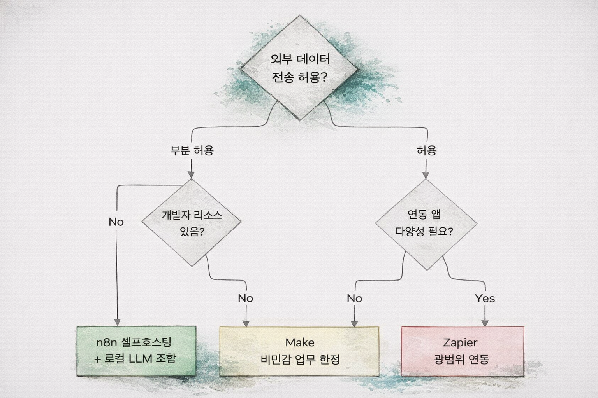

# 어디서 부터 시작할까? 

{width=90%}

--- 
layout: default
transition: fade
---

## 예제. Zapier 이용 
{width=10%}

{width=55%}
ㄱ

<!-- Zapier는 연결할 수 있는 앱이 8,000개 이상으로 압도적으로 많습니다. 특정 앱 연동이 필요한 경우 Zapier가 가장 빠릅니다. 그러나 모든 데이터가 Zapier 서버를 거칩니다. 내부 보안 정책 확인 후 사용 여부를 결정해야 합니다.
 -->

---

# 우리 환경에서 선택 기준

