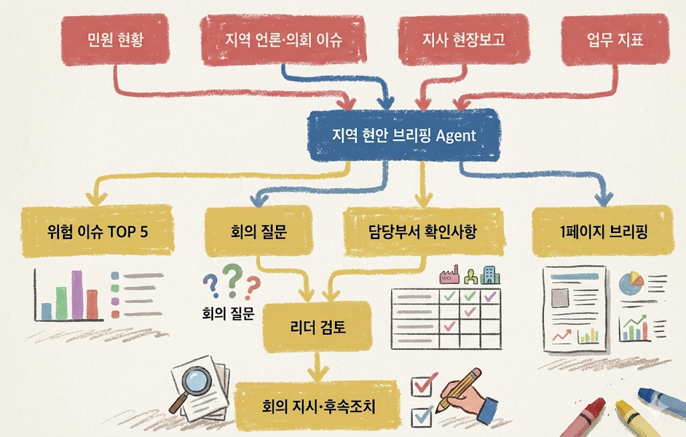
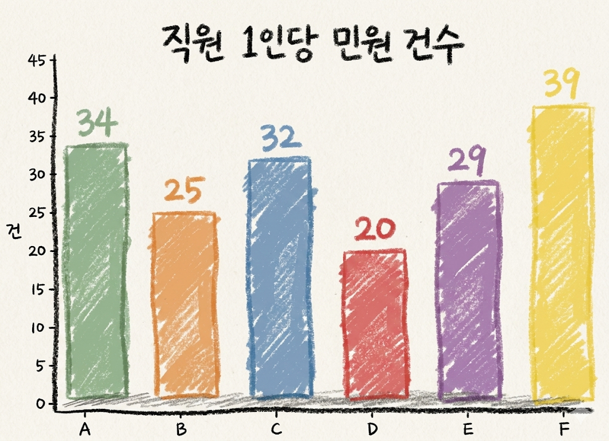
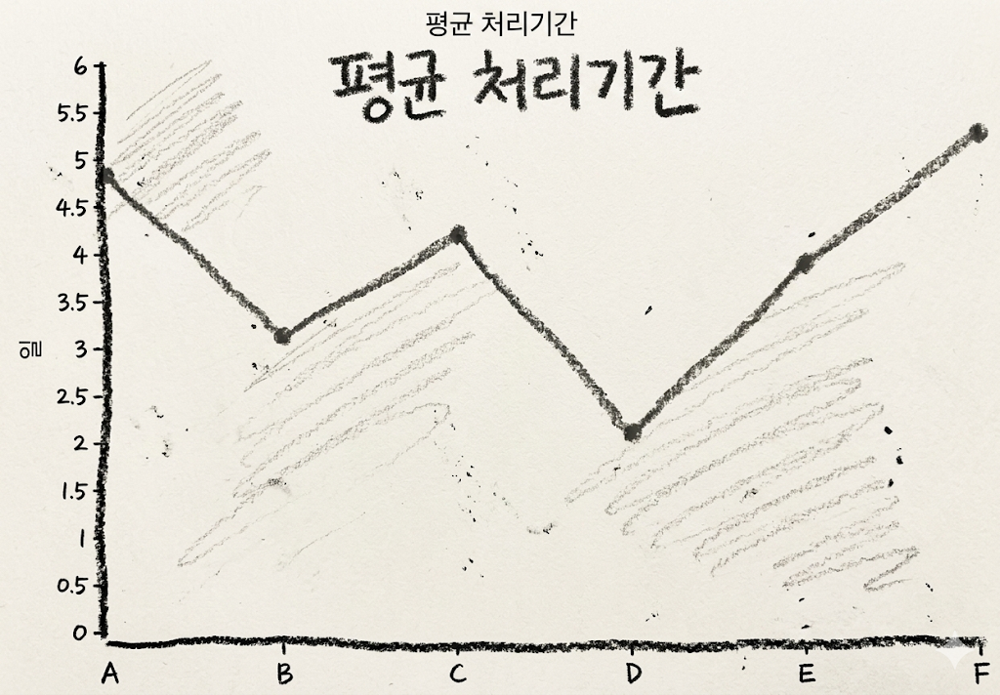
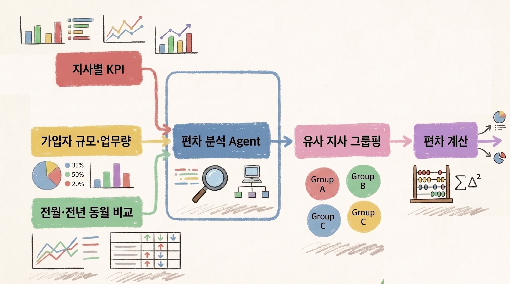
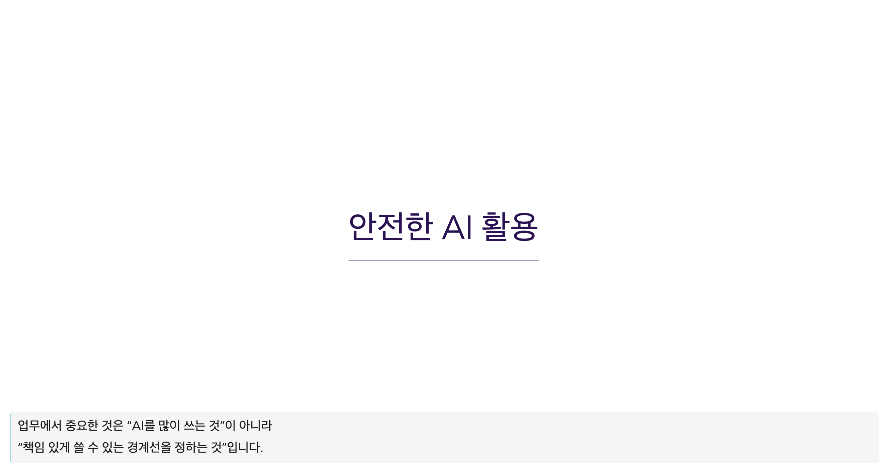
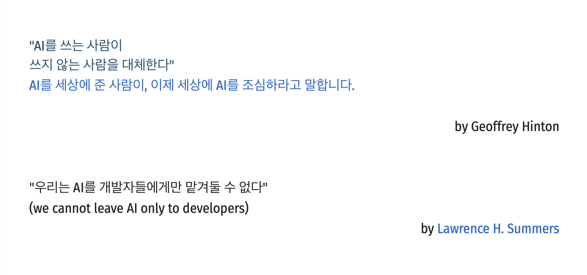
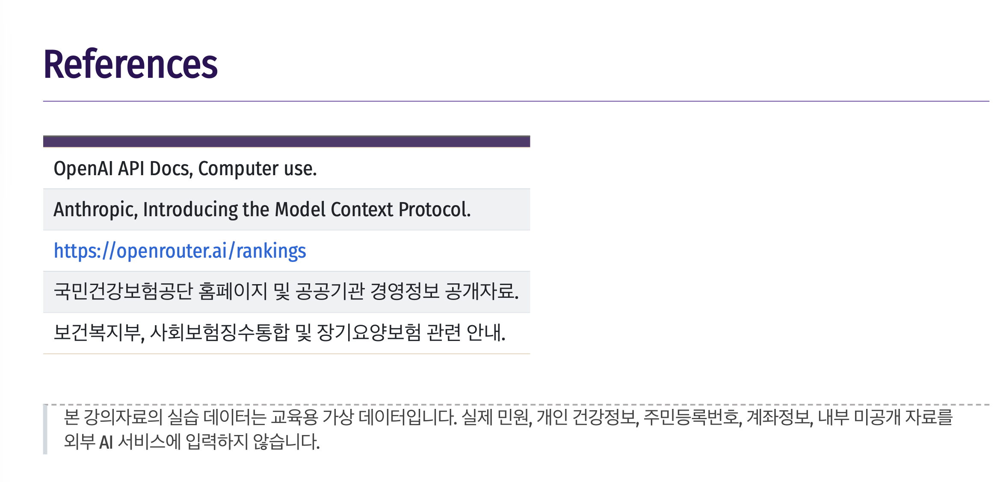

# NHIS 업무의 특징

<div class="columns">
<div>

### 공단 업무의 특징
<br>

- 공공성·책임성·보안성이 높은 업무
- 민원, 지표, 현장보고, 법령, 언론 동시 발생
- 최종 판단 전 방대한 자료 검토 시간을 요함

- **빠른 답변**과 **정확한 답변** 요구 민원

</div>
<div class="checklist-table">

### AI가 먼저 도와줄 수 있는 일

<br>


   | 업무 | AI 활용 방식 |
   |---|---|
   | 현안 파악 | 여러 자료를 읽고 핵심 이슈 5개 추출 |
   | 민원 분석 | 유형·긴급도·반복성 분류 |
   | 지사 비교 | 유사 규모 지사와 지표 편차 분석 |
   | 회의 준비 | 안건, 쟁점, 질문 목록 작성 |
   | 보고 초안 | 1페이지 브리핑 초안 작성 |

</div>
</div>

---

# 예시. 업무용 프롬프트 템플릿

<div class="columns">
<div>

### 템플릿

```text
당신은 국민건강보험공단 지역본부 리더를 보좌하는 업무분석 담당자입니다.
아래 자료를 기준으로 핵심 이슈를 정리하세요.

분석 기준:
1. 민원 증가 가능성
2. 언론·대외 리스크
3. 처리 지연 가능성
4. 취약계층 영향
5. 내부 후속조치 필요성

출력 형식:
- 이번 주 위험 이슈 TOP 5
- 각 이슈별 근거
- 담당부서 확인사항
- 리더가 회의에서 물어볼 질문
- 확인 필요 정보

주의:
개인정보는 사용하지 말고, 자료에 없는 내용은 추정하지 마세요.
```

</div>
<div>

### 이 템플릿이 좋은 이유

- 역할이 명확하다
- 판단 기준이 있다
- 출력 형식이 정해져 있다
- "확인 필요"를 허용한다
- 개인정보 사용 금지를 명시한다

<br>

**질문에서 업무지시로 프롬프트 활용**

</div>
</div>

---
layout: center
style: ../styles.css
---

# 오늘의 핵심 실습 1.

## 지역 현안 브리핑 AI

| 매주 지역별 민원, 언론, 지표, 현장 보고를 모아 <br>
| "이번 주 위험 이슈 5개"를 정리하는 AI 

---

## [실습1. 가정]

<br>


<div class="columns">
<div >

### 상황

당신은 지역본부 리더입니다. 
월요일 오전 회의 전에 아래 자료를 10분 안에 정리해야 합니다.

- 지사별 민원 증가 현황
- 지역 언론 보도
- 장기요양 현장 보고
- 건강검진 수검률
- 징수 관련 지표

</div>
<div class="checklist-table">

### AI에게 맡길 일과 사람의 일 구분하기

| AI의 일 | 사람의 일 |
|---|---|
| 자료 요약 | 최종 판단 |
| 위험도 분류 | 책임 있는 지시 |
| 회의 질문 초안 | 대외 메시지 결정 |
| 후속조치 목록화 | 조직 조정 |

</div>
</div>

---

## [실습1. 데이터] 지역 현안 브리핑용 가상 자료

아래 자료를 휴대폰 AI 앱에 그대로 복사해 사용합니다. 실제 개인정보나 내부자료가 아닌 **가상 데이터**입니다.

<div class="checklist-table">

| 지역 | 민원 증감 | 언론·외부 이슈 | 현장 보고 | 주요 지표 |
|---|---:|---|---|---|
| A | +34% | 신문: 장기요양 대기기간 불만 기사 | 방문조사 차질(일정 지연,인력 결원) | 인정조사 평균 11.2일 |
| B | +8% | 특이사항 없음 | 고령 민원인 내방 증가 | 건강검진 수검률 61% |
| C | +27% | 온라인: 보험료 부과 불만 확산 | 피부양자 자격 관련 상담 급증 | 부과 민원 420건 |
| D | -3% | 특이사항 없음 | 민원처리 안정 | 처리기간 2.1일 |
| E | +19% | 지방의회 자료요구 예정 | 체납 안내문 반송 증가 | 체납 고지 반송률 14% |
| F | +41% | 지역방송: 취재 문의 | 본인부담상한제 환급 문의 폭증 | 환급 문의 680건 |

</div>

---

## [실습 1. 프롬프트 작성하기] (휴대폰 환경)

```text
당신은 국민건강보험공단 지역본부장을 보좌하는 지역 현안 브리핑 AI입니다.
아래 가상 자료를 기준으로 이번 주 지역본부 회의에서 다룰 위험 이슈 TOP 5를 정리하세요.

분석 기준:
1. 민원 증가율
2. 언론·외부 확산 가능성
3. 취약계층 영향
4. 처리 지연 가능성
5. 리더 의사결정 필요성

출력 형식:
표로 작성하세요.
열은 [순위, 이슈명, 관련 지역, 위험도, 근거, 오늘 회의 질문, 후속조치]로 구성하세요.

주의사항:
- 자료에 없는 내용은 추정하지 마세요.
- 개인정보는 포함하지 마세요.
- 최종 판단이 필요한 항목은 "리더 판단 필요"라고 표시하세요.

[자료]
A지사: 민원 +34%, 장기요양 대기기간 불만 기사, 방문조사 일정 지연, 조사인력 결원 2명, 인정조사 평균 11.2일
B지사: 민원 +8%, 특이 언론 없음, 고령 민원인 내방 증가, 건강검진 수검률 61%
C지사: 민원 +27%, 온라인 커뮤니티 보험료 부과 불만 확산, 피부양자 자격 상담 급증, 부과 민원 420건
D지사: 민원 -3%, 특이 이슈 없음, 민원처리 안정, 처리기간 2.1일
E지사: 민원 +19%, 지방의회 자료요구 예정, 체납 안내문 반송 증가, 체납 고지 반송률 14%
F지사: 민원 +41%, 지역방송 취재 문의, 본인부담상한제 환급 문의 폭증, 환급 문의 680건
```

---

## [실습 1. 좋은 결과물의 모습]

<br>
<div class="columns">
<div>

### AI 결과에서 확인할 점

- 단순 민원 증가율 순서로만 정리했는가?
- 언론·지방의회·지역방송 이슈를 반영했는가?
- "오늘 회의 질문"이 실제 리더 질문처럼 구체적인가?
- 후속조치가 담당부서 행동으로 바뀔 수 있는가?

</div>
<div class="column">

### 추가 진행 사항

```bash
> 위 결과를 기준으로 지역본부장 회의용 1페이지 브리핑 문안을 작성하세요.
> 문장은 보고용 문체로 작성하고, 각 이슈마다 담당부서 확인사항을 1개씩 붙이세요.
> 단, 외부 공개가 곤란한 표현은 완곡하게 바꾸세요.
```

</div>
</div>

<br>
<div class="card">
<b>포인트</b><br>
한 번에 완성본 요구 대신, 1차 분류 → 2차 회의자료 → 3차 메시지 조정 순서 권장
</div>

---

## [실습1. 지역 현안 브리핑 AI 확장 구조]

<div style="width: 70%; margin: 10px auto">


</div>

---
layout: center
---

# 오늘의 핵심 실습 2.

## 지사 편차 분석 AI

| 비슷한 규모 지사끼리 처리기간, 민원 증가율, 직원 1인당 업무량, 징수 실적 차이 비교 분석

---

## [실습2. 데이터] 지사 편차 분석용 가상 지표

<br> 

<div class="checklist-table">

| 지사 | 가입자 규모 | 월 민원 | 민원 증가율 | 평균 처리기간 | 직원 수 | 직원 1인당 민원 | 징수율 | 건강검진 수검률 |
|---|---:|---:|---:|---:|---:|---:|---:|---:|
| A | 21만 | 1,420 | 34% | 4.8일 | 42 | 33.8 | 96.1% | 63% |
| B | 20만 | 980 | 8% | 3.1일 | 39 | 25.1 | 97.4% | 61% |
| C | 22만 | 1,310 | 27% | 4.2일 | 41 | 32.0 | 95.8% | 66% |
| D | 19만 | 760 | -3% | 2.1일 | 38 | 20.0 | 98.0% | 72% |
| E | 21만 | 1,080 | 19% | 3.9일 | 37 | 29.2 | 94.9% | 68% |
| F | 23만 | 1,690 | 41% | 5.3일 | 43 | 39.3 | 96.5% | 59% |

</div>
<br>
<div class="tiny">

> 주의: 위 데이터는 교육용 가상 데이터입니다. 실제 지사 평가나 성과판단에 사용할 수 없습니다.
</div>

---

# [실습 2. 시각화 결과] 비슷한 규모 지사의 편차 보기


<div class="columns">
<div>



</div>
<div>



</div>
</div>

---

## [실습 2. 확장] 품질 높이는 추가 질문해보기

<br>

<div class="columns">
<div>

### 1차 결과가 나왔을 때

```text
위 분석을 지역본부장 보고용으로 바꾸세요.
표현은 특정 지사를 비난하지 않는 방식으로 조정하고,
"지원 필요 영역" 중심으로 작성하세요.
```

<br>

### 비교 기준을 더 엄격하게

```text
가입자 규모가 19만~23만인 지사만 같은 그룹으로 보고,
그룹 평균 대비 편차를 계산해 표로 보여주세요.

```

<br>
</div>
<div>

### 회의 질문 만들기

```text
분석 결과를 바탕으로 지사장 회의에서 사용할 질문 7개를 작성하세요.
질문은 추궁형이 아니라 원인 파악과 지원 방안 도출형으로 작성하세요.
.

```

<br> 

### 실행계획 만들기

```text
위 결과를 바탕으로 2주 안에 실행할 수 있는 조치와 3개월 구조개선 과제를 구분해 주세요.


```

</div>
</div>

---

## [실습2. 지사 편차 분석 AI 확장 구조]

<div style="width: 85%; margin: 10px auto">



</div>

---
layout: center
transition: fade
---




---

# AI 사용 금지·주의·실전

<div class="columns">
<div >

### 금지

- 주민등록번호, 계좌번호, 진료·요양 상세정보 
- 특정 민원인 개인정보를 외부 AI에 입력
- AI 답변을 검토 없이 민원인에게 발송
- 제재·불이익 판단을 AI에게 자동 결정시킴

### 주의

- 내부 결재 전 문서
- 국회·언론 대응자료
- 법령 해석
- 민감 민원

</div>
<div>

### 권장

- 가상 데이터 실습
- 비식별화된 통계 분석
- 공개 자료 요약
- 회의 안건 초안
- 직원 교육자료 초안
- 체크리스트 작성

<div class="card">
<b>리더의 원칙</b><br>
AI 활용의 책임은 AI가 아니라 조직과 사용자에게 있습니다. 따라서 "자동화"보다 "검토 가능한 보조"로 설계해야 합니다.
</div>

</div>
</div>

---

## 개인정보 제거 예시

| 원문 | AI 입력용 변환 |
|---|---|
| 홍길동, 580101-1******, 장기요양 등급 이의신청 | 70대 남성, 장기요양 등급 이의신청 사례 |
| 서울 ○○구 ○○아파트 101동 1203호 | 수도권 거주 고령 민원인 |
| 계좌번호 123-456-789 | 계좌정보 삭제 |
| 특정 병명과 진료내역 포함 | 건강정보 삭제 후 제도 문의 유형만 남김 |
| 담당 직원 실명 비판 | 담당부서 또는 업무유형으로 대체 |

---

## 실습용 데이터 만들기 규칙

```text
1. 사람 이름은 A민원인, B민원인으로 바꾼다.
2. 주민번호, 연락처, 주소, 계좌번호는 삭제한다.
3. 진료명, 병명, 요양 상세기록은 업무 유형으로 일반화한다.
4. 지사명은 A지사, B지사처럼 익명화한다.
5. 수치는 실제값이 아니라 교육용 범위로 변환한다.
6. AI 결과는 초안으로만 사용하고 최종 문서는 사람이 검토한다.
```

<div class="card">
<b>현장 팁</b><br>
AI 실습 자료는 "실제처럼 보이는 가상 데이터"가 가장 좋습니다. 실제 데이터보다 안전하고, 교육 효과는 충분합니다.
</div>

---
layout: center
---


---
layout: center
---

# 간단한 활용 예시
## 임의 데이터 생성, 간단한 대시보드 작성하기


---

# Before → After

<div class="columns">
<div >

## Before

- 자료를 사람이 하나씩 읽는다
- 엑셀을 열어 직접 비교한다
- 보고서 초안을 처음부터 쓴다
- 회의 후 후속조치가 흩어진다
- 바쁜 리더가 맥락을 모두 떠안는다

</div>
<div>

## After

- AI가 먼저 읽고 분류한다
- Agent가 편차와 이상징후를 제시한다
- 리더는 초안을 검토하고 판단한다
- 회의 질문과 후속조치가 자동 정리된다
- 리더는 반복 업무보다 의사결정에 집중한다

</div>
</div>

<br> 

### 완벽한 AI 시스템보다 중요한 것은, 오늘 당장 업무 하나를 20% 줄이는 첫 실험입니다.

---
layout: center
---



---
layout: center
---


