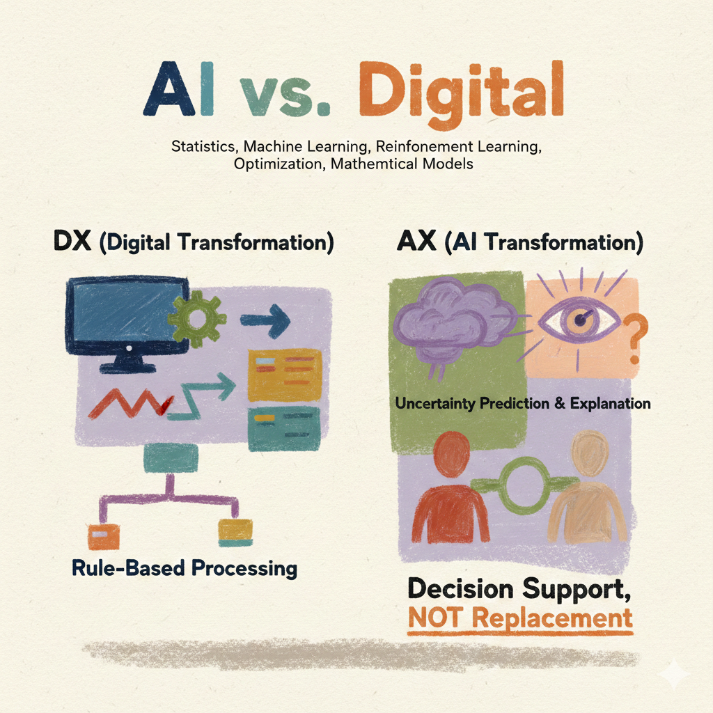
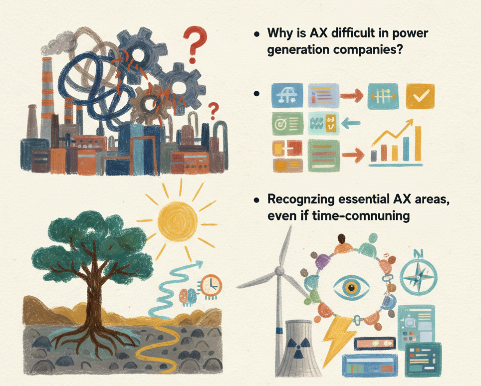

---
# try also 'default' to start simple
theme: seriph
aspectRatio: 16/9
canvasWidth: 980

# random image from a curated Unsplash collection by Anthony
# like them? see https://unsplash.com/collections/94734566/slidev
# https://cover.sli.dev
background: https://cdn.jsdelivr.net/gh/slidevjs/slidev-covers@main/static/d34DtRp1bqo.webp
# some information about your slides (markdown enabled)
title: From-insight AX world !
info: |
  ## Presentation slides for KOMIPO AX TF team

author: 권 수 정 
# apply UnoCSS classes to the current slide
class: text-center
# https://sli.dev/features/drawing
drawings:
  persist: false
# slide transition: https://sli.dev/guide/animations.html#slide-transitions
transition: slide-left
# enable MDC Syntax: https://sli.dev/features/mdc
mdc: true
# duration of the presentation
duration: 35min
download: true
---

<style>
  .font-family {
    font-family: 'Noto Sans KR', sans-serif;
  }
  .h1 {
    color: #0056b3;
  }
  .columns {
      display: grid;
      grid-template-columns: repeat(2, 1fr);
      gap: 1em;
    }

  h2 {
    color: #0056b3;
  }
  .cite {
    font-size: 0.7em;
    color: #777;
    margin-top: 10px;
  }
</style>

# Welcome to AX world !

<div @click="$slidev.nav.next" class="mt-12 py-1" hover:bg="white op-10">
  AX-TF를 위한 실전 가이드 <carbon:arrow-right />
</div>

<div class="abs-br m-6 text-xl">
  <a href="https://suekwon.github.io/about/" target="_blank" class="slidev-icon-btn">
    <carbon:logo-github />
  </a>
</div>

<!--
The last comment block of each slide will be treated as slide notes. It will be visible and editable in Presenter Mode along with the slide. [Read more in the docs](https://sli.dev/guide/syntax.html#notes)
-->

<!-- 
저는 산업공학 박사로, 생성형 AI·강화학습·머신러닝을 활용해서 연구하고, 실무에 적용하고 있는 전문가입니다. 공공기관과 금융·산업 현장에서 AI 기반 의사결정 자동화와 분석 고도화를 실제로 구현해 온 경험을 바탕으로, AI를 기존 업무에 현실적으로 적용하는 방법을 중심으로 강의합니다. 기술 설명에 그치지 않고 중부발전 기관 특성을 고려한 단계적 AI 도입과 활용 방향을 제시해보려 합니다.

 -->
---
layout: two-cols-header
title: AX Icebreaking
---

## 게임 규칙

- 질문에 **해당되면 손가락 1개 접기**
- 총 **5개 질문**
- **5개 모두 접으면 우승**

> *정답은 없습니다. 솔직하게 해주세요.*

<br>

::left::

<v-click>

#### 질문 ① 최근 한 달 내  
**ChatGPT 등 AI에 질문해본 적 있다**

☝️ 해당되면 손가락 접기

</v-click>

<v-click>

#### 질문 ② 보고서 · 메일 · 자료 초안에  
**AI 도움을 받아본 적 있다**

☝️ 해당되면 손가락 접기

</v-click>

::right::
<div v-click="[1, 6]">

<v-click>

#### 질문 ③ "이거 AI로 자동화하면
**훨씬 덜 귀찮을 텐데**"
라고 생각해본 적 있다 → ☝️ 해당되면 손가락 접기

<br>
</v-click>

<v-click>

#### 질문 ④ 엑셀 · 시스템 · 수기 입력 등
**반복 작업이 많다고 느낀다** → ☝️ 해당되면 손가락 접기

</v-click>

<v-click>

#### 질문 ⑤ AI가 무섭다기보다
**어디까지 써도 되는지 애매**하다고 느낀다

</v-click>

</div>


<div class="absolute bottom-2 left-4 text-xs opacity-80" style="color: #585a5dff;"> Presented by From-insight Inc. &copy 2026</div>
<div class="absolute bottom-2 right-4 text-xs opacity-80" style="color: #585a5dff;"><SlideCurrentNo /> / <SlidesTotal /></div>


<!-- 
1. 핵심 메시지: AI는 이미 진입 장벽이 없다
2. 공기업 공감 포인트 상투적 문구 “보고서/회의자료/대외문서”
3. AI 전환은 기술 문제가 아니라 문제 인식의 문제
4. AI의 첫 타깃은 ‘잘 돌아가지만 비효율적인 업무’
5. 보안, 책임, 내부 규정 등 기관 특성 반영

5개 다 접음
→ “이미 AI 전환의 출발선에 서 계신 분”

2~3개 접음
→ “오늘 강의 끝나면 5개가 됩니다”

0~1개
→ “오늘 가장 얻어갈 게 많은 분”


1등은 프롬프트 3선
뒤에서 1등은 다음 질문에 우선 발언권

지금 게임에서 중요한 건 ‘AI를 아느냐’가 아니라
이미 쓰고 있다는 사실을 인식했느냐였습니다.
 -->

---
layout: two-cols-header
transition: fade-out
---

::left::
## AI 현주소
<br>

- [생성형AI 종류 3가지](https://openrouter.ai/models)
- [생성형AI는 왜 거짓말을 하는가?](https://www.google.com/search?q=transformer+abstract+diagram&newwindow=1&sca_esv=0941c5488d98d8af&udm=2&biw=1434&bih=1071&aic=0&sxsrf=ANbL-n4mFitsI2HLQ1YrqfhMGVtU7eNEug%3A1769868367139&ei=Twx-adCdCJfd2roP5b7F0Aw&ved=0ahUKEwiQgcq6-bWSAxWXrlYBHWVfEcoQ4dUDCBI&uact=5&oq=transformer+abstract+diagram&gs_lp=Egtnd3Mtd2l6LWltZyIcdHJhbnNmb3JtZXIgYWJzdHJhY3QgZGlhZ3JhbUidPFDOBFjKOnAGeACQAQCYAYgBoAGFFaoBBDAuMjO4AQPIAQD4AQGYAg2gAt4LwgIFEAAYgATCAgcQIxjJAhgnwgIEEAAYHsICBhAAGAgYHpgDAIgGAZIHBDEuMTKgB5E5sgcEMC4xMrgH2wvCBwcwLjMuOS4xyAc9gAgB&sclient=gws-wiz-img#sv=CAMSVhoyKhBlLVZzNHdNcDB2TTFuSmlNMg5WczR3TXAwdk0xbkppTToOYUxQX2YzdF94WkVvSU0gBCocCgZtb3NhaWMSEGUtVnM0d01wMHZNMW5KaU0YADABGAcg5_-0hQ8wAkoKCAEQAhgCIAIoAg)
- [OpenAI 와 chatGPT](https://openai.com/ko-KR/open-models/)
- AI로 할 수 있는 업무 종류
- AI, agent, AGI, Physical AI


<v-click>

## AI는 어디로 가는가?
<br>

- 인공지능의 역사
- [생성형AI와 산업의 변화: 의료, 법률, 교육, 기술, 창작](https://product.kyobobook.co.kr/detail/S000213501853)
- 노동의 미래
- 위험, 기회, 규제, 글로벌 경쟁
- 변화는 과거부터 있었음

</v-click>
  
::right::
<br><br>


<v-click>
<br><br><br><br><br><br>
<div align="text-center">
"우리는 AI를 개발자들에게만 맡겨둘 수 없다" <br>
(we cannot leave AI only to developers) <br>
 
<div align="right">by <a href="https://www.google.com/search?q=Lawrence+H.+Summers&oq=Lawrence+H.+Summers&gs_lcrp=EgZjaHJvbWUyBggAEEUYOTIGCAEQLhhA0gEHMjIyajBqNKgCALACAQ&sourceid=chrome&ie=UTF-8" target="_blank">Lawrence H. Summers</a> </div>
</div>
</v-click>

<div class="absolute bottom-2 left-4 text-xs opacity-80" style="color: #585a5dff;"> Presented by From-insight Inc. &copy 2026</div>
<div class="absolute bottom-2 right-4 text-xs opacity-80" style="color: #585a5dff;"><SlideCurrentNo /> / <SlidesTotal /></div>

---
layout: image-right
image: ./images/axdx.png
transition: fade-out
---

## AI vs. Digital

통계, 머신러닝, 강화학습, 최적화 수리 모델 
<br>
<br> 

#### DX (Digital Transformation)
- 시스템 전산화
- 프로세스 자동화
- 규칙 기반 처리

<br>


#### AX (AI Transformation)

- 불확실성 다룸
- 예측·설명·판단 <span v-mark.underline.red> 보조</span>
- 사람의 의사결정을 <span v-mark.after.circle.red> **대체하지 않음**</span>

<br>
<br>

<!-- 
| <span class="bold">DX (Digital Transformation)</span> | <span class="bold">AX (AI Transformation)</span> |
| :--- | :--- |
| 시스템 전산화<br>프로세스 자동화<br>규칙 기반 처리 | 불확실성 다룸<br>예측·설명·판단 보조<br>사람의 의사결정을 **대체하지 않음** | -->

<!-- ::right::



<br>
<br> -->

<div class="absolute bottom-2 left-4 text-xs opacity-80" style="color: #585a5dff;"> Presented by From-insight Inc. &copy 2026</div>
<div class="absolute bottom-2 right-4 text-xs opacity-80" style="color: #585a5dff;"><SlideCurrentNo /> / <SlidesTotal /></div>
---
layout: two-cols-header
transition: fade-out
---

## AX = AI + 업무 전환 

<br>
<br> 
<br>

::left::
  <span v-mark.circle.red> 발전사</span>에서 **AX가 왜 어려운지** 이해
<br><br> **<span v-mark.underline.red>효율적으로 시작할</span> 수 있는 AX 업무** 구분
<br><br> <span v-mark.underline.red> 시간이 걸려도 </span> **반드시 해야 하는 AX 영역** 인식
<br><br> <span v-mark.circle.red> TF 팀</span>이 가져야 할  **역할과 관점 정리**

<div v-click>
  <div class="mt-10 py-1" hover:bg="white op-10">
    <h3 style="color: #af1818ff;"> 발전사의 AX는 무엇이 다른가!  <carbon:arrow-right /> </h3> 
  </div>
</div>

::right::



<!-- <div @click="$slidev.nav.next" class="mt-12 py-1" hover:bg="white op-10">  
</div> -->

<!--
Here is another comment.
-->

<div class="absolute bottom-2 left-4 text-xs opacity-80" style="color: #585a5dff;"> Presented by From-insight Inc. &copy 2026</div>
<div class="absolute bottom-2 right-4 text-xs opacity-80" style="color: #585a5dff;"><SlideCurrentNo /> / <SlidesTotal /></div>
---
layout: two-cols-header
transition: slide-left
---

## 발전사가 특히 고려해야 할 특성 

<br>

- **물리 설비 중심 산업**
- **안전·규정·감사·책임**이 강함
  - 사고 = 사회적 리스크
  - 규제·감사·책임 강한 구조
- **계통/시장/정산** 비롯한 외부 연계가 많음
  - B2B 구조(최종 고객은 사람이 아님)
- **현장-본사-협력사**를 관통하는 프로세스가 핵심

<br>
<div style="font-size: 1.2rem;">

- <span v-mark.underline.red> 발전사에서 AX의 목표는,</span>
<v-click>

 &nbsp; "화려한 자동화" 보다, **운영 안정성 · 예측 정확도 · 의사결정 속도 · 감사 대응력**을 높이는 것

 &nbsp; **"빠른 혁신" vs. "안전한 진화"** 

</v-click>
</div>

<v-drag pos="474,253,446,_,-15">
  <v-click>
  <div style="font-weight: bold; font-size: 1.6rem; color: #af1818ff;">

  "안전하게 빠른 전환"
  </div>

  
  <p v-after class="relative bottom-85 left-25 opacity-30 transform -rotate-10">Here!</p>

  </v-click>  
</v-drag>

<!-- 
|                                                     |                             |
| --------------------------------------------------- | --------------------------- |
| <kbd>right</kbd> / <kbd>space</kbd>                 | next animation or slide     |
| <kbd>left</kbd>  / <kbd>shift</kbd><kbd>space</kbd> | previous animation or slide |
| <kbd>up</kbd>                                       | previous slide              |
| <kbd>down</kbd>                                     | next slide                  | -->

<!-- https://sli.dev/guide/animations.html#click-animation -->

<div class="absolute bottom-2 left-4 text-xs opacity-80" style="color: #585a5dff;"> Presented by From-insight Inc. &copy 2026</div>
<div class="absolute bottom-2 right-4 text-xs opacity-80" style="color: #585a5dff;"><SlideCurrentNo /> / <SlidesTotal /></div>

---
layout: two-cols
layoutClass: gap-16
transition: slide-left
---

## AX 전환 핵심 원칙 ①

“결정 대체”가 아니라 **설명·추천·예측**으로 시작
- ❌ AI가 운영 결정을 대신한다(책임·안전 리스크 폭발)
- ⭕ AI가 **가능한 시나리오와 근거**를 제시한다
- ⭕ 사람은 최종 판단/승인(감사·책임 체계에 부합)

예시.

<!--
- 출력·운전 조정 자동화(범위 넓음) → 위험
- 출력·고장·연료 리스크 사전 경고 → 안전
- 고장 가능성 조기경보 + 근거 제시 → 안전하고 효과 큼-->
Quiz.
  - 🅰️ 🅱️ 자동화 vs. 판단 보조
  - ⭕ ❌ AI가 대신 결정  
  - ⭕ ❌ AI가 설명하고 예측


::right::

<v-click> 

## AX 전환 핵심 원칙 ② 

**데이터는 이미 충분한가?** →  발전사 내 이미 데이터 많을 듯

- 데이터 핵심: “생성, AI”보다 “연결·정합성·메타데이터”
- 실패는 보통 여기서 발생
  - 시스템별 ID 불일치(설비, 부품, 작업)
  - 시간축 불일치(샘플링, 정산, 기록)
  - 검색 불가안 문서 상태(PDF, 스캔, 서식 난립)

예시.
- 센서·상태 데이터
- 정비이력, 작업지시, 부품교체
- 운전일지(텍스트), 장애보고서
- 규정, 매뉴얼, 기술기준서
- 시장데이터, 정산데이터, 연료데이터, 구매·계약 문서
</v-click>

<div class="absolute bottom-2 left-4 text-xs opacity-80" style="color: #585a5dff;"> Presented by From-insight Inc. &copy 2026</div>
<div class="absolute bottom-2 right-4 text-xs opacity-80" style="color: #585a5dff;"><SlideCurrentNo /> / <SlidesTotal /></div>
---
layout: two-cols
layoutClass: gap-16
transition: slide-left
---

## 발전사 AX의 핵심 원칙 ③  

차세대, 전환 시 **흔한 실패 패턴**
1) PoC는 성공 → 현장 사용률 0%
2) IT 주도 → 업무 실행자 부재
3) 규정, 감사, 보안 반영 누락
4) 정답을 주는 AI 라는 환상 → 책임 회피/반발

**대응 원칙**
- 현업에 직접 연결(시간, 품질, 리스크)
- 업무 단계에 끼워 넣기(대시보드, 문서작성, 승인흐름)
- 현장 사용이 최우선

::right::
<v-click>

## 발전사 AX의 핵심 원칙 ④  

일반적으로 모델의 성능보다,
- 격리, 망분리, 접근통제(데이터 반출-LLM 사용 정책)
- 가용성(업무, 설비 운영 영향 최소화)
- 변경관리(모델 혹은 규칙 업데이트 승인 프로세스)
- 감사 추적성(누가, 무엇을, 왜 추천했는지)
- 도입 보다 운영 가능한 체계가 AX의 실체!

</v-click>

<div class="absolute bottom-2 left-4 text-xs opacity-80" style="color: #585a5dff;"> Presented by From-insight Inc. &copy 2026</div>
<div class="absolute bottom-2 right-4 text-xs opacity-80" style="color: #585a5dff;"><SlideCurrentNo /> / <SlidesTotal /></div>
---
layout: two-cols-header
transition: fade-out
---

## AX를 가장 효율적으로 시작할 수 있는 업무(1/2)
<br>

::left::

#### **Quick Win 1. 문서/지식 기반 업무**
<br>

- **대상**
  - 정비이력, 장애 보고서/운전일지/기술 매뉴얼
- **AX 적용**
  - 사내 지식검색 또는 질의응답 AI
  - 유사 고장 사례 자동 탐색 또는 추천
    - 원인, 조치, 재발방지
  - 보고서 초안·요약·비교 자동 생성
  - 신입·비전문가 지원
- **효과**
  - 현업 체감도 매우 높음
  - 안전리스크 낮음
  - 숙련자 지식 전파 빠름

::right::

<v-click>

#### **Quick Win 2. 보고·회의·공문(초안 + 검증)**
<br>

- **대상**
  - 주간·월간 운영 보고, 경영 보고, 이슈 정리, 공문 초안
- **AX 적용**
  - 초안 자동 생성
  - 데이터 → 문장 변환
  - 요약·비교 자동화
  <br><br><br>
- **효과**
  - 시간 절감 수치로 드러남
  - 여러 조직으로 확산에 유리

</v-click>
<div class="absolute bottom-2 left-4 text-xs opacity-80" style="color: #585a5dff;"> Presented by From-insight Inc. &copy 2026</div>
<div class="absolute bottom-2 right-4 text-xs opacity-80" style="color: #585a5dff;"><SlideCurrentNo /> / <SlidesTotal /></div>

---
layout: two-cols-header
transition: fade-out
---

## AX를 가장 효율적으로 시작할 수 있는 업무(2/2)
<br>
::left::

#### **Quick Win 3. 데이터 분석 보조(설명형 분석가)**
<br>

- **대상**  
  - 연구기획 - 연구수행 - 연구성과 관리
  - 연료 가격 시나리오 → 변동 요인 분석
  - 반복 엑셀 데이터 요약, 분석
  - 이상치 탐지 → 원인 후보 제시
- **AX 적용**
  - 주기적으로 연구주제 관련 검색,요약 서비스
  - “왜 이번 손익이 변했는지” 요인 분석
  - 상관관계, 추세 자동 리포트
- **효과**
  - 분석, 의사결정 속도 개선
  - 분석 품질 향상 및 표준화

::right::

<v-click>

#### **Quick Win 4. 질의·행정 응대(근거 제시 챗봇)**
<br>

- **대상**
  - 규정, 지침, 절차 문의
  - 반복 행정 질문(신입, 부서, 교육)
  <br><br>
- **AX 적용**
  - 내부 챗봇
  - 근거 조항 제시형 답변
  - 체크리스트 제안
  <br><br>
- **효과**
  - 해당 업무 조직 피로도 감소
  - 효율적인 업무 처리 및 감사 대응력 보강

</v-click>

<div class="absolute bottom-2 left-4 text-xs opacity-80" style="color: #585a5dff;"> Presented by From-insight Inc. &copy 2026</div>
<div class="absolute bottom-2 right-4 text-xs opacity-80" style="color: #585a5dff;"><SlideCurrentNo /> / <SlidesTotal /></div>

---
layout: two-cols-header
transition: slide-up
---

## 시간이 걸려도 반드시 해야 하는 AX
<br>
::left:: 

#### **Strategic AX 1. 설비 고장 예측**
<br>

- **필요성**
  - 설비 노후화 + 고장 비용 급증
  - 숙련 인력 은퇴 → 지식 소멸
  - 예기치 못한 정지/사고 리스크 예방 필요
- **어려운 이유**
  - 고장 데이터 희소(라벨 부족)
  - 베테랑 은퇴 = 판단 기준 소멸
    - 사고 대응/정비 노하우는 문서만으로 부족
  - 센서,정비 기록 정합성 문제
  - 책임 이슈(오경보)
- **현실적 접근**
  <!-- - 자동제어 ❌ → **조기경보 + 근거 + 대응 추천** ⭕
  - 중요 설비부터(보일러/터빈/발전기/주요 펌프 등)
  - “알람”이 아니라 “업무 흐름”에 연결(작업지시/점검)  
  - 고장/사고 대응 플레이북(사례 기반)
  - 판단 근거 기록(왜 그렇게 했는지)
  - 인터뷰->지식화, 시뮬레이션 기반 학습 => 안하면 추후 복구 불가능 
  - => 이건 늦을수록 회복이 어렵다(선제 투자 필요)
  - 신입용 시뮬레이션/코칭(질문-답변-근거)
  - -->

 <!-- ⭕ ❌ 자동 제어 &nbsp;&nbsp;&nbsp;&nbsp; ⭕ ❌ 조기 경보   -->

::right::
#### **Strategic AX 2. 통합 의사결정 지원**
<br>

- **필요성**
  - 부서별 최적화가 전체 최적과 다름
  - 리스크, 비용은 서로 영향을 주고 받음 <br>
    (정비↔출력↔연료↔정산)
    <br><br>
- **현실적 접근**
  - 정답 제시 >> **트레이드오프 설명 + 시나리오 비교**
  - `"연료비 절감 시나리오 A는 단기 유리하지만,
    3개월 내 정비 리스크가 증가" 같은 설명`

<div class="absolute bottom-2 left-4 text-xs opacity-80" style="color: #585a5dff;"> Presented by From-insight Inc. &copy 2026</div>
<div class="absolute bottom-2 right-4 text-xs opacity-80" style="color: #585a5dff;"><SlideCurrentNo /> / <SlidesTotal /></div>

---
layout: two-cols-header
transition: fade
---

## AX TF 조직의 역할 - 작게 시작해서 크게 확산!
<br>

::left::
#### TF는 기술 조직!?

```yml
>> AX는 기술 프로젝트가 아니라  
>> 업무 판단 구조를 바꾸는 조직 프로젝트다
```

  - *AX 과제 선정 예시* (4개 축으로 평가)
    - 가치(Value): 비용절감/정지방지/품질/속도/감사
    - 리스크(Risk): 안전/규정/보안/책임
    - 데이터(Data): 접근성/정합성/라벨/희소성
    - 확산(Scale): 다른 발전소/부서로 복제 가능성 
   <br>
    `가치 높고, 리스크 낮고, 데이터 확보 쉬운 것부터`
  - 단기 사용률과 만족도로 현장과 IT 연결 및 확산
  - 장기 내부 지표로 관리
<br><br>


::right::
#### 이런 다음 단계는 어떤가요?

<br>

- 중부발전 AX 로드맵 (3년)
  - 계통, 운전·정비, 연료·정산·중장기 계획
- "해야만 하는 부서별 AX" 후보 과제 도출
- "하면 안 되는 AX” 실패 사례 정리
- TF 내부 실습용 미니 프로젝트

**좋은 AX 과제 체크리스트 예시(현업 적용 관점)**
  - 업무 단계에 끼워 넣을 자리가 명확한가?
  - 추천·요약·근거를 검증 가능한가?
  - 실패 시 안전장치(사람의 승인, 차단)가 있는가?
  - 운영 시 로그, 감사, 버전관리, 권한관리 가능한가?
  - 다른 발전소 또는 부서로 복제 가능한가?

<div class="absolute bottom-2 left-4 text-xs opacity-80" style="color: #585a5dff;"> Presented by From-insight Inc. &copy 2026</div>
<div class="absolute bottom-2 right-4 text-xs opacity-80" style="color: #585a5dff;"><SlideCurrentNo /> / <SlidesTotal /></div>

---
layout: center
---

<div text-3xl align="center">

"DONE IS BETTER THAN PERFECT"

</div>
