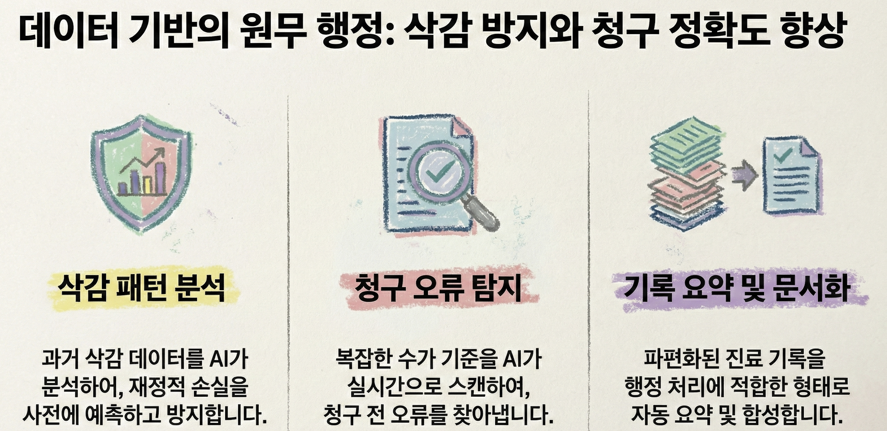
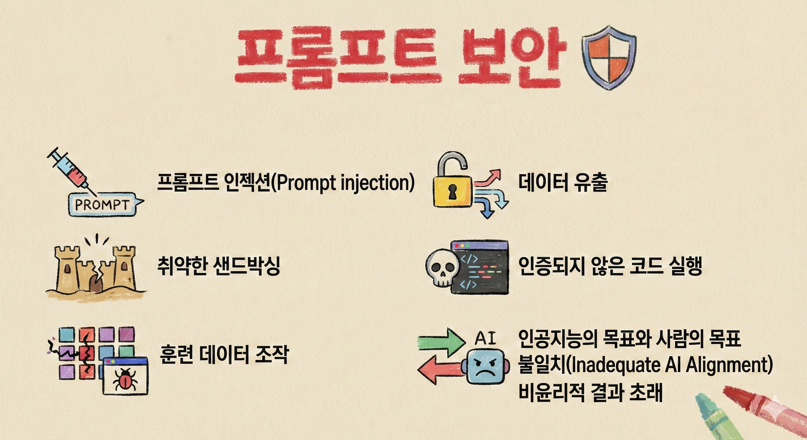
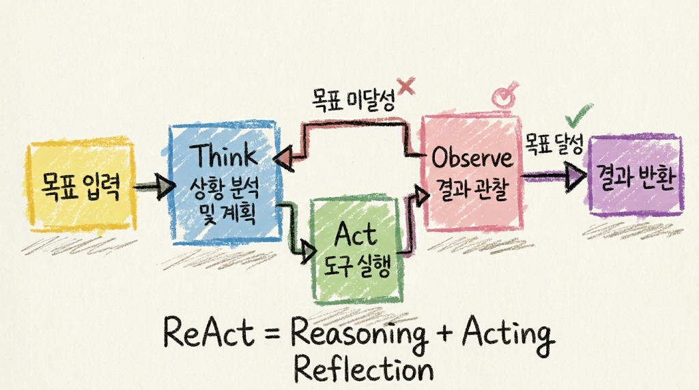
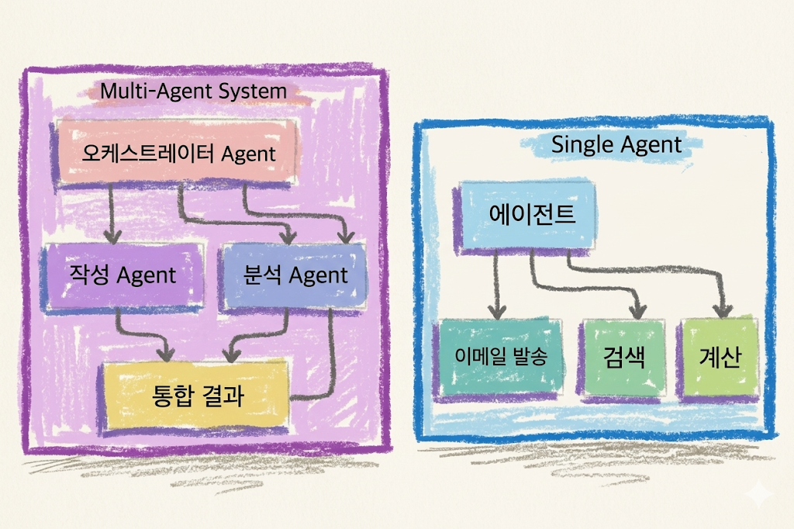
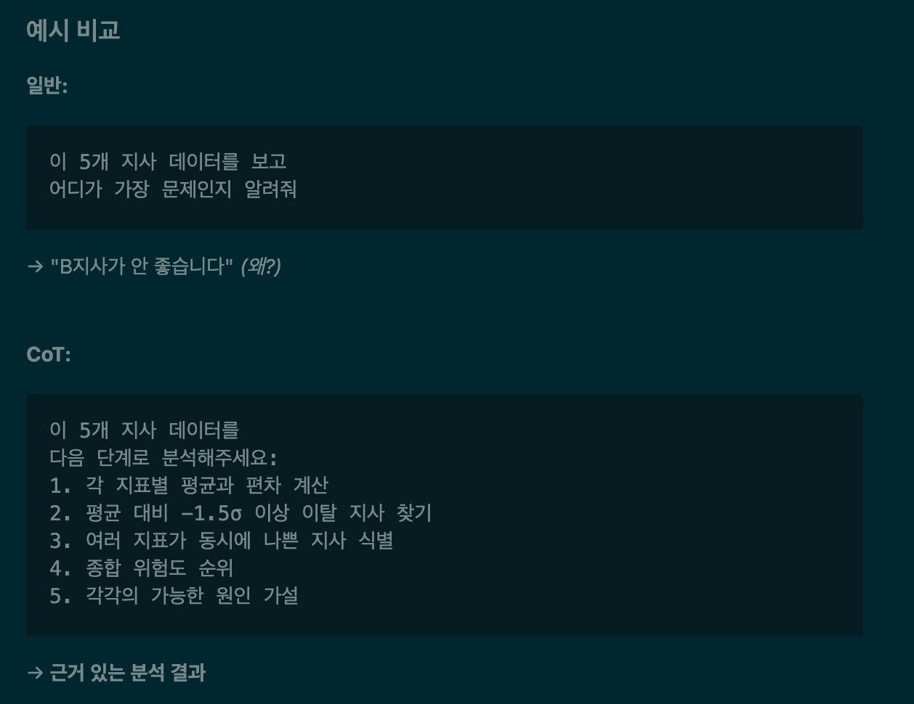

<style global>
  .font-family {
    font-family: 'Pretendard', -apple-system, BlinkMacSystemFont, 'Segoe UI', Roboto, Oxygen;
  }
  h1{
    color: rgb(45, 17, 86);
    border-bottom: 1px solid rgb(45, 17, 86); 
    line-height: 1.25;
    padding-bottom: 15px;
  }
  h2 {
    color: #1a5276;
  }
  .columns {
    display: grid;
    grid-template-columns: repeat(2, 1fr);
    gap: 1em;
  }
  .columns3 {
    display: grid;
    grid-template-columns: repeat(3, 1fr);
    gap: 1em;
  }  
  .cite {
    font-size: 0.7em;
    color: #888;
    margin-top: 8px;
  }
  blockquote {
    position: absolute;
    bottom: 2.5em;
    left: 1em;
    right: 1em;
  }
  .highlight-box {
    background: #eaf4fb;
    border-left: 4px solid #1a5276;
    padding: 10px 16px;
    border-radius: 4px;
    margin: 8px 0;
    font-size: 0.92em;
  }
  .card {
    background: #f8f9fa;
    border-radius: 8px;
    padding: 12px 14px;
    border: 1px solid #dee2e6;
    margin: 6px 0;
  }
  .warn-box {
    background: #fef9e7;
    border-left: 4px solid #f39c12;
    padding: 10px 16px;
    border-radius: 4px;
    margin: 8px 0;
  }
  .danger-box {
    background: #fdedec;
    border-left: 4px solid #e74c3c;
    padding: 10px 16px;
    border-radius: 4px;
    margin: 8px 0;
  }
  .cite-author { 
      text-align        : right; 
   }
   .cite-author:after {   
      color             : #f87ca1;
      font-size         : 130%;
      font-style        : italic;
      font-weight       : bold;
      font-family       : Cambria, Cochin, Georgia, Times, 'Times New Roman', serif;
      padding-right     : 130px;
   }
   .cite-author[data-text]:after {
      content           : " - "attr(data-text) " - ";      
   }
   .cite-author p {    
      padding-bottom : 40px
   } 
  .classReact rect {
    fill: #61dafb;
    stroke: #000;
    stroke-width: 2px;
    rx: 10;
    ry: 10;
    max-width: 350px;
  }
  .title-bg {
    position: absolute;
    inset: 0;
    z-index: -1;
    background-image: url('./images/nhis/agent-title.png');
    background-repeat: no-repeat;
    background-size: 52%;
    background-position: left 48%;
  }
  * {
   -webkit-user-select: none;  /* Chrome, Safari, Opera */
    -moz-user-select: none;     /* Firefox */
    -ms-user-select: none;      /* IE/Edge */
    user-select: none;          /* Standard */
  }
  .two-cols-header .col-right { padding-left: 1.2rem; }
  strong { color: rgba(5, 51, 255, 0.834); }
  em { color: rgba(25, 171, 255, 0.895); }
  th { background-color: rgba(62, 36, 93, 0.9); color: white; text-align: center !important; padding: 1px 8px !important; line-height: 1.6; }
  td { padding: 1px 8px !important; line-height: 1.6; }
  
</style>


<div class="columns">
  <div class="title-bg"></div>
  <div> </div>
  <div style="font-size: 2.2em; margin-top: -30px; color: #1a5276; text-align: center;"> Welcome to AX World
    <div class="mt-6 text-gray-200 text-lg" style="color: #1a5276;">
   개념부터 실전까지 : 실습 위주 <strong style="color:maroon;">원데이 클래스</strong> 
</div>

  </div>
</div>


<div class="abs-br m-6 text-sm text-left">
  <h3 style="color: #1a5276;">
    <div>권수정 <a href="https://suekwon.github.io/about/" target="_blank" style="color: #1a5276;"> <carbon:logo-github /> </a></div>
    <div style="color: #3669ad; font-size: 0.85em">AI 전략 컨설턴트 | 프롬인사이트</div>
  </h3>
</div>


<!-- 
<div class="absolute bottom-2 right-4 text-xs opacity-80" style="color: #585a5dff;">
    <SlideCurrentNo /> / <SlidesTotal />
  </div>
   -->


---
layout: center
transition: fade
---

### 강사 소개

**권수정**
AI 전략 컨설턴트 | 프롬인사이트

- 산업공학 박사, 최적화 전공
- 생성형AI · 강화학습 · 머신러닝
  연구 및 실무 적용 전문
- 공공기관·금융·산업 현장
  AI 기반 의사결정 구현 경험

📧 [sue.kwon@from-insight.com](mailto:sue.kwon@from-insight.com)


---
layout: two-cols-header
title: AI Icebreaking
transition: fade-out
---

# 오늘 아침 업무 책상 위에는?

- 질문에 **해당되면 ☝️ 손가락 1개 접기**  
- 총 **5개** 질문

<br>


::left::

<v-click>

### 질문 ①  
최근 1주일 안에 **보고서·회의자료·답변 초안** 때문에 시간이 부족했다

</v-click>

<v-click>

### 질문 ②  
행정, 현장 보고 받을/할 것을 **따로따로 확인하다가** 중요한 이슈를 놓칠까 걱정한 적 있다


</v-click>

<v-click>

### 질문 ③  
"**어떤 AI**를 사용하지" 고민한 적이 있다

</v-click>

::right::

<v-click>

### 질문 ④  
비슷한 종류의 자료들을 비교해보고 싶은데, **엑셀 정리**에 시간이 많이 든다


</v-click>

<v-click>

### 질문 ⑤  
AI에게 **음성으로 질문**하거나 AI가 만든 **이미지·영상을** 본 적이 있다


</v-click>


<!--
멘트 예시:
5개 다 접으신 분은 이미 AI 전환의 핵심 문제를 정확히 알고 계신 분입니다.
0개이신 분은 축하드립니다. 오늘 강의가 끝나면 적어도 3개는 접게 됩니다.
-->

---
layout: default
transition: fade
---

# 최신 AI 흐름: 챗봇에서 Agent로


<br>

<div class="columns">
<div>

### 과거: 질문하면 답하는 AI

- "이 문서 요약해줘"
- "회의자료 초안 써줘"
- "민원 답변문 만들어줘"
- "OO 정보에 대해서 알려줘"

</div>
<div>

### 현재: 도구를 쓰는 AI

- 파일을 읽는다
- 웹이나 내부 자료를 검색한다
- 표를 계산한다
- 시스템 화면을 보며 작업 순서를 제안한다
- 여러 단계를 나눠 실행한다

</div>
</div>

<div style="width:70%; margin: 0 auto;">


</div>

> OpenAI: Responses API와 Agents SDK에서 web search, file search, computer use 같은 도구 결합을 Agent 구축의 핵심 기능으로 설명 <br>
> Anthropic: **MCP**는 AI 애플리케이션과 외부 데이터·도구를 연결하는 표준으로 제시


---
layout: center
transition: fade
---

# 오늘 실습 목표
#### *"AI에게 일을 맡긴다" vs. "AI가 처리할 수 있는 형태로 일을 재설계한다"*


<div class="three-cols">
<div class="card">
<h3>1. 이해</h3>
생성형 AI가 왜 그럴듯하게 답하고, 왜 틀릴 수 있는지 이해한다.
</div>
<div class="card">
<h3>2. 적용</h3>
나의 업무 중 바로 적용 가능한 예시를 실습한다.
</div>
<div class="card">
<h3>3. 설계 및 확장</h3>
Agent를 설계하고, 나만의 Agent를 만든다.
</div>
</div>

---
layout: center
transition: fade
---

# 생성형 AI 구조를 확실히 알고 쓰기

  "AI가 똑똑하다" → "AI가 어떤 방식으로 작동한다"


---
layout: two-cols-header
transition: fade
---

# 생성형 AI는 어떻게 답을 만드는가

#### **AI는 "확률적으로 그럴듯한 초안 작성자"** &ensp;  <span v-click="1" v-mark.crossed-off.red> 데이터베이스 </span> &emsp; <span v-click="2" v-mark.crossed-off.red> 검색엔진 </span> 

<div style = "width:70%; margin: 0 auto;">

    
    <b> *토큰화*, 숫자벡터, *임베딩*, 다음 토큰*예측*, 답변 *생성* , &nbsp;
    [변환기(Transformer)](https://www.google.com/search?q=transformer+abstract+diagram&newwindow=1&sca_esv=0941c5488d98d8af&udm=2&biw=1434&bih=1071&aic=0&sxsrf=ANbL-n4mFitsI2HLQ1YrqfhMGVtU7eNEug%3A1769868367139&ei=Twx-adCdCJfd2roP5b7F0Aw&ved=0ahUKEwiQgcq6-bWSAxWXrlYBHWVfEcoQ4dUDCBI&uact=5&oq=transformer+abstract+diagram&gs_lp=Egtnd3Mtd2l6LWltZyIcdHJhbnNmb3JtZXIgYWJzdHJhY3QgZGlhZ3JhbUidPFDOBFjKOnAGeACQAQCYAYgBoAGFFaoBBDAuMjO4AQPIAQD4AQGYAg2gAt4LwgIFEAAYgATCAgcQIxjJAhgnwgIEEAAYHsICBhAAGAgYHpgDAIgGAZIHBDEuMTKgB5E5sgcEMC4xMrgH2wvCBwcwLjMuOS4xyAc9gAgB&sclient=gws-wiz-img#sv=CAMSVhoyKhBlLVZzNHdNcDB2TTFuSmlNMg5WczR3TXAwdk0xbkppTToOYUxQX2YzdF94WkVvSU0gBCocCgZtb3NhaWMSEGUtVnM0d01wMHZNMW5KaU0YADABGAcg5_-0hQ8wAkoKCAEQAhgCIAIoAg)
    </b>
    <br> [LLM 모델은 몇 개나 될까? ](https://openrouter.ai/models)
</div>


---
layout: two-cols-header
transition: fade
---

# 생성형AI는 무엇을 잘하고 무엇을 못하는가

<br>

::left::

### <span v-mark.circle.red> **잘하는 것** </span>
  - 반복 작업
  - 문서 초안 작성
  - 요약
  - 패턴 분석
  - 각종 변환 

<br>

### <span v-mark.circle.red> **못하는 것** </span>
  - 맥락 없는 추정
  - 법적 최종 판단
  - <span v-mark.strike-through.orange> 데이터 최신 정보(예. 보험수가 최신버전) 완벽 반영 </span>
  
::right::

<br><br>

- 예시 업무
    

  <!-- 
  잘하는 것의 예시: 알파고 2016
  - 경우의 수가 많은 복잡한 게임
  - 4:1 승리
  - 사람의 통찰력?
  - 글쓰기??
  - 사람이 더 잘하는 영역? -->


---
layout: two-cols-header
transition: fade
---

# 적용해 볼 수 있는 업무와 위험한 분야


<div class="card"  v-mark.after.box.red>

#### **원칙**: AI로 <span class="ok">초안·분류·요약·비교</span>후, 최종 판단은 <span style="color:red">사람</span>이 한다.

</div>

<br>

::left::

### 적용 분야

- 긴 문서 요약, 정리(ex. 회의록)
- 표 비교 및 패턴 찾기 및 경중 업무 분류
- 초안 작성
- 체크리스트 생성
- 동시다발 처리해야하는 업무
- 잦은 반복 + 오랜 시간 업무
- “빠르게” “정확한" 답변

::right::

###  <span v-mark.undeline.orange > 조심해야 하는 일</span>

- 개인정보 포함 자료 입력
- 민감 자료 최종 분석
- 법적 최종 판단
- 최신 법령·정보를 확인하지 않은 내용
- 내부 규정과 다르게 자동 처리
- 자동 결정
  

---
layout: image
transition: fade
---


<div style="width:90%">



</div>


---
layout: two-cols-header
transition: fade
---

# 업무용 AI 사용 원칙(체크리스트 예시)

<br>

::left::

### 입력 전 확인 사항

<br>

| 질문 | 판단 |
|---|---|
| 주민번호, 계좌, 진료정보가 있는가? | 있으면 입력 금지 |
| 특정 개인이 식별되는가? | 비식별 처리 |
| 내부 결재 전 자료인가? | 내부 규정 확인 |
| 최신 법령 확인이 필요한가? | 출처 확인 필수 |
| ... | ... |

::right::

### 출력 후 확인 사항

<br>

| 질문 | 판단 |
|---|---|
| 근거가 명확한가? | 출처 확인 |
| 과장된 표현은 없는가? | 문장 조정 |
| 기관 입장처럼 단정했는가? | 책임 표현 수정 |
| 부서 간 이해관계 및 불리한 판단인가? | 사람 검토 필수 |
| ... | ... |

---
layout: center
transition: fade
---

# 챗봇 vs AI Agent

<br> 
<div style="width:60%; margin: 0 auto;">


</div>


---
layout: default
transition: fade
---

# 에이전트의 일하는 방식 — 추론 : 도구호출 : 메모리

<div class="card">
<b>Agentic Workflow</b><br>
Agent ~ LLM + 업무목표 + 자료접근 + 도구사용 + 검토절차
</div>

<div style = "width:70%; margin: 0 auto">



</div>


<!-- > **발표자 노트:**
> ReAct는 AI 에이전트가 작동하는 핵심 원리입니다. 생각하고(Think), 행동하고(Act), 결과를 보고(Observe), 다시 생각합니다. 이 루프가 목표를 달성할 때까지 반복됩니다. 사람이 문제를 해결할 때와 동일한 방식입니다. -->

---
layout: default
transition: fade
---

# 싱글 vs. 멀티 에이전트

{width=80%}

--- 
layout: default
src: ./pages/begin-agent.md
---


---
layout: center
transition: fade
---

# 몸풀기 실습. 프롬프트 작성하기
| 실습준비: 구글계정, 브라우저


---
layout: default
transition: fade
---

# 좋은 프롬프트


<div class="columns">

<div class="card">
<b>기본 공식</b><br><br>
당신은 <strong style="color:blue">[역할]</strong>입니다.
목표는 <strong style="color:blue">[목표]</strong>입니다.
아래 <strong style="color:blue">[자료]</strong>를 기준으로 <strong style="color:blue">[기준]</strong>에 따라 분석하세요.
출력은 <strong style="color:blue">[형식]</strong>으로 작성하세요.
모르는 내용은 추정하지 말고 <strong style="color:blue">"확인 필요"</strong>라고 표시하세요.

<br>

| 요소 | 질문 |
|---|---|
| 역할 | AI가 어떤 역할을 해야 하는가? |
| 목표 | 무엇을 만들어야 하는가? |
| 자료 | 어떤 입력자료를 기준으로 할 것인가? |
| 기준 | 어떤 관점으로 판단할 것인가? |
| 출력 | 어떤 형식으로 내보낼 것인가? |

</div>
<div class="card">

<b> Agentic 지침 예시 </b>

```markdown
## 다음 형식을 사용하세요
- Thought: [문제를 이해하고 어떤 계산이 필요한지 생각하세요]
- Action: [계산이 필요한 경우 계산하세요]
- Observation: [계산 결과를 적으세요]
- ... 필요시 반복 ...
- Final Answer: [최종 답을 말하세요]
```
</div>
</div>

---
layout: image
trasition: fade
---



---
layout: two-cols-header
transition: fade
---

# 결과가 만족스럽지 않을 때

<br>

::left::

### 점검 순서
1. **역할이 명확한가?** (누구로서 답할지)
2. **목표가 구체적인가?** (무엇을 원하는지)
3. **자료가 충분한가?** (배경 정보)
4. **형식을 지정했는가?** (어떻게 답할지)
5. **예시가 도움될까?** (Few-shot)
6. **단계별로 시킬까?** (CoT)

::right::

### 자주 하는 실수
<div class="danger-box">

❌ **하지 말 것**을 나열  
"이런 거 쓰지 마, 저런 거 쓰지 마"  
→ AI는 부정문을 잘 이해 못함

✅ **해야 할 것**을 명시  
"공식적인 어조로, 구체적인 절차 위주로"

</div>

<div class="highlight-box">

💡 **한 번에 완벽한 답을 기대하지 마세요**  
- 2~3번 대화하며 다듬는 게 정상  
- "더 짧게", "표 형식으로", "예시 추가" 등으로 수정  
- AI는 **대화 상대**이지 검색엔진이 아님

</div>

---
layout: two-cols-header
transition: fade
---

## 업무용 프롬프트 템플릿 예시

<br>
::left::

### 템플릿

```text
당신은 국민건강보험공단 지역본부 리더를 보좌하는 업무분석 담당자입니다.
아래 자료를 기준으로 핵심 이슈를 정리하세요.

분석 기준:
1. 민원 증가 가능성
2. 언론·대외 리스크
3. 처리 지연 가능성
4. 취약계층 영향
5. 내부 후속조치 필요성

출력 형식:
- 이번 주 위험 이슈 TOP 5
- 각 이슈별 근거
- 담당부서 확인사항
- 리더가 회의에서 물어볼 질문
- 확인 필요 정보

주의:
개인정보는 사용하지 말고, 자료에 없는 내용은 추정하지 마세요.
```

::right::

### 이 템플릿이 좋은 이유

- 역할이 명확하다
- 판단 기준이 있다
- 출력 형식이 정해져 있다
- “확인 필요”를 허용한다
- 개인정보 사용 금지를 명시한다

<div class="card">
<b> 프롬프트는 질문보다, 업무지시서에 가까워야 합니다.</b>
</div>

---
layout: center
transition: fade
---

# 도구 연결하기 실습

## 준비물: 생성형 + 배포사이트


> #### 재고 관리 대시보드 만들고 배포하기  


---
layout: default
transition: fade
---

# 예시와 실습

<div style="position: relative; min-height: 320px;">

<div v-click.after.hide style="position: absolute; top: 0; left: 0; width: 100%;"> 

#### 예시 상황. 월요일 오전 회의 전에 아래 자료를 10분 안에 정리해야 합니다.

<br>

- 서비스별 민원 증가 현황
- 지역 언론 보도
- 현장 업무 보고
- 서비스 이용 관련 지표

<br> 

### AI에게 맡길 일 구분

| 사람의 일 | AI의 일 |
|---|---|
| 최종 판단 | 자료 요약 |
| 책임 있는 지시 | 위험도 분류 |
| 대외 메시지 결정 | 회의 질문 초안 |
| 조직 조정 | 후속조치 목록화 |

</div>

<div v-click="2" class="card" style="font-size:20px; position: absolute; top: 0; left: 0; width: 100%;">

```markdown
#1.
과일 가게 운영하고 있는데 아직 과일 가게 데이터가 없어. 엑셀형식으로 과일 현황 데이터 50줄 입력해줘. 
- 과일 이름
- 품종/종류
- 재고 수량
- 구매 가격 
- 판매 가격
- 유통기한/입고일
- 공급업체
```
</div>

<div v-click="3" class="card" style="position: absolute; top: 70%; left: 0; width: 100%;">

```markdown
#2.
다음 열을 추가하고 수식을 이용해서 계산하도록 해. 
- 판매량
- 실매출 : 구매가격과 판매 가격을 고려한 수식

#3. 
판매량에 기본값 대신에 임의로 값을 넣어줘. 
데이터를 바탕으로 과일 가게의 매출을 확인할 수 있도록 대시보드를 간단하게 만들어줘.
```

</div>
</div>

---
layout: default
transition: fade
---

## 실습 데이터: 지역 현안 브리핑용 가상 자료

아래 자료를 휴대폰 AI 앱에 그대로 복사해 사용합니다. 실제 개인정보나 내부자료가 아닌 "**가상 데이터**"입니다.

| 지역 | 민원 증감 | 언론·외부 이슈 | 현장 보고 | 주요 지표 |
|---|---:|---|---|---|
| A지사 | +34% | 지역신문: 대기기간 불만 기사 | 현장 일정 지연, 인력 결원 2명 | 인정조사 평균 11.2일 |
| B지사 | +8% | 특이 없음 | 고령 민원인 내방 증가 | 건강검진 수검률 61% |
| C지사 | +27% | 온라인 커뮤니티: 보험료 부과 불만 확산 | 피부양자 자격 관련 상담 급증 | 부과 민원 420건 |
| D지사 | -3% | 특이 없음 | 민원처리 안정 | 처리기간 2.1일 |
| E지사 | +19% | 지방의회 자료요구 예정 | 체납 안내문 반송 증가 | 체납 고지 반송률 14% |
| F지사 | +41% | 지역방송 취재 문의 | 본인부담상한제 환급 문의 폭증 | 환급 문의 680건 |

---
layout: default
transition: fade
---

## 휴대폰 실습 1: 바로 복사하는 프롬프트

```text
당신은 국민건강보험공단 지역본부장을 보좌하는 지역 현안 브리핑 Agent입니다.
아래 가상 자료를 기준으로 이번 주 지역본부 회의에서 다룰 위험 이슈 TOP 5를 정리하세요.

분석 기준:
1. 민원 증가율
2. 언론·외부 확산 가능성
3. 취약계층 영향
4. 처리 지연 가능성
5. 리더 의사결정 필요성

출력 형식:
표로 작성하세요.
열은 [순위, 이슈명, 관련 지역, 위험도, 근거, 오늘 회의 질문, 후속조치]로 구성하세요.

주의사항:
- 자료에 없는 내용은 추정하지 마세요.
- 개인정보는 포함하지 마세요.
- 최종 판단이 필요한 항목은 “리더 판단 필요”라고 표시하세요.

[자료]
A지사: 민원 +34%, 장기요양 대기기간 불만 기사, 방문조사 일정 지연, 조사인력 결원 2명, 인정조사 평균 11.2일
B지사: 민원 +8%, 특이 언론 없음, 고령 민원인 내방 증가, 건강검진 수검률 61%
C지사: 민원 +27%, 온라인 커뮤니티 보험료 부과 불만 확산, 피부양자 자격 상담 급증, 부과 민원 420건
D지사: 민원 -3%, 특이 이슈 없음, 민원처리 안정, 처리기간 2.1일
E지사: 민원 +19%, 지방의회 자료요구 예정, 체납 안내문 반송 증가, 체납 고지 반송률 14%
F지사: 민원 +41%, 지역방송 취재 문의, 본인부담상한제 환급 문의 폭증, 환급 문의 680건
```

---
layout: two-cols-header
transition: fade
---

# 예제: 좋은 결과물의 모습

<br>
::left::

### AI 결과에서 확인할 점

- 단순 민원 증가율 순서로만 정리했는가?
- 언론·지방의회·지역방송 이슈를 반영했는가?
- "오늘 회의 질문"이 실제 리더 질문처럼 구체적인가?
- 후속조치가 담당부서 행동으로 바뀔 수 있는가?

<br>

### 추가로 물어볼 질문

```markdown
위 결과를 기준으로 지역본부장 회의용 1페이지 브리핑 문안을 작성하세요.
문장은 보고용 문체로 작성하고, 각 이슈마다 담당부서 확인사항을 1개씩 붙이세요.
단, 외부 공개가 곤란한 표현은 완곡하게 바꾸세요.
```

::right::

### 지역 현안 브리핑 Agent 구조

{width=100%}

> AI에게 한 번에 완성본을 요구하지 말고, 1차 분류 → 2차 회의자료 → 3차 메시지 조정 순서로 사용하기!!

---
layout: center
transition: fade
---

# Agent 설계 실습

## 내 업무/취미 Agent로 바꿔보기


---
layout: center
transition: fade
---

# 안전한 AI 활용

> 업무에서 중요한 것은 “AI를 많이 쓰는 것”이 아니라  
> “책임 있게 쓸 수 있는 경계선을 정하는 것”입니다.

---
layout: two-cols-header
transition: fade
---

# AI 사용 금지·주의·권장 영역

<br>

::left::

### 금지

- 주민등록번호, 계좌번호, 진료·요양 상세정보 입력
- 특정 민원인의 개인정보를 외부 AI에 입력
- AI 답변을 검토 없이 민원인에게 발송
- 제재·불이익 판단을 AI에게 자동 결정시킴

### 주의

- 내부 결재 전 문서
- 국회·언론 대응자료
- 법령 해석
- 민감 민원

::right::

### 권장

- 가상 데이터 실습
- 비식별화된 통계 분석
- 공개 자료 요약
- 회의 안건 초안
- 직원 교육자료 초안
- 체크리스트 작성

<div class="card">
<b>리더의 원칙</b><br>
AI 활용의 책임은 AI가 아니라 조직과 사용자에게 있습니다. 따라서 “자동화”보다 “검토 가능한 보조”로 설계해야 합니다.
</div>

---
layout: default
transition: fade
---

# 개인정보 제거 예시

<br>

| 원문 | AI 입력용 변환 |
|---|---|
| 홍길동, 580101-1******, 장기요양 등급 이의신청 | 70대 남성, 장기요양 등급 이의신청 사례 |
| 서울 ○○구 ○○아파트 101동 1203호 | 수도권 거주 고령 민원인 |
| 계좌번호 123-456-789 | 계좌정보 삭제 |
| 특정 병명과 진료내역 포함 | 건강정보 삭제 후 제도 문의 유형만 남김 |
| 담당 직원 실명 비판 | 담당부서 또는 업무유형으로 대체 |

---
layout: default
transition: fade
---

# 실습용 데이터 만들기 규칙

<br> 

```text
1. 사람 이름은 A민원인, B민원인으로 바꾼다.
2. 주민번호, 연락처, 주소, 계좌번호는 삭제한다.
3. 진료명, 병명, 요양 상세기록은 업무 유형으로 일반화한다.
4. 지사명은 A지사, B지사처럼 익명화한다.
5. 수치는 실제값이 아니라 교육용 범위로 변환한다.
6. AI 결과는 초안으로만 사용하고 최종 문서는 사람이 검토한다.
```

<div class="card">
<b>현장 팁</b><br>
AI 실습 자료는 “실제처럼 보이는 가상 데이터”가 가장 좋습니다. 실제 데이터보다 안전하고, 교육 효과는 충분합니다.
</div>

---
layout: center
---

# Done is better than Perfact

