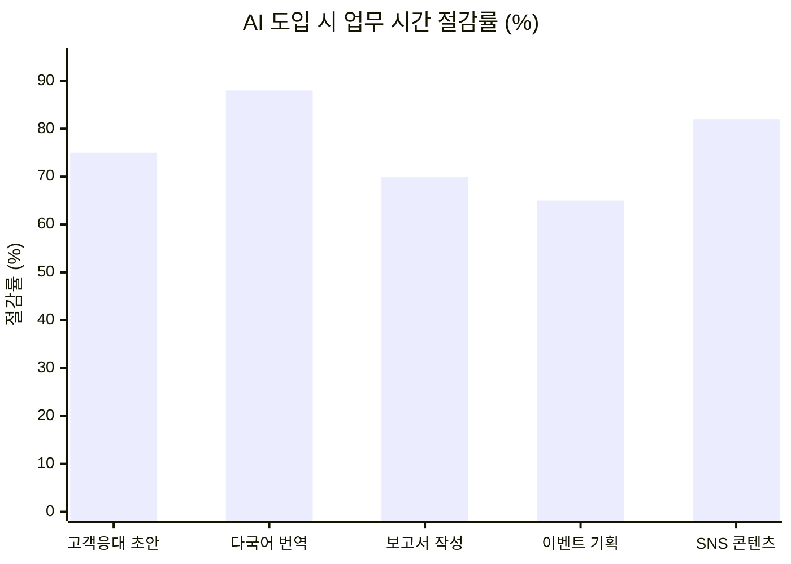
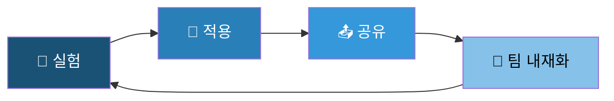
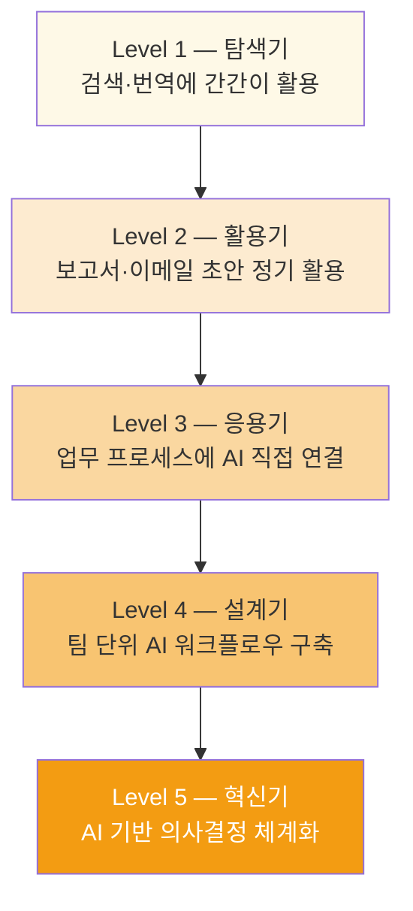
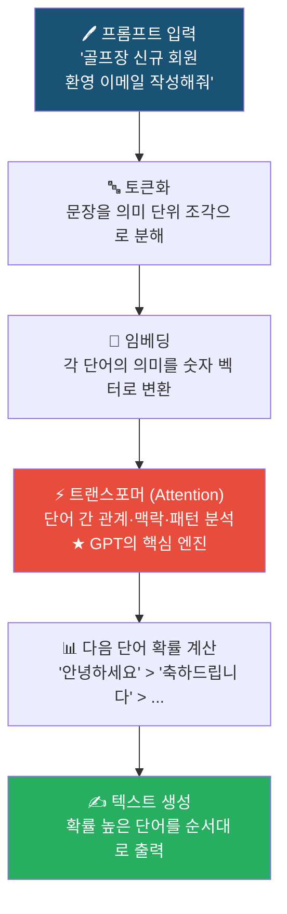
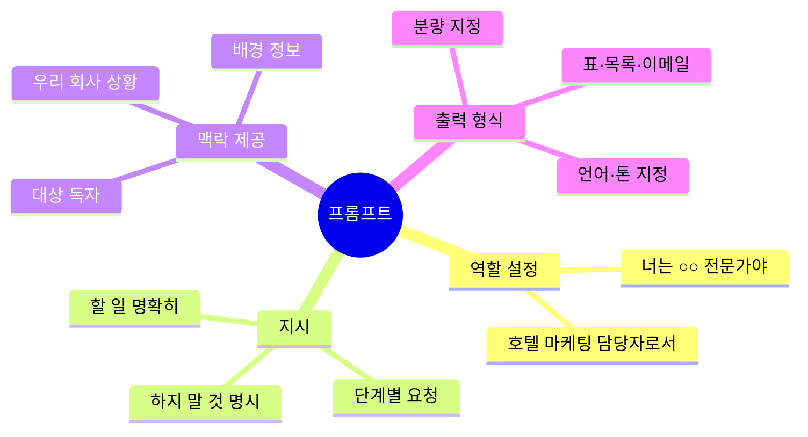
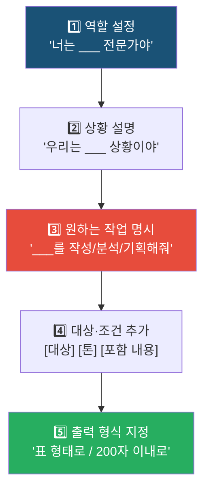
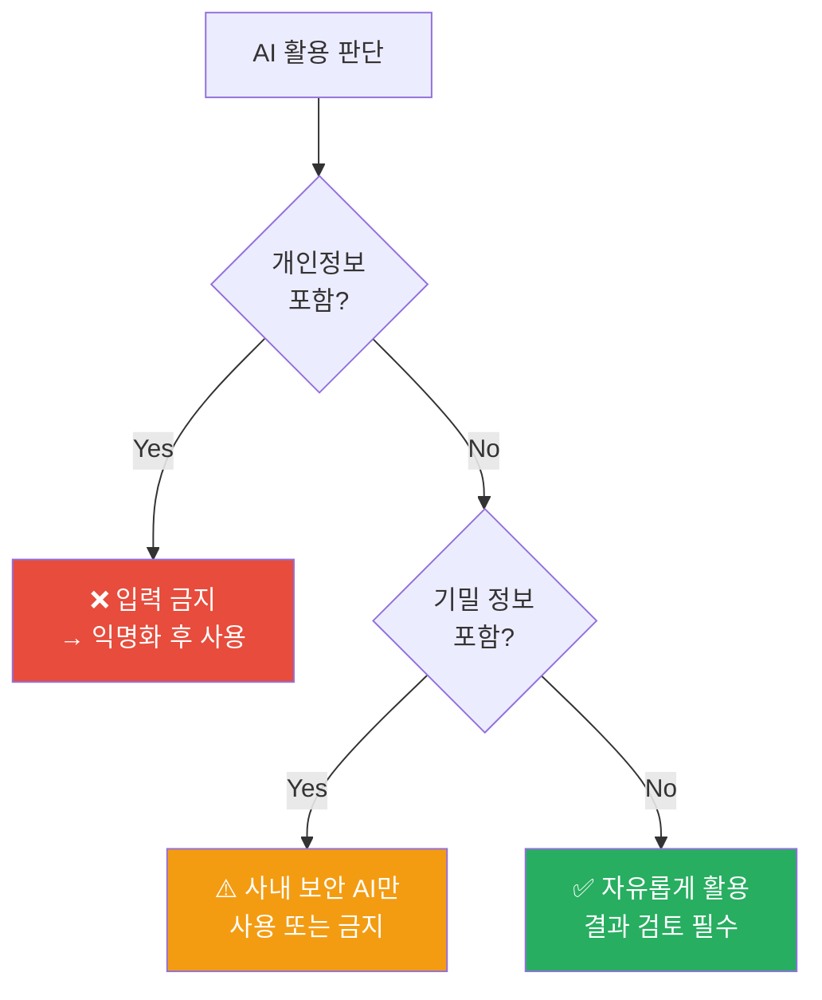
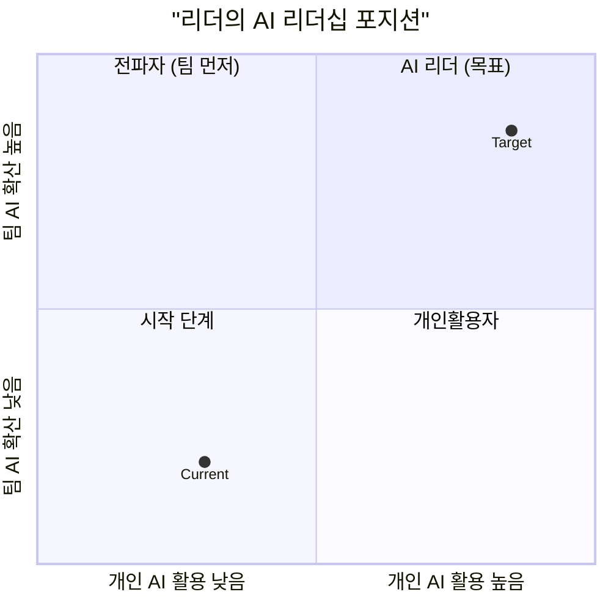

<style>
  .font-family {
    font-family: 'Pretendard', -apple-system, BlinkMacSystemFont, 'Segoe UI', Roboto, Oxygen;
  }
  h2 {
    color: #1a5276;
  }
  .columns {
    display: grid;
    grid-template-columns: repeat(2, 1fr);
    gap: 1em;
  }
  .columns3 {
    display: grid;
    grid-template-columns: repeat(3, 1fr);
    gap: 1em;
  }
  .cite {
    font-size: 0.7em;
    color: #888;
    margin-top: 8px;
  }
  blockquote {
    position: absolute;
    bottom: 2.5em;
    left: 1em;
    right: 1em;
  }
  .highlight-box {
    background: #eaf4fb;
    border-left: 4px solid #1a5276;
    padding: 10px 16px;
    border-radius: 4px;
    margin: 8px 0;
    font-size: 0.92em;
  }
  .card {
    background: #f8f9fa;
    border-radius: 8px;
    padding: 12px 14px;
    border: 1px solid #dee2e6;
    margin: 6px 0;
  }
  .warn-box {
    background: #fef9e7;
    border-left: 4px solid #f39c12;
    padding: 10px 16px;
    border-radius: 4px;
    margin: 8px 0;
  }
  .danger-box {
    background: #fdedec;
    border-left: 4px solid #e74c3c;
    padding: 10px 16px;
    border-radius: 4px;
    margin: 8px 0;
  }
</style>

<h1 style="font-size: 2.2em; margin-top: -30px; color: white; text-shadow: 2px 2px 8px rgba(0,0,0,0.6);">AI 전환 시대</h1>
<h2 style="color: #aed6f1; font-size: 1.3em; text-shadow: 1px 1px 4px rgba(0,0,0,0.6);">리더의 AI 전략</h2>

<div class="mt-6 text-gray-200 text-lg" style="text-shadow: 1px 1px 4px rgba(0,0,0,0.7);">
  현장에서
  <strong style="color: #f9e79f;">바로 쓰는</strong> 생성형 AI 실전 가이드
</div>

<div class="abs-br m-6 text-sm text-left">
  <h3 style="color: white; text-shadow: 1px 1px 3px rgba(0,0,0,0.5);">
    <div>권수정 <a href="https://suekwon.github.io/about/" target="_blank" style="color: #aed6f1;"> <carbon:logo-github /> </a></div>
    <div style="color: #aed6f1; font-size: 0.9em">AI 전략 컨설턴트 | 프롬인사이트</div>
  </h3>
</div>


<!-- 
<div class="absolute bottom-2 right-4 text-xs opacity-80" style="color: #585a5dff;">
    <SlideCurrentNo /> / <SlidesTotal />
  </div>
   -->


<!--
안녕하세요. 오늘은 레저·F&B·건설관리 업종에 특화된 AI 활용 전략을 알아봅니다.
이론보다 현장에서 내일부터 바로 쓸 수 있는 예시 중심으로 진행합니다.
강의 후 최소 1가지는 오늘 저녁 또는 내일 아침에 직접 써보실 수 있도록 설계했습니다.
-->

---
layout: center
transition: fade
---

### 강사 소개

**권수정**
AI 전략 컨설턴트 | 프롬인사이트

- 산업공학 박사
- 생성형AI · 강화학습 · 머신러닝
  연구 및 실무 적용 전문
- 공공기관·금융·산업 현장
  AI 기반 의사결정 구현 경험

📧 [suekwon.github.io/about](https://suekwon.github.io/about/)


---
layout: center
transition: fade-out
title: IceBreaking
---

## 아이스브레이킹 - AI 뉴스 OX 퀴즈

<div class="mt-6 text-xl text-gray-500">
  AI 세계에서 일어난 일들 — 얼마나 알고 계신가요?
</div>

<div class="mt-6 mx-auto" style="max-width: 500px;">

| 선택 | 표현 방법 |
|:---:|---------|
| ⭕  | 두 손을 동그랗게 머리 위로 |
| ❌  | 두 팔을 X 모양으로 앞에 |
| 🏆  | 5문제 중 **4개 이상** 정답 → "AI 얼리어답터" |

</div>

<div class="mt-6 text-gray-400 text-sm">
  ※ 정답 공개 후 함께 이야기 나눠봅시다
</div>

---
layout: two-cols-header
transition: fade
---

## O or X 퀴즈 

<br><br>

::left::

<v-click>

#### **Q1**. ChatGPT는 출시 **5일 만에** 100만 명의 사용자를 돌파했다

☝️ O or X ?

</v-click>

<v-click>

#### **Q2**. 2025년 1월, 중국의 AI 스타트업이 무료 오픈소스 AI 모델을 공개해 미국 빅테크를 충격에 빠뜨렸다

☝️ O or X ?

</v-click>

<v-click>

#### **Q3**. AI는 인터넷에서 실시간으로 새로운 정보를 자동 학습한다

☝️ O or X ?

</v-click>

::right::

<v-click>

#### **Q4**. 현재 AI는 텍스트뿐 아니라 이미지·음성·영상도 생성할 수 있다

☝️ O or X ?

</v-click>

<v-click>

#### **Q5**. 프롬프트(질문 방식)를 바꾸는 것만으로도 AI 답변 품질이 크게 달라진다

☝️ O or X ?

</v-click>

---
layout: two-cols-header
transition: fade
---

## 🎉 정답 공개

<br><br>

::left::

<v-click>

- **Q1 → ⭕**
  ChatGPT 2022년 11월 30일 출시. **5일 만에 100만 명**  
  [(비교: Netflix 3.5년, Spotify 5개월, Instagram 2.5개월)](https://www.digitalinformationworld.com/2023/01/chat-gpt-achieved-one-million-users-in.html)
</v-click>

<v-click>

- **Q2 → ⭕**
  **DeepSeek R1** (2025년 1월) — 미국 대비 **1/10 비용**으로 개발
  → 엔비디아 주가 17% 폭락, AI 판도 재편
  → AI는 이제 특정 기업만의 것이 아님

</v-click>

<v-click>

- **Q3 → ❌**
  AI는 **학습 마감일(cutoff) 이후 데이터를 모름**
  → 최신 정보는 직접 붙여넣어 줘야 효과적

</v-click>

::right::

<v-click>

- **Q4 → ⭕**
  텍스트(ChatGPT), 이미지(Midjourney·DALL-E),
  음성(ElevenLabs), 영상(Sora·Runway) — **멀티모달 AI 시대**

</v-click>

<v-click>

- **Q5 → ⭕**
  같은 AI에 같은 질문도 **표현 방식**에 따라 결과가 완전히 다름
  → 오늘의 핵심 주제 **"프롬프트 엔지니어링"**

</v-click>

<div v-click class="mt-4 highlight-box">
  💡 <strong>핵심 메시지:</strong> AI를 잘 쓰는 사람과 못 쓰는 사람의 차이는<br>
  IQ나 기술력이 아니라 <strong>"질문하는 방법"</strong>에 있습니다
</div>

<!--
퀴즈 결과 멘트:
- 5개 맞춤: "AI 얼리어답터! 오늘 심화 기술을 채워가세요"
- 3-4개: "방향은 잡혀 있습니다, 오늘 실전 방법론을 가져가세요"
- 0-2개: "오늘 가장 많이 가져가실 분!"

DeepSeek 이야기: 리더들에게 중요한 포인트
AI는 더 이상 대기업·선진국만의 것이 아님. 오픈소스로 누구나 쓸 수 있는 세상.
-->

---
layout: center
transition: fade
---

# Part 1
## 리더의 To-Be (feat. AI)

<div class="text-xl text-gray-400 mt-4">
  방향 · 마인드셋 · 실천
</div>

---
layout: two-cols-header
transition: fade
---

## AI가 바꾸는 레저·F&B 산업 — 지금 일어나는 일

<br>

::left::

<div style="transform: scale(0.75); transform-origin: center left; margin-bottom: -80px;">



</div>
<div class="cite">※ McKinsey & Company (2024), 서비스업 AI 도입 효과 연구 기반 추정치</div>

::right::

<div style="font-size: 0.82em; line-height: 1.4;">

<v-click>

🏔️ **리조트·스키장**
- AI 날씨 분석 → 슬로프 운영 최적화
- 방문 이력 기반 개인화 패키지 추천
- 챗봇 예약 문의 24시간 자동 응대
</v-click>

<v-click>

⛳ **골프클럽**
- 예약 취소·노쇼 예측으로 손실 방지
- 회원 이탈 징후 조기 감지 및 선제 마케팅
- AI 스윙 분석 → 레슨 서비스 차별화
</v-click>

<v-click>

🏨 **호텔·F&B**
- 실시간 객실 가격 최적화 (Revenue Management)
- AI 리뷰 분석 → 서비스 개선점 자동 도출
- 다국어 컨시어지 챗봇 (영·중·일 즉시 대응)
</v-click>

</div>


<!--
레저·F&B 산업은 이미 AI 전환이 빠르게 진행 중입니다.
경쟁사가 AI를 도입하기 시작하면, 우리가 안 쓸 때 격차가 벌어집니다.
리더의 역할은 이 흐름을 인식하고 팀을 이끄는 것입니다.
-->

---
layout: two-cols-header
transition: fade
---

## 리더의 역할: AS-IS → TO-BE

<br>

<style>
.two-cols-header .col-right { padding-left: 1.2rem; }
</style>

::left::


<div class="card" style="font-size: 0.8em">

| **AS-IS** | 기존 방식 | 소요 시간 |
|------|-----------|----------|
| 보고서 필요 | 담당자에게 지시 | 반나절 ~ 하루 |
| 번역 필요 | 외주 또는 구글 번역 | 1~3일 |
| 아이디어 필요 | 회의 소집 | 2시간 |
| 고객 답변 필요 | 직접 작성 | 30~60분 |

</div>

<div class="mt-4 text-gray-500 text-sm">
→ 시간 지연 · 비용 발생 · 소통 오류 · 야근
</div>

::right::

<div class="card" style="font-size: 0.8em">

| **TO-BE** | AI 활용 방식 | 소요 시간 |
|------|-------------|----------|
| 보고서 필요 | AI 초안 → 검토·수정 | 30분 |
| 번역 필요 | AI 즉시 번역 → 맥락 검수 | 10분 |
| 아이디어 필요 | AI 브레인스토밍 → 선택 | 20분 |
| 고객 답변 필요 | AI 초안 → 개인화 수정 | 5분 |

</div>

<div class="mt-4 highlight-box" style="font-size: 0.7em">
  리더의 새 역할:<br>
  <strong>"어떤 업무에 AI를 연결할지 설계하는 사람"</strong><br>
  — AI 오케스트레이터(Orchestrator)
</div>

[AI도입기업 현주소](https://www.outsourcing.co.kr/news/articleView.html?idxno=201215)

<!--
리더가 직접 AI를 쓰는 것도 중요하지만
더 중요한 것은 팀 전체가 AI를 활용하도록 환경을 만드는 것입니다.
-->

---
layout: two-cols-header
transition: fade
---

## 리더에게 필요한 3가지 마인드셋

<br>

::left::

<v-click>

**1. 실험가의 자세**
- "완벽하지 않아도 일단 써보자"
- 작게 시작 → 빠르게 학습 → 점진 확장
- 팀원의 AI 시도 **격려하는 문화** 조성
- **"Done is better than perfect"**

</v-click>

<v-click>

**2. 큐레이터 역할**
- AI가 만든 결과물의 **품질 판단** 능력
- 최종 책임은 항상 **사람(리더)** 에게
- "이 답변이 맞나?" 비판적 검토 습관
- AI는 도구, **판단은 내가**

</v-click>

::right::

<v-click>

**3. 공유하는 리더**
- 내가 배운 AI 활용법을 **팀과 공유**
- 팀 내 "AI 성공 사례 공유" 시간 만들기
- AI 활용 가이드라인 함께 수립
- 개인 효율 → **팀 역량**으로 확장

</v-click>

<v-click>



</v-click>

---
layout: two-cols-header
transition: fade
---

## 나의 AI 활용 현황

**해당되면 손가락 하나씩 접기 👇 (정답은 없습니다)**

::left::

<v-click>

 **1. 최근 한 달 내 업무에 AI를 활용해 본 적 있다** <br>
  (보고서 초안, 이메일, 번역, 자료 검색 등)

  ☝️ 해당되면 손가락 접기

</v-click>

<v-click>

 **2. 우리 사업장에서 **AI를 쓰면 좋겠다고 생각한 업무**가 <br> 머릿속에 떠오른 적 있다**

  ☝️ 해당되면 손가락 접기

</v-click>

<v-click>

 **3. "이 업무, AI가 하면 훨씬 빠를 텐데"** <br>
  라고 생각해본 적 있다

  ☝️ 해당되면 손가락 접기

</v-click>

::right::

<v-click>

 **4. 팀원들에게 **AI 활용을 권장하거나 가르치고 싶다**는 <br> 생각을 한 적 있다**

  ☝️ 해당되면 손가락 접기

</v-click>

<v-click>

 **5. AI를 **어디까지 써도 되는지, 보안은 괜찮은지** <br> 아직 애매하다고 느낀다**

  ☝️ 해당되면 손가락 접기

</v-click>

<!--
5개 다 접음 → "이미 AI 전환의 최전선에 계신 분, 오늘 실전 기술 채워가세요"
3-4개 → "방향은 잡혀 있습니다, 오늘 방법론을 가져가세요"
0-2개 → "오늘 가장 많이 바뀌실 분"

중요한 건: AI를 아느냐가 아니라, 현장에서 쓰고 싶다는 '의지'가 있느냐
리더가 의지를 가져야 팀이 따라옴
-->


---
layout: two-cols-header
transition: fade
---

## AI 활용 성숙도 모델: 나는 어디에?

<br> 

::left::

<div style="transform: scale(0.7); transform-origin: top center;">



</div>

::right::

### 리더의 목표: Level 3 이상

<div class="mt-4" style="transform: scale(0.8); transform-origin: top left; margin-bottom: -80px">

| Level | 특징 | 비고 |
|-------|------|------|
| 1 | 가끔 사용 | → 오늘 강의로 극복 |
| 2 | 규칙적 사용 | → 프롬프트 연습 |
| **3** | **프로세스 연결** | **✅ 오늘 목표** |
| 4 | 팀 단위 도입 | → 3개월 내 목표 |
| 5 | 의사결정 연동 | → 연간 목표 |

</div>
<br>
<div class="mt-4 highlight-box">
  📌 오늘 강의 후 목표:<br>
  <strong>내 업무 중 AI를 연결할 수 있는<br>구체적인 3가지를 찾는다</strong>
</div>

<!--
대부분의 분들이 Level 1-2에 계실 것입니다.
오늘 강의를 통해 Level 3으로 올라가는 방법을 알아가는 것이 목표입니다.
Level 4-5는 조직 차원의 변화가 필요하므로 단기 목표로는 무리입니다.
-->

---
layout: two-cols-header
transition: fade
---

## 오늘부터 실천할 AI 루틴

<br>

::left::

#### **일주일 AI 루틴**

<v-click>

**매일 (5분)**
- AI로 오늘 업무 중 **1가지 초안** 작성
- 예: 이메일, 회의 아젠다, 공지문

</v-click>

<v-click>

**주 1회 (15분)**
- 팀과 **"AI 활용 사례 공유"** 미팅
- "이번 주 AI로 뭘 해봤어요?" 한 마디

</v-click>

<v-click>

**월 1회 (1시간)**
- AI 적용 업무의 **시간 절감 효과 측정**
- 새로운 AI 도구 탐색 및 팀 공유

</v-click>

::right::

#### **당장 시작하는 3가지**

<v-click>

1. **ChatGPT 또는 Claude 계정 만들기**
   무료 버전으로 충분히 시작 가능

2. **오늘 쓸 이메일 1개를 AI로 초안 작성**
   → 내가 쓴 것과 품질 비교해보기

3. **팀 단톡에 AI 팁 1개 공유하기**
   → 리더가 먼저 쓰면 팀이 따라옴

</v-click>

<div v-click class="mt-4 highlight-box">
  💬 <em>"AI를 안 쓰는 것이 리스크인 시대가 됐습니다"</em><br>
    <em> 하지만, </em> <br>
    <em> "AI를 세상에 준 사람은, 이제 세상에 AI를 조심하라고 말합니다."</em>
</div>

---
layout: center
transition: fade
---

# Part 2
## 생성형 AI, 구조를 알면 제대로 쓴다

<div class="text-xl text-gray-400 mt-4">
  구조 · 원리 · 한계 · 프롬프트
</div>

---
layout: two-cols-header
transition: fade
---

## 생성형 AI란 무엇인가?

<br>

::left::

- **G**enerative **P**re-trained **T**ransformer
- 방대한 텍스트 학습 → 패턴 파악 → **다음 단어 예측·생성**
- 텍스트, 이미지, 음성, 영상 모두 생성 가능

<div class="mt-4 warn-box" style="transform: scale(0.85); transform-origin: top center; font-size: 0.7em;">
  📖 <strong>GPT는 백과사전이 아닙니다</strong><br>
  "가장 자연스러운 다음 단어"를 확률적으로 고르는<br>
  <strong>언어 패턴 예측기</strong>입니다<br>
  → 이것이 가끔 틀리는 이유이자 활용법의 핵심!
</div>

<v-click>

- **2025년 주요 AI 모델**

<div style="transform: scale(0.85); transform-origin: top center; font-size: 0.8em; line-height: 1; header-height: ">

| 회사 | 모델 | 특징 |
|------|------|------|
| Google | Gemini 2.0 | 멀티모달 강점 |
| OpenAI | GPT-4o, o1/o3 | 범용·추론 강화 |
| Anthropic | Claude 3.7 | 장문 분석·안전성 |
| DeepSeek | R1 | 고성능·저비용 오픈소스 |

</div>

</v-click>

::right::

<v-click>

<div style="transform: scale(0.55); transform-origin: top center; margin-top: -20px;">



</div>
</v-click>

<!--
이 구조를 이해하면:
1. 왜 AI가 최신 정보를 모르는지 (학습 데이터 cutoff)
2. 왜 AI가 가끔 틀리는지 (확률적 예측)
3. 왜 프롬프트가 중요한지 (입력이 바뀌면 패턴 분석이 달라짐)
를 자연스럽게 이해할 수 있습니다.
-->

---
transition: fade
---

## AI의 강점과 한계: 이것만 알면 절반 성공

<br> 

<div class="columns" style="font-size: 0.9em;">
<div>

- #### **AI가 잘하는 것**

<div class="card">

- **문서 초안 작성**
  보고서, 이메일, 공지문, 제안서, 계획서
- **반복 작업 자동화**
  양식 채우기, 데이터 정리, 분류, 요약
- **다국어 번역·현지화**
  영어·중국어·일어 고객 안내문 즉시 제작
- **브레인스토밍**
  이벤트 아이디어, 마케팅 카피, 행사 기획
- **패턴 분석·요약**
  고객 리뷰 분석, 트렌드 파악, 데이터 해석

</div>

</div>
<div>

#### **AI가 못하는 것 (주의!)**

<div class="card">

- **최신 정보 자동 반영 ❌**
  학습 마감일 이후 데이터는 모름 <br>
  → **최신 데이터는 직접** 확인하기
- **정밀한 수치 계산 ❌**
  재무·회계 계산은 반드시 검증 필수
- **법적·최종 판단 ❌**
  계약서 해석, 법률 판단 → 전문가에게
- **기밀 정보 처리 ❌**
  개인정보·영업비밀 입력 절대 금지
- **맥락 없는 추측 ❌**
  우리 회사 내부 상황은 알려줘야 함

</div>

</div>
</div>

> 💡 **Caution**: AI 결과물은 반드시 사람이 검토·수정한 후 사용!!

---
layout: center
transition: fade
---

# Part 3 
## AI에게 일 잘 시키는 방법 - 프롬프트 엔지니어링

<div class="mt-4 text-xl text-gray-400">
  같은 AI, 다른 결과 — 차이는 <strong>질문법</strong>에 있다
</div>

---
layout: two-cols-header
transition: fade
---

## 프롬프트 4가지 핵심 요소

<br> 

::left::

<div style="transform: scale(1); transform-origin: center;">



</div>

::right::

#### **실전 비교: 같은 요청, 다른 결과**


- **Lv.1 프롬프트**
  ```
  환영 이메일 써줘
  ```


- **Lv.3 좋은 프롬프트**
  ```
  너는 프리미엄 골프클럽 마케팅 담당자야.
  신규 입회 회원에게 보내는 환영 이메일을
  작성해줘.

  [대상] 40-50대 CEO급 회원
  [톤] 따뜻하고 격식 있게
  [포함 내용]
  - 전담 캐디 배정 안내
  - 회원 전용 라운지 혜택
  - 담당 매니저 연락처
  [분량] 200자 이내, 이메일 형식
  ```


---
layout: two-cols-header
transition: fade
---

<style>
.two-cols-header .col-right { padding-left: 1.2rem; }
</style>

## 프롬프트 유형별 활용법

<br> 

::left::

#### **제로샷 (Zero-shot)**
- 예시 없이 바로 요청 — 단순 작업에 적합

```
[예시]
다음 고객 불만을 3줄로 요약해줘:
"체크인이 너무 늦었고
직원도 불친절했어요..."
```

<br>

#### **퓨샷 (Few-shot)**
- 예시를 먼저 보여주고 패턴 학습

```
아래 형식으로 분류해줘:
입력: "조용한 객실 원해요"
출력: [요청유형: 시설] [우선순위: 보통]

입력: "아이 동반 가능해요?"
출력: ← 이것도 같은 형식으로
```

::right::

#### **명령형 CoT (Chain of Thought)**
- 단계별 사고 유도 — 복잡한 분석에 최적

```
우리 스키장 이번 시즌 노쇼율이
전년 대비 15% 상승했어.

단계적으로 생각해서
원인 분석과 개선 방안을 제시해줘:

1단계: 노쇼 발생 가능한 원인 나열
2단계: 원인별 데이터 확인 방법 제안
3단계: 우선순위별 개선 방안 3가지
4단계: 빠른 실행 가능한 것 1가지 추천
```

---
layout: two-cols-header
transition: fade
---

## 만족스럽지 못한 결과가 나왔다면?


::left::

**체크리스트**

<v-click>

- 역할 및 맥락이 명확한가?
  ```
  분석해줘
  vs. 
    너는 호텔 수익 관리 전문가야.
    이 데이터를 분석해줘.

    이벤트 기획해줘
  vs.
    12월 스키장 개장 시즌,
    30대 가족 고객 대상,
    주말 1박 패키지 이벤트를
    기획해줘.
  ```

</v-click>

<v-click>

- 출력 형식을 지정했는가?
  ```
  (형식 미지정)
  vs.
    표 형태로, 3가지 안으로,
    각 안별 예산·기대효과 포함해서
  ```
</v-click>

::right::

**개선 전략**

<v-click>

- "하지 마"보다 "해줘"로
```
❌ 어렵게 쓰지 마
✅ 고객이 바로 이해할 수 있도록
   쉬운 말로 써줘
```

</v-click>

<v-click>

- 한 문장 보다는 단계별로
```
❌ 분석하고 보고서 쓰고
   발표자료도 만들어줘

✅ 1단계: 먼저 데이터 분석해줘
   2단계: 그 결과로 보고서 써줘
   3단계: 핵심 요약 3줄 만들어줘
```

</v-click>


---
layout: center
transition: fade
---

# Part 4
## 현업 적용 사례

<div class="text-xl text-gray-400 mt-4">
  스키장 · 골프클럽 · 호텔 · F&B · 건설관리
</div>

---
layout: two-cols-header
transition: fade
---

## 🎿 스키장 & 리조트 AI 활용

<br> 

::left::

**Before vs After**

<div style="font-size: 0.7em">

<style scoped>
table td, table th { padding: 2px 8px !important; line-height: 1.7 !important; }
</style>

| 업무 | Before | After AI |
|------|--------|----------|
| 다국어 안내문 | 외주 2~3일 | AI 즉시 + 검수 30분 |
| 고객 불만 답변 | 담당자 30분/건 | AI 초안 5분 |
| 주간 운영 보고 | 데이터 정리 4시간 | AI 초안 1시간 |
| 시즌 이벤트 기획 | 회의 2시간 | AI 초안 20분 |
</div>

<v-click>

<br>

<details>
<summary> <strong>즉시 써볼 프롬프트 1. 시즌 개장 안내문 다국어 제작</strong> </summary>

```
너는 스키리조트 마케팅 담당자야.
이번 시즌 개장 안내문을 작성해줘.

내용: 12월 15일 개장,
     신규 슬로프 2개 추가,
     시즌권 10% 할인 (11월 말까지)

작성 후 영어, 중국어, 일어로도 번역해줘.
각 언어는 현지 문화에 맞게 자연스럽게.
```

</details>

</v-click>

::right::

<v-click>

<br>

<details>
<summary> <strong>즉시 써볼 프롬프트 2. 고객 불만 자동 분류 및 답변 초안</strong> </summary>

```
다음 고객 불만 이메일을 읽고:
1. 불만 유형 분류
   (시설/서비스/안전/예약/기타)
2. 감정 긴급도 평가 (긴급/일반/낮음)
3. 정중한 사과 + 해결책 답변 초안

[고객 이메일]
"어제 방문했는데 리프트 대기가
 2시간이나 됐어요. 주말마다 이런
 상황인데 시즌권 환불 받을 수 있나요?"
```

</details>
</v-click>

<v-click>

<br>

<details>
<summary> <strong>즉시 써볼 프롬프트 3. 주간 임원 보고서 초안</strong> </summary>

```
아래 데이터로 임원 보고용 주간 리포트
초안을 작성해줘 (1페이지 분량):
- 방문객: 12,450명 (전주 대비 +15%)
- 리프트 가동률: 94%
- 고객 만족도: 4.2/5.0
- 주요 이슈: 3호 슬로프 제설 지연
```

</details>
</v-click>

---
layout: two-cols-header
transition: fade
---

## ⛳ 골프클럽 AI 활용

::left::

### Before vs After

| 업무 | Before | After AI |
|------|--------|----------|
| 신규 회원 안내서 | 담당자 2일 | AI 초안 30분 |
| 그린피 안내 번역 | 외주 1주일 | 즉시 완료 |
| 월간 운영 보고 | 4시간 | 1시간 |
| 회원 이탈 분석 | 데이터팀 의뢰 | AI로 패턴 파악 |

<v-click>

### 🔥 즉시 써볼 프롬프트 ①
**회원 이탈 방지 전략**
```
우리 골프클럽 현황을 분석해줘:
- 최근 3개월 미방문 회원: 127명
- 전년 동기 대비 방문 감소율: 23%
- 탈퇴 이유 (설문):
  그린피 부담(45%), 예약 어려움(30%),
  시설 노후(25%)

이탈 방지를 위한 맞춤 전략 3가지를
각 전략별 예상 비용·기대 효과와 함께
제안해줘.
```

</v-click>

::right::

<v-click>

### 🔥 즉시 써볼 프롬프트 ②
**신규 회원 온보딩 이메일 시리즈**
```
프리미엄 골프클럽 회원 관리 전문가로서,
신규 입회 회원에게 보내는
웰컴 이메일 시리즈 3개를 써줘.

1번: 입회 당일 — 따뜻한 환영 + 혜택 소개
2번: 첫 라운드 전날 — 시설 안내 + 팁
3번: 첫 라운드 후 — 피드백 요청 + 다음 예약 유도

각 이메일: 200자 이내, 격식 있고 친근한 톤
```

</v-click>

<v-click>

### 🔥 즉시 써볼 프롬프트 ③
**주말 노쇼 방지 문자 초안**
```
예약 2일 전 발송하는 노쇼 방지 문자를
3가지 버전으로 써줘.
- 버전 A: 일반 리마인더
- 버전 B: 혜택 강조형 (캐디백 서비스 등)
- 버전 C: 부드러운 취소 유도형
각 60자 이내
```

</v-click>

---
layout: two-cols-header
transition: fade
---

## 🏨 호텔 AI 활용

::left::

### 🔥 즉시 써볼 프롬프트 ①
**다국어 객실 안내서 제작**
```
우리 호텔 객실 안내서를
아래 내용으로 작성하고,
영어·중국어·일어로 번역해줘.

체크인: 15:00 / 체크아웃: 11:00
조식: 07:00-10:00 (1층 레스토랑)
수영장: 09:00-21:00
룸서비스: 24시간 (내선 1번)
Wi-Fi: HOTEL_GUEST / 비번: welcome2024

각 언어는 그 나라 투숙객이
자연스럽게 읽을 수 있도록 현지화해줘.
```
→ 외주 번역비 절감 + 당일 완료

::right::

<v-click>

### 🔥 즉시 써볼 프롬프트 ②
**고객 리뷰 분석 및 개선 방향**
```
아래 최근 한 달 고객 리뷰를 분석해서:
1. 자주 언급된 불만 TOP 3
2. 자주 언급된 칭찬 TOP 3
3. 즉시 개선 가능한 사항 (1주일 내)
4. 중장기 개선 필요 사항
를 표 형태로 정리해줘.

[리뷰 붙여넣기]
```

</v-click>

<v-click>

### 🔥 즉시 써볼 프롬프트 ③
**기업 워크샵 유치 제안서**
```
기업 워크샵 유치 제안서 초안을 써줘.

[고객 정보]
- 기업: IT 스타트업 / 50명
- 목적: 팀빌딩 + 세미나
- 예산: 인당 20만원 내외
- 희망: 3월 둘째 주 주말

[우리 호텔]
- 세미나룸 3개 (최대 200석)
- 레스토랑 + 야외 바베큐
- 단체 객실 할인 가능

맞춤형 2박 3일 패키지로 제안해줘.
```

</v-click>

---
layout: two-cols-header
transition: fade
---

## 🍽️ F&B & 🏗️ 건설관리 AI 활용

::left::

### 🍽️ F&B (레스토랑·식음)

<v-click>

**메뉴 설명 & SNS 콘텐츠 제작**
```
우리 리조트 레스토랑 시그니처 메뉴를
소개하는 인스타그램 포스트를 써줘.

메뉴: 제주 흑돼지 스테이크
특징: 72시간 저온 숙성,
      제주산 제철 채소 곁들임
가격: 68,000원

- 해시태그 5개 포함
- 이모지 자연스럽게 활용
- 150자 이내
- 고급스럽지만 친근한 톤
```

</v-click>

<v-click>

**식재료 발주 계획 초안**
```
이번 주 예약 현황을 바탕으로
주요 식재료 발주 계획을 표로 정리해줘:
- 주말 투숙객: 380명
- 레스토랑 예약: 120팀
- 뷔페 행사: 1회 (80명)
발주 품목, 예상 수량, 우선순위 포함.
```

</v-click>

::right::

### 🏗️ 건설관리 (시설관리 포함)

<v-click>

**계약서·문서 핵심 요약**
```
아래 시설 관리 계약서를 읽고
다음 항목을 표로 요약해줘:

1. 계약 기간 및 금액
2. 우리 측 주요 의무 사항
3. 계약 해지 조건
4. 위약금 규정
5. 주의해야 할 특이 조항

⚠️ 최종 검토는 반드시 법무팀 진행 예정

[계약서 내용 붙여넣기]
```

</v-click>

<v-click>

**공사 현황 보고서 초안**
```
아래 현장 점검 메모를 바탕으로
임원 보고용 공정 현황 보고서 초안을
작성해줘. (A4 1페이지 분량, 표 포함)

[현장 메모 붙여넣기]
```

</v-click>

---
layout: two-cols-header
transition: fade
---

## ⚡️ 실습: 나의 프롬프트 만들기

<br>

::left::

<div style="transform: scale(0.7); transform-origin: top center; margin-bottom: -80px;">



</div>

::right::

#### 지금 직접 해보세요! (3분)

<div class="card">

**내 업무에서 AI를 쓰고 싶은 상황을 골라 프롬프트를 작성해보세요**

```
너는 ______________________ 전문가야.

상황: ______________________________

원하는 것: _________________________

대상/조건: _________________________

출력 형식: _________________________
```

</div>

<div class="mt-4 highlight-box">
  📌 <strong>3분 작성 후 이웃과 비교해보세요</strong><br>
  → 서로 다른 접근 방식 비교로<br>
  더 좋은 프롬프트 발견!
</div>

---
layout: two-cols-header
transition: fade
---

## 리더가 반드시 알아야 할 것 - AI 보안 & 윤리

<br> 

::left::

#### ✨ **AI 사용 시 기억할 것**

<div class="highlight-box" style="font-size: 0.8em;">

- AI 결과물은 반드시 **사람이 검토**
- 최종 판단·서명은 항상 **사람\(리더\)** 이 하기
- 회사 공식 문서에는 **AI 사용 여부 표기** 고려
- 팀 내 **AI 사용 가이드라인 수립** 필요

</div>
<br>

#### 🔐 **절대 AI에 입력하지 말 것**

<div class="danger-box" style="font-size: 0.8em;">

- 고객 개인정보 (이름, 연락처, 결제정보)
- 직원 인사 정보 및 평가 내용
- 미공개 경영 전략·재무 정보
- 계약 상대방의 기밀 내용
- 내부 보안·시스템 관련 정보

</div>

::right::

#### 🧭 **조직 차원 판단 기준**

<div style="transform: scale(0.75); transform-origin: top center; margin-bottom: -80px;">



</div>

<div class="mt-4 warn-box">
  📌 <strong>팀 내 AI 3줄 정책 (예시)</strong><br>
  1. 개인정보 절대 NO<br>
  2. 결과물 반드시 사람이 검토<br>
  3. 모르면 물어보기 (AI에게도, 동료에게도)
</div>

<!--
이 부분은 리더들이 팀에 돌아가서 바로 가이드라인으로 쓸 수 있도록
실용적으로 정리했습니다.
-->

---
layout: two-cols-header
transition: fade
---

## 리더의 To-Be: AI 활용 가이드

<br> 

::left::

<div style="transform: scale(0.75); transform-origin: top left; margin-bottom: -80px;">



<div class="cite">오늘 강의를 통해 현재 위치 → 목표 위치로</div>

</div>

::right::

  <div style="height: 80%">

  <v-click>

  **1. 직접 써보고 경험 쌓기**
 - 이번 주 내 업무 1가지에 AI 적용
 - "어, 이게 되네?" 경험이 변화의 시작
 - 잘 안 되어도 괜찮음 → 다음 시도

  </v-click>

  <v-click>

  **2. 팀에 AI 문화 심기**
  - 주간 회의에 "AI 활용 사례 공유" 5분 추가
  - 실패해도 괜찮은 **실험 문화** 허용
  - "나도 써봤어" — 리더의 솔선수범

  </v-click>

  <v-click>

  **3. AI 적용 업무 목록 만들기**
  - 우리 팀 반복 업무 목록 작성
  - AI 적용 가능한 것 체크 (오늘 바로!)
  - 월 1회 효과 측정 및 팀 공유

  </v-click>

  </div>

---
layout: center
transition: slide-up
---

<div class="text-3xl font-bold mt-4" style="color: #1a5276; line-height: 1.4em;">
  "AI를 쓰는 사람이<br>쓰지 않는 사람을 대체한다"
</div>

<div class="text-2xl mt-8 text-gray-500">
  <a href="https://www.nobelprize.org/prizes/physics/2024/hinton/speech/" target="_blank">AI를 세상에 준 사람이, 이제 세상에 AI를 조심하라고 말합니다.</a>
  <br>
  Geoffrey Hinton 의 경고
</div>

---
layout: two-cols-header
transition: fade
---

## 📋 오늘의 핵심 정리

<br>

::left::

- **생성형 AI 제대로 이해하기**
  - GPT는 **언어 패턴 예측기** — 항상 검토 필수
  - **학습 마감일 이후 정보는 모름** → 직접 붙여넣기
  - **프롬프트 = 업무 지시서**
    - 역할 + 상황 + 원하는 것 + 형식
  - **질문 방식**이 결과 품질을 결정

- **리더의 AI To-Be**
  - AI **사용자** → AI **기획자** (오케스트레이터)
  - 개인 효율 → **팀 역량**으로 확장
  - 실험 허용 + 공유 문화 = AI 조직 내재화
  - 보안·윤리 가이드라인 수립이 리더의 책임

::right::

- **오늘부터 실천 로드맵**

<div style="font-size: 0.8em;">

| 시점 | 실천 사항 |
|------|-----------|
| **오늘** | 이메일 1개 AI 초안 작성 |
| **이번 주** | 팀원과 AI 활용 사례 공유 |
| **이번 달** | AI 적용 업무 목록 3개 작성 |
| **3개월** | 팀 AI 사용 가이드라인 수립 |

</div>
  

<div class="mt-4 highlight-box">
 <strong>필수 프롬프트 구조</strong><br>
  <strong>역할</strong> → <strong>상황</strong> → <strong>원하는 것</strong> → <strong>조건</strong> → <strong>형식</strong><br><br>
    ✒️&nbsp;&nbsp;&nbsp;어느 업무에나 적용 가능합니다!
</div>

---
layout: default
transition: fade
---

## 교육 후기 & 소통

<br>
<div class="columns">
<div>

### 강의 설문
피드백을 남겨주세요!
더 좋은 강의로 돌아오겠습니다.

[설문 링크]

</div>

</div>

<div class="mt-6 text-center text-2xl font-bold" style="color: #1a5276;">
  오늘 강의에 함께 해주셔서 감사합니다! 🙏<br>
  <span style="font-size: 0.7em; color: #888;">나가시기 전에 한 가지 — AI로 ______ 1개 써보기! ✅</span>
</div>
