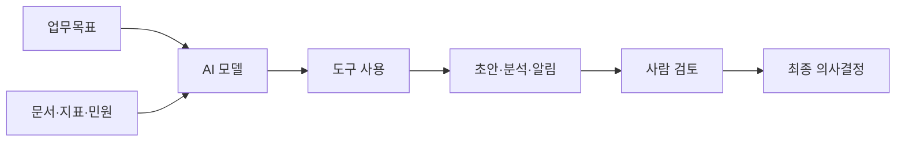
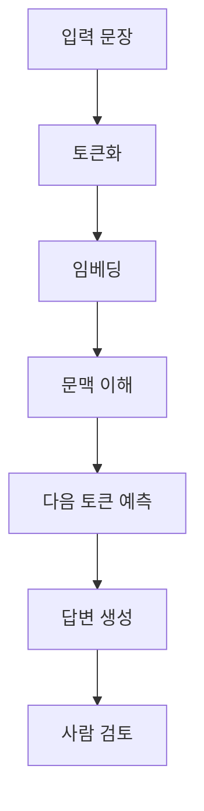
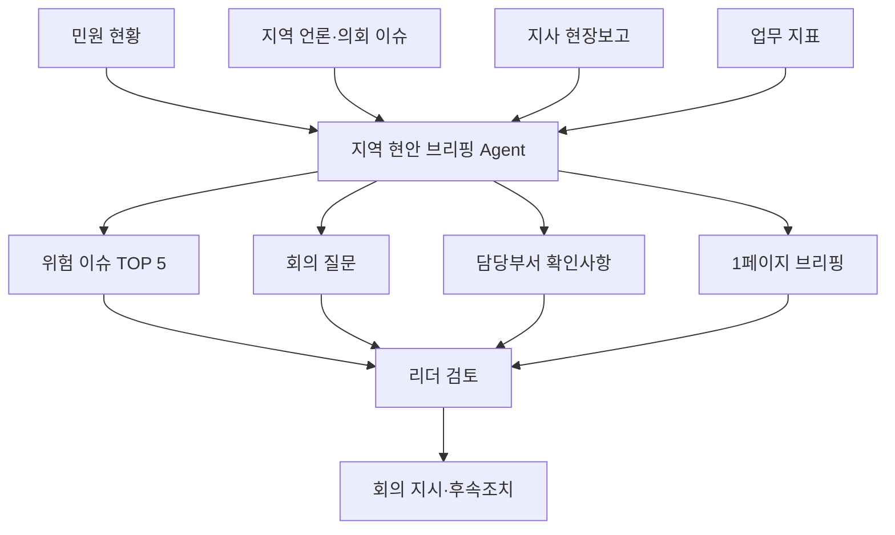
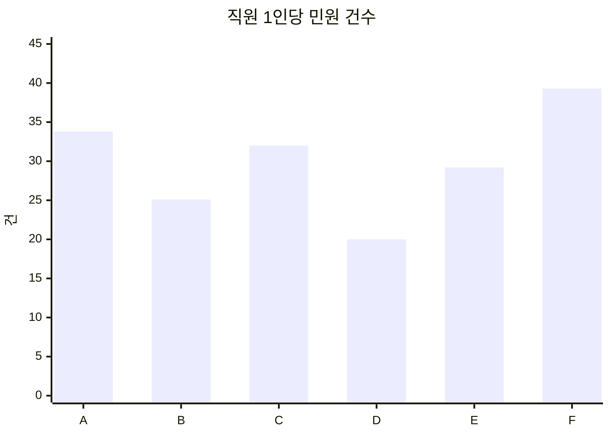
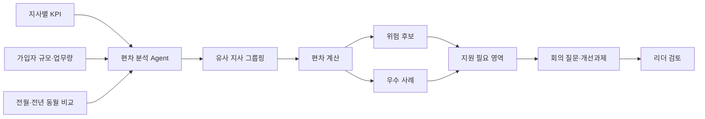
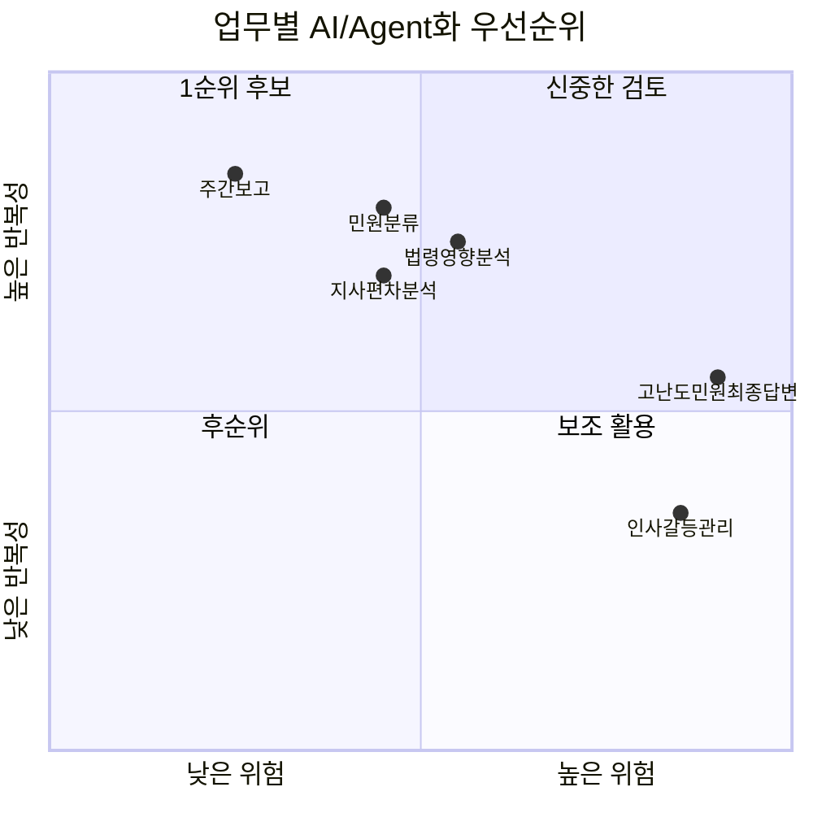

<style>
  .font-family {
    font-family: 'Pretendard', -apple-system, BlinkMacSystemFont, 'Segoe UI', Roboto, Oxygen;
  }
  h2 {
    color: #1a5276;
  }
  .columns {
    display: grid;
    grid-template-columns: repeat(2, 1fr);
    gap: 1em;
  }
  .columns3 {
    display: grid;
    grid-template-columns: repeat(3, 1fr);
    gap: 1em;
  }
  .cite {
    font-size: 0.7em;
    color: #888;
    margin-top: 8px;
  }
  blockquote {
    position: absolute;
    bottom: 2.5em;
    left: 1em;
    right: 1em;
  }
  .highlight-box {
    background: #eaf4fb;
    border-left: 4px solid #1a5276;
    padding: 10px 16px;
    border-radius: 4px;
    margin: 8px 0;
    font-size: 0.92em;
  }
  .card {
    background: #f8f9fa;
    border-radius: 8px;
    padding: 12px 14px;
    border: 1px solid #dee2e6;
    margin: 6px 0;
  }
  .warn-box {
    background: #fef9e7;
    border-left: 4px solid #f39c12;
    padding: 10px 16px;
    border-radius: 4px;
    margin: 8px 0;
  }
  .danger-box {
    background: #fdedec;
    border-left: 4px solid #e74c3c;
    padding: 10px 16px;
    border-radius: 4px;
    margin: 8px 0;
  }
  .cite-author { 
      text-align        : right; 
   }
   .cite-author:after {   
      color             : #f87ca1;
      font-size         : 130%;
      font-style        : italic;
      font-weight       : bold;
      font-family       : Cambria, Cochin, Georgia, Times, 'Times New Roman', serif;
      padding-right     : 130px;
   }
   .cite-author[data-text]:after {
      content           : " - "attr(data-text) " - ";      
   }
   .cite-author p {    
      padding-bottom : 40px
   } 
  .classReact rect {
    fill: #61dafb;
    stroke: #000;
    stroke-width: 2px;
    rx: 10;
    ry: 10;
    max-width: 350px;
  }
  .title-bg {
    position: absolute;
    inset: 0;
    z-index: -1;
    background-image: url('./images/nhis/agent-title.png');
    background-repeat: no-repeat;
    background-size: 52%;
    background-position: left 48%;
  }
  * {
   -webkit-user-select: none;  /* Chrome, Safari, Opera */
    -moz-user-select: none;     /* Firefox */
    -ms-user-select: none;      /* IE/Edge */
    user-select: none;          /* Standard */
  }
</style>


<div class="title-bg"></div>

<h1 style="font-size: 2.2em; margin-top: -30px; color: ; text-shadow: 2px 2px 8px rgba(0,0,0,0.6);"> AI 기반 문제 해결 및 전략 수립</h1>

<div class="mt-6 text-gray-200 text-lg" style="color: #1a5276;">
  현장에서 <strong style="color:maroon;">바로 쓰는</strong> 생성형 AI 실전 가이드: 개념부터 실전까지
</div>

<div class="abs-br m-6 text-sm text-left">
  <h3 style="color: #1a5276;">
    <div>권수정 <a href="https://suekwon.github.io/about/" target="_blank" style="color: #1a5276;"> <carbon:logo-github /> </a></div>
    <div style="color: #3669ad; font-size: 0.85em">AI 전략 컨설턴트 | 프롬인사이트</div>
  </h3>
</div>


<!-- 
<div class="absolute bottom-2 right-4 text-xs opacity-80" style="color: #585a5dff;">
    <SlideCurrentNo /> / <SlidesTotal />
  </div>
   -->


---
layout: center
transition: fade
---

### 강사 소개

**권수정**
AI 전략 컨설턴트 | 프롬인사이트

- 산업공학 박사
- 생성형AI · 강화학습 · 머신러닝
  연구 및 실무 적용 전문
- 공공기관·금융·산업 현장
  AI 기반 의사결정 구현 경험

📧 [suekwon.github.io/about](https://suekwon.github.io/about/)


---
layout: two-cols-header
title: AI Icebreaking
transition: fade-out
---

## 아이스브레이킹: 오늘 아침 리더의 책상 위에는?

- 질문에 **해당되면 손가락 1개 접기**
- 총 **5개 질문**
- 5개 모두 접으면 오늘 실습의 주인공입니다

::left::

<v-click>

### 질문 ①  
최근 1주일 안에 **보고서·회의자료·답변 초안** 때문에 시간이 부족했다

☝️ 해당되면 손가락 접기

</v-click>

<v-click>

### 질문 ②  
민원, 언론, 지표, 현장 보고를 **따로따로 확인하다가** 중요한 이슈를 놓칠까 걱정한 적 있다

☝️ 해당되면 손가락 접기

</v-click>

<v-click>

### 질문 ③  
“이 정도 정리는 AI가 먼저 해주면 좋겠다”고 생각한 적 있다

☝️ 해당되면 손가락 접기

</v-click>

::right::

<v-click>

### 질문 ④  
비슷한 규모의 지사끼리 비교해보고 싶은데, 엑셀 정리에 시간이 많이 든다

☝️ 해당되면 손가락 접기

</v-click>

<v-click>

### 질문 ⑤  
AI를 쓰고 싶지만 **개인정보·책임·보안** 때문에 어디까지 가능한지 애매하다

☝️ 해당되면 손가락 접기

</v-click>

<div v-click class="card">
<b>오늘의 메시지</b><br>
AI는 리더를 대체하는 도구가 아니라, 리더가 판단하기 전의 <b>자료정리·요약·비교·초안작성</b>을 줄여주는 업무 보좌관입니다.
</div>

<!--
멘트 예시:
5개 다 접으신 분은 이미 AI 전환의 핵심 문제를 정확히 알고 계신 분입니다.
0개이신 분은 축하드립니다. 오늘 강의가 끝나면 적어도 3개는 접게 됩니다.
-->

---
layout: center
transition: fade
---

# 오늘 강의의 목표

<div class="three-cols">
<div class="card">
<h3>1. 이해</h3>
생성형 AI가 왜 그럴듯하게 답하고, 왜 틀릴 수 있는지 이해한다.
</div>
<div class="card">
<h3>2. 적용</h3>
건보공단 리더 업무 중 바로 적용 가능한 예시를 실습한다.
</div>
<div class="card">
<h3>3. 설계</h3>
지역 현안 브리핑 Agent와 지사 편차 분석 Agent를 설계한다.
</div>
</div>

> 오늘의 결론: “AI에게 일을 맡긴다”가 아니라 “AI가 처리할 수 있는 형태로 일을 재설계한다.”

---
layout: two-cols-header
transition: fade
---

## 왜 지금 리더에게 AI가 필요한가

::left::

### 공단 리더 업무의 특징

- 민원, 지표, 현장보고, 법령, 언론 이슈가 동시에 들어온다
- 최종 판단은 리더가 하지만, 판단 전 자료정리에 시간이 많이 든다
- 업무는 공공성·책임성·보안성이 높다
- “빠른 답변”과 “정확한 답변”을 동시에 요구받는다

::right::

### AI가 먼저 도와줄 수 있는 일

| 업무 | AI 활용 방식 |
|---|---|
| 현안 파악 | 여러 자료를 읽고 핵심 이슈 5개 추출 |
| 민원 분석 | 유형·긴급도·반복성 분류 |
| 지사 비교 | 유사 규모 지사와 지표 편차 분석 |
| 회의 준비 | 안건, 쟁점, 질문 목록 작성 |
| 보고 초안 | 1페이지 브리핑 초안 작성 |

---
layout: two-cols-header
transition: fade
---

## 최신 AI 흐름: 챗봇에서 Agent로

::left::

### 과거: 질문하면 답하는 AI

- “이 문서 요약해줘”
- “회의자료 초안 써줘”
- “민원 답변문 만들어줘”

### 현재: 도구를 쓰는 AI

- 파일을 읽는다
- 웹이나 내부 자료를 검색한다
- 표를 계산한다
- 시스템 화면을 보며 작업 순서를 제안한다
- 여러 단계를 나눠 실행한다

::right::

<div class="card">
<b>Agent의 핵심</b><br><br>
Agent = LLM + 업무목표 + 자료접근 + 도구사용 + 검토절차
</div>

<br>



<div class="tiny">
참고: OpenAI는 Responses API와 Agents SDK에서 web search, file search, computer use 같은 도구 결합을 Agent 구축의 핵심 기능으로 설명한다. Anthropic의 MCP는 AI 애플리케이션과 외부 데이터·도구를 연결하는 표준으로 제시되었다.
</div>

---
layout: center
transition: fade
---

# 생성형 AI 구조를 확실히 알고 쓰기

> AI를 잘 쓰는 리더는 “AI가 똑똑하다”가 아니라  
> “AI가 어떤 방식으로 답을 만드는지”를 알고 씁니다.

---
layout: two-cols-header
transition: fade
---

## 생성형 AI는 어떻게 답을 만드는가

::left::

### 핵심 흐름

1. 문장을 작은 단위인 **토큰**으로 나눈다
2. 토큰을 숫자 벡터로 바꾼다
3. 문맥상 다음에 올 가능성이 높은 토큰을 예측한다
4. 예측을 반복해 문장과 보고서를 만든다

<div class="card">
<b>중요한 해석</b><br>
AI는 “공식 결재권자”가 아니라 “확률적으로 그럴듯한 초안 작성자”입니다.
</div>

::right::



---
layout: two-cols-header
transition: fade
---

## AI가 잘하는 일과 위험한 일

::left::

### 잘하는 일

- 긴 문서 요약
- 반복 민원 분류
- 회의록 정리
- 표 비교와 패턴 찾기
- 보고서 초안 작성
- 체크리스트 생성
- 쉬운 설명문 작성

::right::

### 조심해야 하는 일

- 법적 최종 판단
- 민감 민원 최종 답변
- 개인정보 포함 자료 입력
- 최신 법령·고시를 확인하지 않은 답변
- 내부 규정과 다르게 자동 처리
- 불이익 처분 자동 결정

<div class="card">
<b>원칙</b><br>
AI는 <span class="ok">초안·분류·요약·비교</span>까지, 최종 판단은 <span class="danger">사람</span>이 한다.
</div>

---
layout: two-cols-header
transition: fade
---

## 공공기관 리더용 AI 사용 원칙

::left::

### 입력 전에 확인할 것

| 질문 | 판단 |
|---|---|
| 주민번호, 계좌, 진료정보가 있는가? | 있으면 입력 금지 |
| 특정 개인이 식별되는가? | 비식별 처리 |
| 내부 결재 전 자료인가? | 내부 규정 확인 |
| 최신 법령 확인이 필요한가? | 출처 확인 필수 |

::right::

### 출력 후 확인할 것

| 질문 | 판단 |
|---|---|
| 근거가 명확한가? | 출처 확인 |
| 과장된 표현은 없는가? | 문장 조정 |
| 기관 입장처럼 단정했는가? | 책임 표현 수정 |
| 민원인에게 불리한 판단인가? | 사람 검토 필수 |

---
layout: center
transition: fade
---

# 프롬프트 작성법: 리더 업무용 5요소

---
layout: two-cols-header
transition: fade
---

## 좋은 프롬프트의 5요소

::left::

| 요소 | 질문 |
|---|---|
| 역할 | AI가 어떤 역할을 해야 하는가? |
| 목표 | 무엇을 만들어야 하는가? |
| 자료 | 어떤 입력자료를 기준으로 할 것인가? |
| 기준 | 어떤 관점으로 판단할 것인가? |
| 출력 | 어떤 형식으로 내보낼 것인가? |

::right::

<div class="card">
<b>기본 공식</b><br><br>
당신은 [역할]입니다.<br>
목표는 [목표]입니다.<br>
아래 [자료]를 기준으로 [기준]에 따라 분석하세요.<br>
출력은 [형식]으로 작성하세요.<br>
모르는 내용은 추정하지 말고 “확인 필요”라고 표시하세요.
</div>

---
layout: two-cols-header
transition: fade
---

## 건보공단 리더 업무용 프롬프트 템플릿

::left::

### 템플릿

```text
당신은 국민건강보험공단 지역본부 리더를 보좌하는 업무분석 담당자입니다.
아래 자료를 기준으로 핵심 이슈를 정리하세요.

분석 기준:
1. 민원 증가 가능성
2. 언론·대외 리스크
3. 처리 지연 가능성
4. 취약계층 영향
5. 내부 후속조치 필요성

출력 형식:
- 이번 주 위험 이슈 TOP 5
- 각 이슈별 근거
- 담당부서 확인사항
- 리더가 회의에서 물어볼 질문
- 확인 필요 정보

주의:
개인정보는 사용하지 말고, 자료에 없는 내용은 추정하지 마세요.
```

::right::

### 이 템플릿이 좋은 이유

- 역할이 명확하다
- 판단 기준이 있다
- 출력 형식이 정해져 있다
- “확인 필요”를 허용한다
- 개인정보 사용 금지를 명시한다

<div class="card">
<b>리더의 프롬프트는 질문이 아니라 업무지시서에 가까워야 합니다.</b>
</div>

---
layout: center
transition: fade
---

# 오늘의 핵심 실습 1

## 지역 현안 브리핑 Agent

> 매주 지역별 민원, 언론, 지표, 현장 보고를 모아  
> “이번 주 위험 이슈 5개”를 정리하는 Agent

---
layout: two-cols-header
transition: fade
---

## 실습 1의 업무 상황

::left::

### 상황

당신은 지역본부 리더입니다. 월요일 오전 회의 전에 아래 자료를 10분 안에 정리해야 합니다.

- 지사별 민원 증가 현황
- 지역 언론 보도
- 장기요양 현장 보고
- 건강검진 수검률
- 징수 관련 지표

::right::

### AI에게 맡길 일

| 사람의 일 | AI의 일 |
|---|---|
| 최종 판단 | 자료 요약 |
| 책임 있는 지시 | 위험도 분류 |
| 대외 메시지 결정 | 회의 질문 초안 |
| 조직 조정 | 후속조치 목록화 |

---
layout: default
transition: fade
---

## 실습 데이터: 지역 현안 브리핑용 가상 자료

아래 자료를 휴대폰 AI 앱에 그대로 복사해 사용합니다. 실제 개인정보나 내부자료가 아닌 **가상 데이터**입니다.

| 지역 | 민원 증감 | 언론·외부 이슈 | 현장 보고 | 주요 지표 |
|---|---:|---|---|---|
| A지사 | +34% | 지역신문: 장기요양 대기기간 불만 기사 | 방문조사 일정 지연, 조사인력 결원 2명 | 인정조사 평균 11.2일 |
| B지사 | +8% | 특이 없음 | 고령 민원인 내방 증가 | 건강검진 수검률 61% |
| C지사 | +27% | 온라인 커뮤니티: 보험료 부과 불만 확산 | 피부양자 자격 관련 상담 급증 | 부과 민원 420건 |
| D지사 | -3% | 특이 없음 | 민원처리 안정 | 처리기간 2.1일 |
| E지사 | +19% | 지방의회 자료요구 예정 | 체납 안내문 반송 증가 | 체납 고지 반송률 14% |
| F지사 | +41% | 지역방송 취재 문의 | 본인부담상한제 환급 문의 폭증 | 환급 문의 680건 |

---
layout: default
transition: fade
---

## 휴대폰 실습 1: 바로 복사하는 프롬프트

```text
당신은 국민건강보험공단 지역본부장을 보좌하는 지역 현안 브리핑 Agent입니다.
아래 가상 자료를 기준으로 이번 주 지역본부 회의에서 다룰 위험 이슈 TOP 5를 정리하세요.

분석 기준:
1. 민원 증가율
2. 언론·외부 확산 가능성
3. 취약계층 영향
4. 처리 지연 가능성
5. 리더 의사결정 필요성

출력 형식:
표로 작성하세요.
열은 [순위, 이슈명, 관련 지역, 위험도, 근거, 오늘 회의 질문, 후속조치]로 구성하세요.

주의사항:
- 자료에 없는 내용은 추정하지 마세요.
- 개인정보는 포함하지 마세요.
- 최종 판단이 필요한 항목은 “리더 판단 필요”라고 표시하세요.

[자료]
A지사: 민원 +34%, 장기요양 대기기간 불만 기사, 방문조사 일정 지연, 조사인력 결원 2명, 인정조사 평균 11.2일
B지사: 민원 +8%, 특이 언론 없음, 고령 민원인 내방 증가, 건강검진 수검률 61%
C지사: 민원 +27%, 온라인 커뮤니티 보험료 부과 불만 확산, 피부양자 자격 상담 급증, 부과 민원 420건
D지사: 민원 -3%, 특이 이슈 없음, 민원처리 안정, 처리기간 2.1일
E지사: 민원 +19%, 지방의회 자료요구 예정, 체납 안내문 반송 증가, 체납 고지 반송률 14%
F지사: 민원 +41%, 지역방송 취재 문의, 본인부담상한제 환급 문의 폭증, 환급 문의 680건
```

---
layout: two-cols-header
transition: fade
---

## 실습 1: 좋은 결과물의 모습

::left::

### AI 결과에서 확인할 점

- 단순 민원 증가율 순서로만 정리했는가?
- 언론·지방의회·지역방송 이슈를 반영했는가?
- “오늘 회의 질문”이 실제 리더 질문처럼 구체적인가?
- 후속조치가 담당부서 행동으로 바뀔 수 있는가?

::right::

### 리더가 추가로 물어볼 질문

```text
위 결과를 기준으로 지역본부장 회의용 1페이지 브리핑 문안을 작성하세요.
문장은 보고용 문체로 작성하고, 각 이슈마다 담당부서 확인사항을 1개씩 붙이세요.
단, 외부 공개가 곤란한 표현은 완곡하게 바꾸세요.
```

<div class="card">
<b>포인트</b><br>
AI에게 한 번에 완성본을 요구하지 말고, 1차 분류 → 2차 회의자료 → 3차 메시지 조정 순서로 사용합니다.
</div>

---
layout: default
transition: fade
---

## 지역 현안 브리핑 Agent 구조



---
layout: center
transition: fade
---

# 오늘의 핵심 실습 2

## 지사 편차 분석 Agent

> 비슷한 규모의 지사끼리 비교해 처리기간, 민원 증가율, 직원 1인당 업무량, 징수 실적 차이를 분석하는 Agent

---
layout: default
transition: fade
---

## 실습 데이터: 지사 편차 분석용 가상 지표

| 지사 | 가입자 규모 | 월 민원 | 민원 증가율 | 평균 처리기간 | 직원 수 | 직원 1인당 민원 | 징수율 | 건강검진 수검률 |
|---|---:|---:|---:|---:|---:|---:|---:|---:|
| A지사 | 21만 | 1,420 | 34% | 4.8일 | 42 | 33.8 | 96.1% | 63% |
| B지사 | 20만 | 980 | 8% | 3.1일 | 39 | 25.1 | 97.4% | 61% |
| C지사 | 22만 | 1,310 | 27% | 4.2일 | 41 | 32.0 | 95.8% | 66% |
| D지사 | 19만 | 760 | -3% | 2.1일 | 38 | 20.0 | 98.0% | 72% |
| E지사 | 21만 | 1,080 | 19% | 3.9일 | 37 | 29.2 | 94.9% | 68% |
| F지사 | 23만 | 1,690 | 41% | 5.3일 | 43 | 39.3 | 96.5% | 59% |

<div class="tiny">
주의: 위 데이터는 교육용 가상 데이터입니다. 실제 지사 평가나 성과판단에 사용할 수 없습니다.
</div>

---
layout: two-cols-header
transition: fade
---

## 시각화: 비슷한 규모 지사의 편차 보기

::left::



::right::

```mermaid
xychart-beta
    title "평균 처리기간"
    x-axis ["A", "B", "C", "D", "E", "F"]
    y-axis "일" 0 --> 6
    line [4.8, 3.1, 4.2, 2.1, 3.9, 5.3]
```

---
layout: default
transition: fade
---

## 휴대폰 실습 2: 바로 복사하는 프롬프트

```text
당신은 국민건강보험공단 지역본부의 지사 편차 분석 Agent입니다.
아래 가상 지표를 이용해 비슷한 규모의 지사 사이에서 성과 편차와 병목 가능성을 분석하세요.

분석 기준:
1. 가입자 규모가 비슷한 지사끼리 비교
2. 민원 증가율과 평균 처리기간의 동시 상승 여부
3. 직원 1인당 민원 부담
4. 징수율과 건강검진 수검률의 상대적 약점
5. 단기 조치와 구조적 조치를 구분

출력 형식:
1. 핵심 관찰 5개
2. 위험 지사 후보와 이유
3. 우수 지사 벤치마킹 포인트
4. 지역본부장이 물어볼 질문 5개
5. 다음 주까지 필요한 추가 데이터

주의사항:
- 순위를 단정하지 말고 “위험 후보”, “확인 필요”로 표현하세요.
- 특정 직원이나 개인 책임으로 해석하지 마세요.
- 자료에 없는 원인은 추정하지 마세요.

[가상 지표]
A지사: 가입자 21만, 월 민원 1420, 민원 증가율 34%, 평균 처리기간 4.8일, 직원 42명, 직원 1인당 민원 33.8, 징수율 96.1%, 건강검진 수검률 63%
B지사: 가입자 20만, 월 민원 980, 민원 증가율 8%, 평균 처리기간 3.1일, 직원 39명, 직원 1인당 민원 25.1, 징수율 97.4%, 건강검진 수검률 61%
C지사: 가입자 22만, 월 민원 1310, 민원 증가율 27%, 평균 처리기간 4.2일, 직원 41명, 직원 1인당 민원 32.0, 징수율 95.8%, 건강검진 수검률 66%
D지사: 가입자 19만, 월 민원 760, 민원 증가율 -3%, 평균 처리기간 2.1일, 직원 38명, 직원 1인당 민원 20.0, 징수율 98.0%, 건강검진 수검률 72%
E지사: 가입자 21만, 월 민원 1080, 민원 증가율 19%, 평균 처리기간 3.9일, 직원 37명, 직원 1인당 민원 29.2, 징수율 94.9%, 건강검진 수검률 68%
F지사: 가입자 23만, 월 민원 1690, 민원 증가율 41%, 평균 처리기간 5.3일, 직원 43명, 직원 1인당 민원 39.3, 징수율 96.5%, 건강검진 수검률 59%
```

---
layout: two-cols-header
transition: fade
---

## 실습 2: 추가 질문으로 품질 높이기

::left::

### 1차 결과가 나왔을 때

```text
위 분석을 지역본부장 보고용으로 바꾸세요.
표현은 특정 지사를 비난하지 않는 방식으로 조정하고,
“지원 필요 영역” 중심으로 작성하세요.
```

### 비교 기준을 더 엄격하게

```text
가입자 규모가 19만~23만인 지사만 같은 그룹으로 보고,
그룹 평균 대비 편차를 계산해 표로 보여주세요.
```

::right::

### 회의 질문 만들기

```text
분석 결과를 바탕으로 지사장 회의에서 사용할 질문 7개를 작성하세요.
질문은 추궁형이 아니라 원인 파악과 지원 방안 도출형으로 작성하세요.
```

### 실행계획 만들기

```text
위 결과를 바탕으로 2주 안에 실행할 수 있는 조치와 3개월 구조개선 과제를 구분해 주세요.
```

---
layout: default
transition: fade
---

## 지사 편차 분석 Agent 구조



---
layout: center
transition: fade
---

# 실무 예시 상황 5개

> “강의가 끝나고 내일부터 바로 써볼 수 있는 업무” 중심

---
layout: default
transition: fade
---

## 예시 1. 월요일 아침 지사장 회의자료 초안

### 상황

- 지난주 민원 증가
- 장기요양 인정조사 지연
- 건강검진 수검률 부진
- 언론 취재 문의 발생

### 프롬프트

```text
당신은 지사장 회의자료를 작성하는 업무보좌관입니다.
아래 메모를 바탕으로 회의자료 초안을 작성하세요.

출력 형식:
1. 이번 주 핵심 이슈 3개
2. 지사장 모두에게 공유할 메시지
3. 담당부서별 확인사항
4. 다음 회의까지 후속조치
5. 대외 표현 주의사항

문체는 공공기관 내부 회의자료 문체로 작성하세요.
```

---
layout: default
transition: fade
---

## 예시 2. 민원 급증 원인 가설 정리

### 상황

본인부담상한제 환급 문의가 갑자기 늘었습니다.

### 프롬프트

```text
아래 민원 증가 상황을 보고 가능한 원인 가설을 정리하세요.

주의:
- 자료에 없는 원인을 사실처럼 단정하지 마세요.
- 확인해야 할 데이터와 담당부서를 함께 제시하세요.
- 민원 응대 현장에서 바로 쓸 수 있는 안내문 초안도 작성하세요.

출력:
[가능 원인 가설] [확인 데이터] [담당부서] [민원 안내문 초안]
```

---
layout: default
transition: fade
---

## 예시 3. 법령·지침 변경 영향분석

### 상황

새로운 고시나 내부 지침이 내려왔습니다.

### 프롬프트

```text
당신은 법령·지침 변경 영향분석 담당자입니다.
아래 변경 내용을 읽고 현장 업무에 미치는 영향을 분석하세요.

출력 형식:
1. 변경 내용 요약
2. 영향받는 업무
3. 영향받는 민원 유형
4. 수정이 필요한 서식·안내문·시스템 항목
5. 직원 교육 필요사항
6. 현장 혼선 가능성과 예방 메시지

불명확한 내용은 “추가 확인 필요”라고 표시하세요.
```

---
layout: default
transition: fade
---

## 예시 4. 취약계층 안내문 쉽게 바꾸기

### 상황

고령 민원인에게 제도를 안내해야 합니다.

### 프롬프트

```text
아래 제도 설명문을 고령 민원인이 이해하기 쉬운 안내문으로 바꾸세요.

작성 기준:
- 한 문장은 40자 이내로 짧게 작성
- 어려운 행정용어는 쉬운 말로 바꾸기
- 필요한 준비물과 문의처를 먼저 제시
- 불안감을 줄이는 친절한 문체 사용
- 법적 판단이나 확정 표현은 피하기

출력 형식:
문자 안내문 / 전화 상담 스크립트 / 창구 안내문 3가지로 작성하세요.
```

---
layout: default
transition: fade
---

## 예시 5. 회의록에서 후속조치 뽑기

### 상황

회의는 길었고, 누가 무엇을 언제까지 해야 하는지 흐릿합니다.

### 프롬프트

```text
아래 회의 메모에서 후속조치를 추출하세요.

출력 형식:
표로 작성하세요.
열은 [결정사항, 담당자/담당부서, 기한, 필요한 자료, 리스크, 다음 확인일]입니다.

주의:
- 담당자가 명확하지 않으면 “지정 필요”라고 쓰세요.
- 기한이 없으면 “기한 확인 필요”라고 쓰세요.
- 실행 불가능해 보이는 항목은 별도 표시하세요.
```

---
layout: center
transition: fade
---

# Agent 설계 실습

## 내 업무를 Agent로 바꾸는 공식

---
layout: two-cols-header
transition: fade
---

## 업무를 Agent로 바꾸는 6칸 카드

::left::

| 칸 | 내용 |
|---|---|
| 업무명 | 어떤 업무인가 |
| 입력자료 | 무엇을 넣는가 |
| 판단기준 | 어떤 기준으로 분석하는가 |
| 출력물 | 무엇을 만들어야 하는가 |
| 사람 검토 | 누가 무엇을 확인하는가 |
| 금지사항 | AI가 하면 안 되는 것은 무엇인가 |

::right::

<div class="card">
<h3>예시: 지역 현안 브리핑 Agent</h3>
<b>입력</b>: 민원 현황, 언론 이슈, 현장보고, 지표<br>
<b>기준</b>: 민원 증가, 대외 리스크, 처리 지연, 취약계층 영향<br>
<b>출력</b>: 위험 이슈 TOP 5, 회의 질문, 후속조치<br>
<b>검토</b>: 지역본부장·담당부서장<br>
<b>금지</b>: 개인정보 입력, 자동 대외답변, 최종 책임 판단
</div>

---
layout: default
transition: fade
---

## 실습: 내 업무 Agent 카드 작성

각자 본인의 업무 중 하나를 골라 아래 표를 채웁니다.

| 항목 | 작성 내용 |
|---|---|
| 반복되는 업무명 |  |
| 입력자료 |  |
| 현재 가장 시간이 많이 드는 부분 |  |
| AI가 먼저 해줄 수 있는 일 |  |
| 사람이 반드시 검토해야 하는 일 |  |
| 개인정보·보안 위험 |  |
| 최종 출력물 |  |
| 내일부터 가능한 첫 실험 |  |

<div class="card">
<b>작성 팁</b><br>
“완전 자동화”가 아니라 “30분 걸리던 초안 작업을 5분으로 줄이는 것”부터 시작합니다.
</div>

---
layout: two-cols-header
transition: fade
---

## Agent화 우선순위 매트릭스

::left::



::right::

### 1순위 후보

- 주간·월간 보고서 초안
- 민원 유형 분류
- 지표 편차 분석
- 회의록 후속조치 추출
- 법령·지침 변경 요약

### 신중한 후보

- 고난도 민원 최종답변
- 처분·불이익 판단
- 개인정보 포함 상담자료
- 인사·갈등관리

---
layout: center
transition: fade
---

# 안전한 AI 활용

> 공공기관에서 중요한 것은 “AI를 많이 쓰는 것”이 아니라  
> “책임 있게 쓸 수 있는 경계선을 정하는 것”입니다.

---
layout: two-cols-header
transition: fade
---

## AI 사용 금지·주의·권장 영역

::left::

### 금지

- 주민등록번호, 계좌번호, 진료·요양 상세정보 입력
- 특정 민원인의 개인정보를 외부 AI에 입력
- AI 답변을 검토 없이 민원인에게 발송
- 제재·불이익 판단을 AI에게 자동 결정시킴

### 주의

- 내부 결재 전 문서
- 국회·언론 대응자료
- 법령 해석
- 민감 민원

::right::

### 권장

- 가상 데이터 실습
- 비식별화된 통계 분석
- 공개 자료 요약
- 회의 안건 초안
- 직원 교육자료 초안
- 체크리스트 작성

<div class="card">
<b>리더의 원칙</b><br>
AI 활용의 책임은 AI가 아니라 조직과 사용자에게 있습니다. 따라서 “자동화”보다 “검토 가능한 보조”로 설계해야 합니다.
</div>

---
layout: default
transition: fade
---

## 개인정보 제거 예시

| 원문 | AI 입력용 변환 |
|---|---|
| 홍길동, 580101-1******, 장기요양 등급 이의신청 | 70대 남성, 장기요양 등급 이의신청 사례 |
| 서울 ○○구 ○○아파트 101동 1203호 | 수도권 거주 고령 민원인 |
| 계좌번호 123-456-789 | 계좌정보 삭제 |
| 특정 병명과 진료내역 포함 | 건강정보 삭제 후 제도 문의 유형만 남김 |
| 담당 직원 실명 비판 | 담당부서 또는 업무유형으로 대체 |

---
layout: default
transition: fade
---

## 실습용 데이터 만들기 규칙

```text
1. 사람 이름은 A민원인, B민원인으로 바꾼다.
2. 주민번호, 연락처, 주소, 계좌번호는 삭제한다.
3. 진료명, 병명, 요양 상세기록은 업무 유형으로 일반화한다.
4. 지사명은 A지사, B지사처럼 익명화한다.
5. 수치는 실제값이 아니라 교육용 범위로 변환한다.
6. AI 결과는 초안으로만 사용하고 최종 문서는 사람이 검토한다.
```

<div class="card">
<b>현장 팁</b><br>
AI 실습 자료는 “실제처럼 보이는 가상 데이터”가 가장 좋습니다. 실제 데이터보다 안전하고, 교육 효과는 충분합니다.
</div>

---
layout: center
transition: fade
---

# 마무리: 리더의 업무방식 변화

---
layout: two-cols-header
transition: fade
---

## Before → After

::left::

### Before

- 자료를 사람이 하나씩 읽는다
- 엑셀을 열어 직접 비교한다
- 보고서 초안을 처음부터 쓴다
- 회의 후 후속조치가 흩어진다
- 바쁜 리더가 맥락을 모두 떠안는다

::right::

### After

- AI가 먼저 읽고 분류한다
- Agent가 편차와 이상징후를 제시한다
- 리더는 초안을 검토하고 판단한다
- 회의 질문과 후속조치가 자동 정리된다
- 리더는 반복 업무보다 의사결정에 집중한다

---
layout: default
transition: fade
---

## 내일부터 적용할 3가지

<div class="three-cols">
<div class="card">
<h3>1. 보고서 초안</h3>
주간회의 자료를 AI에게 먼저 구조화시킨다.
</div>
<div class="card">
<h3>2. 민원·현안 분류</h3>
민원 증가, 언론 이슈, 현장보고를 TOP 5로 정리한다.
</div>
<div class="card">
<h3>3. 지사 비교</h3>
유사 규모 지사끼리 지표 편차를 비교하고 회의 질문을 만든다.
</div>
</div>

<br>

> 완벽한 AI 시스템보다 중요한 것은, 오늘 당장 업무 하나를 20% 줄이는 첫 실험입니다.

---
layout: center
---

# 오늘의 한 문장

<div text-3xl align="center">

AI는 리더를 대신 결정하지 않습니다.<br>
하지만 리더가 더 좋은 결정을 하도록<br>
자료를 읽고, 비교하고, 질문을 준비할 수 있습니다.

</div>

---
layout: default
---

## 참고자료 및 출처

- OpenAI, New tools for building agents: Responses API, web search, file search, computer use, Agents SDK.
- OpenAI API Docs, Computer use.
- OpenAI, The next evolution of the Agents SDK.
- Anthropic, Introducing the Model Context Protocol.
- Model Context Protocol Specification.
- 국민건강보험공단 홈페이지 및 공공기관 경영정보 공개자료.
- 보건복지부, 사회보험징수통합 및 장기요양보험 관련 안내.

<div class="tiny">
본 강의자료의 실습 데이터는 교육용 가상 데이터입니다. 실제 민원, 개인 건강정보, 주민등록번호, 계좌정보, 내부 미공개 자료를 외부 AI 서비스에 입력하지 않습니다.
</div>
